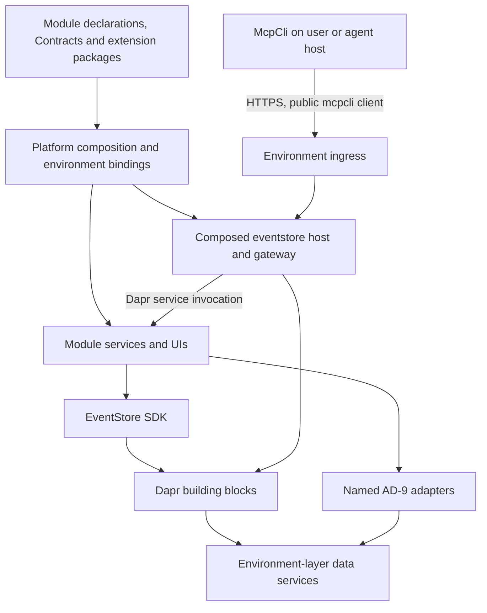
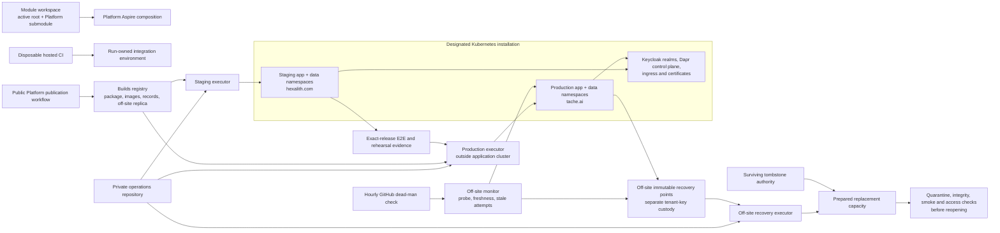
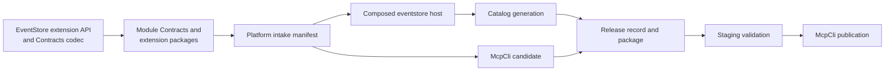

# Architecture Spine — Hexalith Platform

## Design Paradigm

**Modular composition root over event-driven domain services.** Platform composes environments and their operational policies. Technical modules own reusable runtime capabilities; domain modules own contracts, behavior, projections, authorization policy and service-specific readiness. Event-sourced aggregate mutation uses the EventStore SDK. Platform implements no domain behavior and no second orchestration framework.

The MVP covers EventStore, Tenants, Parties, Folders, Projects, McpCli and Memories plus their declared supporting capabilities. **Technical modules:** EventStore, Memories, Commons, Builds, FrontComposer, PolymorphicSerializations. **Domain modules:** Tenants, Parties, Folders, Projects and later domain modules. **Tool:** McpCli. A domain module's minimum composition is EventStore, Tenants, Memories and its declared dependencies. Domain modules keep domain UIs, thin SDK hosts and EventStore extension packages; they own no AppHost, Aspire or ServiceDefaults infrastructure. Technical modules may own reusable hosting capabilities.

Roles: **Administrator** is the production authority, recovery owner and Platform architecture owner; a named **recovery deputy** backs Administrator for recovery and key custody.

This document fixes the target consistency contract; final status does not establish deployed capability or production qualification. Decision history and observations live in [.memlog.md](.memlog.md).

Arrows show calls or dependency direction. Provider SDKs stay inside Dapr components or the named AD-9 adapters. Module-owned presentation and read transports, such as the Tenants BFF REST reads, remain valid.

## Invariants & Rules

### AD-1 — Modular composition root [ADOPTED, AMENDED]

- **Binds:** enrollment, local/hosted topology, chart generation; FR-1–FR-4, FR-10.
- **Prevents:** divergent application graphs, per-module Dapr plumbing and a second deployment definition.
- **Rule:** Platform owns one Aspire application model consuming module declarations through ordinary C# helpers. Environments select modules and bind source or package artifacts and infrastructure. Kubernetes runs hosted workloads; no AppHost runs in production. One shared Platform helper adds Dapr sidecar annotations and Pod Security-compliant security contexts to the generated application chart, which carries workloads, services and ingress. In hosted publish, data services become external connection parameters; the environment layer (AD-3) is a separate per-environment definition generated from profile facets, not a duplicate topology. Dapr resources are rendered from the canonical profile and declarations: data-service-bound Components go with the environment layer; Configurations, WorkflowAccessPolicies, Subscriptions and Resiliency go with the application package. In staging and production the retained Platform package is the only deployment definition of enrolled workloads; module deploy assets are declaration or conformance inputs, and legacy deployments are never a second writer. If export needs per-module Dapr hand-modelling, a custom compiler, recurring generated-file patches or a duplicate full topology, switch to the small maintained Helm-chart fallback with parity checks.

### AD-2 — Retained release artifacts [ADOPTED]

- **Binds:** publication, staging, promotion, rollback; FR-6–FR-8, NFR-1.
- **Prevents:** testing one release and deploying, rolling back to or recovering another.
- **Rule:** The Platform publication workflow publishes one immutable application Helm package identified by its OCI manifest digest, plus immutable image digests, to the Builds registry. The release record is the single binding of a release's release-invariant values: module artifacts and image digests, composed-host identity, catalog route-content digest, McpCli candidate, profile template digest, qualified environment-layer digest sets, realm-contract version, module change classifications and check-suite digests, each linked to its evidence; Builds validators own its encoding. Staging evidence and effective change classifications name the working baseline they were computed against. Promote the same package and images; executors `helm upgrade` the retained package by digest and never regenerate it with `aspire publish` or `aspire deploy`. Deploy accepts only digests whose provenance names the protected publication workflow and ref, the release record only from that workflow, and attempt records and evidence only from the environment's executor identity. Packages, digests, records and evidence are copied off the primary failure domain and retained for the backup retention period or their life as a rollback target, whichever is longer; in-cluster Helm history is never the record.

### AD-3 — Application release ownership boundary [ADOPTED, AMENDED]

- **Binds:** rollout/rollback mechanics, environment layer, persistent state; FR-8–FR-10, NFR-1/NFR-3.
- **Prevents:** an application rollback rewinding data, credentials, data-service versions or infrastructure administration.
- **Rule:** Persistent data, existing Keycloak, shared infrastructure, backups and credential rotation stay outside application rollback. Data services, brokers, OpenBao, persistent volumes, CRDs and other cluster-scoped objects form a forward-only environment layer outside the application package, versioned in the private operations repository and reproducible onto replacement capacity. Persistent objects survive package removal. Each environment-layer object has one version authority, a profile-inventory facet; module digest sets such as Memories.Aspire's are qualification inputs to it. Every environment-layer input a release needs is applied forward-only and verified before the attempt. Application recovery renders the working baseline's package with environment-current values through a Helm upgrade; `--rollback-on-failure` (formerly `--atomic`) and any other automatic rollback are forbidden. A workload counts as changed when any release-owned rendered object digest differs or a catalog generation was committed. Previous code must read current schemas and events with current security state; key generations and durable authority never rewind. An incompatible release uses the Administrator-approved release mode.

### AD-4 — One active-root source identity [ADOPTED]

- **Binds:** source resolution, build and launch; FR-2/FR-3.
- **Prevents:** debugging one checkout while executing another, or silently substituting packages.
- **Rule:** Resolve the active workspace root once, then its active module and only its directly declared dependencies into one mapping consumed by build and launch. Root-declared Hexalith dependencies build from source in Debug; all others resolve as packages at the Builds catalog version; a source and a package copy of one identity fail the build. The Platform tool alone sets the single mode property; file existence never selects a mode. Missing required source fails with the named dependency and path; no ancestor, sibling, recursive, nested-Platform or package fallback. In a module workspace the Platform submodule commit is the single Platform identity: local mode runs Platform from that source; the pinned CI tool embeds its source commit and refuses to run unless it equals the submodule HEAD; an untagged or dirty submodule is allowed only in local source mode.

### AD-5 — Runner-owned CI integration environments [ADOPTED]

- **Binds:** automated tests, artifacts and cleanup; FR-4/FR-5.
- **Prevents:** integration jobs sharing hosted data or credentials.
- **Rule:** Reuse Builds workflows on disposable Linux GitHub-hosted runners. Run isolated tests without Platform first, then real-service integration through the AD-10 Platform runner with Release/NuGet artifacts; Builds owns a blocking Platform-runner integration entry. CI never receives staging or production provider credentials. Staging Kubernetes E2E remains a separate mandatory gate.

### AD-6 — Environment-specific identity realms [ADOPTED]

- **Binds:** users, workloads, realm configuration and administration; FR-10–FR-12, NFR-3.
- **Prevents:** staging credentials, membership or admin authority becoming production authority, and realm drift between environments.
- **Rule:** Separate staging and production application realms on the existing Keycloak server. Local, CI, staging and production realms are generated from one versioned, value-free realm contract: EventStore owns claim names and semantics; Platform owns the contract instance, including the AD-14 client-to-surface map and admin- and user-event settings; modules declare required clients, audiences, roles and claims. The root HS256 development key is retired from Platform compositions. The contract version is bound in the release record and applied forward-only by Administrator before the attempt that needs it. Each environment validates issuer, audiences, admission and module/tenant permissions, reusing EventStore's AD-10 JWT and fingerprint conformance and its separate AD-28 app-channel contract. Production admission is membership in a named production group granted only by Administrator — never by default, self-registration, IdP mapping, first login, copied staging membership or promotion. Realm administration is realm-scoped: no automation, executor or fixture holds master or cross-realm admin; staging provisioning uses a staging-only management client; production realm changes are Administrator-only; admin and revocation events are exported off-cluster for DR replay; master realm and admin consoles stay off public ingress.

### AD-7 — Isolated private-network executors [ADOPTED, AMENDED]

- **Binds:** staging deployment/E2E, production rollout, shared-infrastructure changes, recovery execution; FR-6–FR-10.
- **Prevents:** staging or test code running beside production authority, and repository events reaching deployment credentials.
- **Rule:** Staging and production each use a dedicated self-hosted Linux executor on a separate machine or VM with access to the designated Kubernetes API and verification endpoints; the production executor runs outside the application cluster and runs only production jobs and digest-identified smoke suites that passed staging. Staging, test or PR code never runs on an executor or host process that holds or held production credentials; co-scheduling on the shared node is the AD-8 residual risk. Deployment workflows live in a private operations repository writable only by Administrator. Each executor obtains per-job credentials only for its own environment — the namespace-scoped application deploy identity, the separate environment-layer identity for its data namespace and its synthetic smoke clients — through GitHub OIDC claim checks or executor-held credentials, never with bind, escalate or impersonate. Only the production executor, for named shared-infrastructure workflows, also obtains a per-job cluster-scoped identity. Executors refuse jobs whose repository, workflow ref, ref or event is not on their allowlist; no deployment credential is a repository secret. An off-site recovery executor runs only recovery workflows with pre-provisioned credentials for the prepared capacity, held in off-site custody; drills use it. Routine build and integration jobs stay on disposable hosted runners. Adopt GitHub Team controls once a second person gains write access to the operations repository.

### AD-8 — Separate hosted application state by environment [ADOPTED]

- **Binds:** namespaces, data services, OpenBao, volumes, bindings, providers and pod isolation; FR-9/FR-10, NFR-2/NFR-3.
- **Prevents:** staging principals, pods, restores or maintenance reaching production data, secrets or keys.
- **Rule:** Staging and production each have an application namespace and a separate data namespace holding their own data-service instances, OpenBao instance, persistent volumes and bootstrap Secrets, outside the application deploy identity's scope; environment-layer changes use a separate identity. Each environment has its own credentials, Dapr bindings and external-provider tenancy. Modules sharing an instance within an environment each use a least-privilege principal with no cross-module or instance-admin grant. Namespaces enforce Pod Security `restricted` and default-deny ingress and egress NetworkPolicy on a CNI proven to enforce them. Hosted Dapr Configurations and WorkflowAccessPolicies deny by default and allow callers by trust domain, namespace and app ID, with one trust domain per environment; the Sentry-validated namespace is the enforced discriminator. The shared Dapr control plane is production-critical infrastructure without staging write access. Production workloads get a higher PriorityClass; staging runs under quotas and limits. Negative tests from staging users, credentials and pods prove production data services, app ports, sidecars, workflows, actors, volumes and hostnames unreachable, and a staging release declaring a production hostname is rejected. The single-node shared kernel is an accepted residual risk; pods on one node do not establish node or site resilience.

### AD-9 — Dapr runtime boundary with named capability exceptions [ADOPTED, AMENDED]

- **Binds:** all application and technical modules, shared SDKs, adapters and dependency guards.
- **Prevents:** arbitrary provider coupling, unowned exceptions, and custom Dapr components built only for uniformity.
- **Rule:** Use Dapr through established shared SDKs or provider-neutral contracts wherever it supplies the capability. Event-sourced aggregate mutation uses EventStore SDK contracts. Module-owned auxiliary records — read-model journals, certificates, progress, audits, mappings — may use Dapr state through module-owned stores when declared with a logical role and recovery class. Accepted exceptions: **Memories FalkorDB graph**, **Memories Redis search/vector indexes** and the **Memories SET NX preflight-dedup row**. Provider SDKs, native queries and connection details stay inside each named adapter boundary; all other coordination state, messaging, workflows and secrets use Dapr. Memories' remaining direct Redis coordination is transitional until G2 and does not block local or CI enrollment. Module code never hardcodes Dapr component names. A new exception names the missing capability, owner and surface and needs Administrator acceptance recorded in this spine before the validator admits it. This governs runtime infrastructure access, not native backup/operator tools or external OIDC/HTTPS/MCP protocols.

### AD-10 — Test environments have explicit run ownership [ADOPTED]

- **Binds:** Platform runner, fixtures, readiness, isolation and lifecycle; FR-4/FR-5.
- **Prevents:** two lifecycle owners, stale implicit reuse, lost debug evidence or cleanup of another environment.
- **Rule:** Only the Platform runner provisions, readiness-waits, records ownership of and cleans multi-module integration environments; EventStore.Testing(.Integration), module and McpCli tests consume its versioned environment descriptor and never start their own AppHost. A technical module's own-repository tests may start its AppHost through a non-exported fixture path; such runs are never Platform integration evidence. Default to a fresh run-owned environment per suite or compatible batch with run-scoped ports, resources and catalog instance, or fail fast naming the blocking run. Wait for required readiness and successful startup tasks within the finite deadline, then supply endpoints and composition identity. Local success cleans; local test or startup failures are retained and listable with owner and age; explicit cancellation cleans only that run; CI always cleans, including after partial startup. A run's first terminal outcome alone decides retention or cleanup. Explicit attach is allowed only to local or CI run-owned environments with compatible composition, artifact mode, readiness and data isolation; attaching to hosted environments fails closed. Cleanup is idempotent and reports leftovers; a shared AppHost path alone is not ownership.

### AD-11 — One generic tool with environment-aware discovery [ADOPTED]

- **Binds:** module operation enrollment, discovery, credentials, actor attribution and CLI/MCP routing; FR-12.
- **Prevents:** per-module forks, discovery advertising operations the selected environment cannot run, tokens reaching the wrong environment and spoofed actors.
- **Rule:** Ship one versioned `Hexalith.McpCli` with statically enrolled module Contracts and a common CLI/MCP core. Offline contract inspection is distinct from availability. In connected mode an operation is executable only when the selected gateway's EventStore-owned metadata endpoint, derived from the environment's committed catalog, matches its per-operation contract-schema digest, its Contracts-declared surface eligibility allows it and current authorization permits it; unknown or mismatched digests are non-executable. The gateway reauthorizes every call and never logs or persists bearer tokens. A profile binds one environment's gateway, issuer and audience with no environment fallback or implicit module enablement; hosted access uses short-lived per-environment OIDC tokens sent only to their issuing environment's gateway. In hosted environments McpCli refuses `--actor`, and the gateway rejects a Contracts-declared actor property that differs from the token subject or, for an AD-14 asynchronous task step, from the EventStore-attested original actor. Each Platform release builds a McpCli candidate from its intake Contracts; it runs the staging flows and is published only after staging validation. Locally the Platform tool builds and launches McpCli through the AD-4 mapping. McpCli stdio is the only MVP MCP surface. All proprietary Hexalith module and technical-module MCP hosts, plug-ins, and CLIs, including EventStore Admin, are obsolete migration sources; Platform admits no new alternate proprietary MCP/CLI surface. Retire each source only after its owner-approved operation inventory and replacement or withdrawal evidence. A generic McpCli contract and transport decision is required before non-gateway and infrastructure-admin capabilities can be cut over; AD-14's agent-surface denials remain binding.

### AD-12 — Independent backups and prepared replacement capacity [ADOPTED, AMENDED]

- **Binds:** recovery inventory, backup classes, key custody and disaster execution; FR-9, NFR-2.
- **Prevents:** raw volume copies, application rollback, unspecified hardware or key-bearing backups being treated as complete or erasure-safe recovery.
- **Rule:** Maintain one active production environment; restore compatible retained applications and configuration plus module-approved recovery sets onto identified prepared replacement capacity, including shared dependencies, independently available operator and decryption access, artifacts and failure reporting. Platform owns the exercised sequence in Release and Recovery Acceptance, run by the AD-7 recovery executor; modules own state classes, recovery hooks, boundaries, reconciliation and integrity checks. Tenant keys live in a named tenant-key store excluded from ordinary OpenBao snapshots and backed up as a separate custody class, never held with ciphertext backups; erasure makes every earlier key backup unusable for the erased tenant while a fresh key backup keeps others recoverable.

### AD-13 — Platform-composed shared EventStore host [ADOPTED]

- **Binds:** the `eventstore` app and image, module EventStore extensions, catalog generation and release identity; FR-1, FR-6–FR-8, FR-12.
- **Prevents:** competing module-built `eventstore` images, a generic host missing module semantics, and composed images without release authority.
- **Rule:** Each environment runs exactly one `eventstore` host, which is the gateway, composed by Platform from the EventStore server plus enrolled modules' extension packages (idempotency-intent adapters, trusted-command and coordination policies) against an EventStore-owned versioned extension API. Local and CI modes assemble the host through the AD-4 mapping; hosted environments run the Platform-published composed image. Extension packages implement only the extension API, declare no Dapr roles, and neither reference a provider SDK or Dapr client nor declare a secret — except that a named AD-9 exception may reference its provider SDK and declare its own least-privilege secret. Their configuration inputs are declaration fields. The server declares the extension-API majors it supports (current and previous); the build fails naming any module outside them or registering a duplicate. Modules never publish web projects or images named `eventstore`. The server package carries EventStore-issued evidence-validated and release-available records; the composed image is a Platform subject whose release-available and production-promoted records are Platform-issued and bind the release-available server package and extension digests. EventStore ratifies this rule once, registering Platform as issuer for composed subjects.

### AD-14 — Authenticated client is the calling surface [ADOPTED]

- **Binds:** Keycloak clients, gateway authorization, surface eligibility, actor/workload checks, cross-module calls; FR-11/FR-12, NFR-3.
- **Prevents:** surface restrictions resting on caller-asserted identity, agent-held tokens executing UI-only operations, and cross-module calls losing or forging the original actor.
- **Rule:** Each calling surface is a distinct Keycloak client per environment, mapped to exactly one surface class in the realm contract; gateways derive the surface from the authenticated client (`azp`) through that map, never from caller-set headers or parameters. Because `azp` authenticates only confidential clients, surfaces permitted UI-only or confirmation-required operations are confidential server-side clients without loopback or wildcard redirects; public clients such as McpCli are agent-capable least privilege. McpCli's CLI and MCP heads form one surface; operations not eligible for agent use, or requiring confirmation or step-up, are not executable through McpCli in the MVP. The actor is the token subject; the workload is the authenticated client. In server-to-server calls the workload is the calling module's client or sidecar-attested app ID; synchronous steps carry the user through Keycloak standard token exchange by the calling module's confidential client; asynchronous task steps use the original actor attested by EventStore at admission, authorized only for operations bound to that task. Raw user-token forwarding is forbidden. For each public client, a negative test proves that a token it mints is denied UI-only and confirmation-required operations.

### AD-15 — Expand/contract rollback sets [ADOPTED]

- **Binds:** catalog generations, idempotency and key generations, secret retirement, automatic rollback; FR-8, NFR-1.
- **Prevents:** a committed release making its predecessor unrestorable through retired or non-recommittable catalog, key or secret state.
- **Rule:** Unless an Administrator-approved release names a separately planned recovery, before production rollout record the rollback combination — the working baseline's package with environment-current values and a forward catalog generation holding the baseline's routes plus every still-referenced idempotency and key entry — and have it prepared and ready-validated under the EventStore catalog protocol. Retained entries whose adapter or descriptor version the baseline host lacks are non-executable retention entries it must tolerate; the forward generation uses the baseline's catalog-codec version. A new adapter or descriptor change is additive only when the baseline tolerates it, otherwise breaking. Staging rehearses candidate to baseline with that combination, exercising at least one idempotent command new in the candidate. Until the release is recorded working, no catalog commit or key, secret or catalog-entry retirement may break the combination; retirement happens in a later attempt.

## Consistency Conventions

| Concern | Binding convention |
| --- | --- |
| Module declaration | Platform owns one versioned, non-secret schema and validator; each module owns its instance with `schemaVersion`, and Platform accepts the current and previous major. It enumerates every module input this spine references: stable module/app/resource identities; enabled server list; Dapr capabilities by logical role with recovery class (authoritative-restore, rebuild-only, live-authority-only); inbound callers and operations; external egress destinations; topics with dead-letter policy; logical secrets and dynamic secret namespaces; identity needs; logical interface names and route prefixes; extension packages and their configuration inputs; external providers needing per-environment tenancy; external-effect and destructive-retention workers with their disable control; resource requests and limits, replicas (default 1) and volume needs; readiness and startup tasks with lifecycle scope and authority class; recovery hooks; startup override; critical flows and smoke suites with the surface each exercises; change classification (none, additive, breaking); recovery inventory. Platform assigns component names, namespaces, FQDNs and scopes. Module-authoritative files such as the Parties ACL file become declaration sources. Missing, duplicate or incompatible declarations fail validation. |
| Startup task lifecycle | Scopes: per-start verify (idempotent), once-per-environment creation, recovery (run in declared-dependency order), operator-only. Creation tasks run only when creating a new environment — never on upgrade, rollback, restore or replacement-capacity recovery. Population- or authority-creating tasks are operator-only in hosted environments. |
| Module intake | Module releases enter through a versioned intake manifest in the Platform repository pinning package and image digests and module release-evidence references. A candidate's effective change classification is the maximum over every module release between production's working baseline and the candidate; the manifest keeps that chain. |
| Binding classes | **Release-invariant** values live in the AD-2 release record and are identical in every environment. **Environment-current** values are read from the target environment at deploy and rollback and passed as chart values: secret references and scopes, key and catalog generations with root digest, secret-contract digest, applied realm-contract version, the environment's active profile digest, hostnames and credential references. **Attempt-bound** values — the environment-current values an attempt used, lock epoch, timers, outcome and promotion stop — live in the per-environment attempt record. The **working baseline** is the release record plus the attempt record of the last working attempt. Promotion compares release-invariant digests and requires equal staging and production profile digests; readiness compares attempt-bound digests. |
| Catalogs | EventStore.Contracts owns the routing schema and codec, including per-operation contract-schema digests. One deterministic Platform generator produces each composition's catalog from enrolled declarations: the committed `deploy/dapr/eventstore-routing-catalog.json` holds the hosted instance; local and CI instances are run-scoped and named in the environment descriptor. No second hand-maintained operation catalog. Activation per attempt: prepare the candidate and rollback generations; ready-validate the rollback generation on the running baseline hosts; Helm upgrade, candidate hosts validating their prepared generation; commit at readiness; verify. Recovery commits the rollback generation. |
| Domain truth and delivery | EventStore SDK owns domain mutation and projection mechanics; modules own semantics. Preserve at-least-once unordered delivery, message identity, deduplication, sequence gaps, durable poison capture and replay. No second outbox or event ledger; database backup alone does not recover broker backlog. |
| Secrets | Follow EventStore AD-24: Dapr `secretstores.hashicorp.vault` against the environment's OpenBao. Its per-app tokens and any Kubernetes Secrets are documented bootstrap exceptions, each with a named renewal owner. The value-free `deploy/dapr/openbao-secret-contract.yaml` carries an environment dimension, static entries and module-owned dynamic namespaces such as Memories per-tenant credentials. Platform owns scopes and acknowledged rotations; Administrator holds the Memories operator role and Platform renders its operator artifact. Required generations gate readiness. Administrator and the recovery deputy are the unseal and recovery-key custodians. |
| Production profile | The EventStore-ratified template — runtime and Dapr minor, component types and versions, sidecar mode, ACL and resiliency shape — changes only through EventStore AD-26, still unratified. The profile inventory pins the environment layer (Keycloak, data services, OpenBao, Dapr control plane with sidecar drop-all-capabilities enabled) and, separately, the deploy toolchain; Memories.Aspire digest sets are qualification inputs. The profile digest covers the template plus the inventory's environment-layer pins; it excludes the other environment-current values and all release-invariant values. Staging runs the same template, differing only in declared environment bindings. An environment-layer change is its own attempt, staging first; the production attempt ends by re-verifying the working release and issuing a renewed production-promoted record at the new digest, and promotion stays stopped until that record exists. A release is deployable, and a valid rollback target, only while current environment-layer versions fall within its qualified sets and its record is valid for the active profile digest; otherwise the change is breaking. One sidecar patch per release across local, CI and staging, within the control plane's supported skew. Inventory pins stay within upstream support and current on security patches, checked at each production attempt and monthly drill. Local allow-defaults never feed the profile. |
| Workflows and provenance | The **Platform publication workflow** runs in the public Platform repository on disposable hosted runners through SHA-pinned Builds reusable workflows; it builds and attests the application package, composed image and McpCli candidate, verifies the intake-pinned module images and writes the release record. **Deployment workflows** run from the private operations repository on the executors and only verify and deploy. Provenance for each artifact class names its caller repository, workflow, protected ref and pinned Builds workflow ref (seed: GitHub artifact attestations). Retained artifacts live in the Builds registry `registry.hexalith.com` with an off-site replica; pull credentials are per-environment secrets. |
| Local tool and readiness | The pinned Platform .NET tool (AD-4) in `.config/dotnet-tools.json` provides stable run, teardown and debug commands. Default startup deadline is 10 minutes from environment request; the active module's declared finite override applies, the complete environment uses the largest declared override, and the effective value appears in diagnostics. Record actual startup duration, readiness and effective deadline. Process-running is not readiness. A definite startup failure may stop early; a timeout names unready resources and preserves diagnostics. |
| Hosted interfaces | Staging uses `hexalith.com`, production `tache.ai`, on the designated `192.168.1.30` installation. Each environment's public exposure uses one declared path, each DNS zone has one named owner, and certificates use one declared ACME challenge with per-environment credentials. Platform maps declared logical interface names to FQDNs by one pattern and derives redirect URIs, origins and gateway URLs; no module artifact contains an environment FQDN. The staging namespace can neither serve production or shared-infrastructure hostnames (registry, identity issuers) nor obtain their certificates (seed: built-in ValidatingAdmissionPolicy and namespaced or policy-restricted issuers). The gateway is the composed `eventstore` host's authenticated command, query and metadata endpoint behind environment ingress; ingress terminates TLS and routes but makes no authorization decision, and no external caller bypasses it to reach pods. Executors verify through a declared internal ingress endpoint with the same authentication. Internal service invocation uses Dapr while keeping module API contracts. |
| Synthetic identities | Platform owns one pre-provisioned, flagged synthetic tenant per environment and, per surface class, synthetic actor and workload clients flagged in their tokens, with no admin or cross-tenant grant. Administrator provisions production synthetic credentials, held only by the production executor and rotated through an Administrator attempt; each job mints short-lived tokens. Confirmation-required flows are tested only through their UI surface. Suites never create or delete tenants; synthetic data stays out of real-tenant views and aggregates. |
| Diagnostics and notification | Use shared technical-module health and telemetry. Bind evidence to run or release, environment, artifacts and effective configuration; preserve classified, redacted diagnostics after cleanup. Deployment-workflow logs and artifacts are private; notifications carry environment and release identity and opaque references to access-controlled evidence. GitHub issues assigned to Administrator are the single accepted notification path for every notification in this spine. An off-site monitor runs the availability probe, the recovery-freshness check and the stale-attempt check; an hourly GitHub-hosted dead-man check alerts when the monitor's heartbeat is stale. Domain audits remain module-owned data. |
| Migration and coexistence | The Platform composition is the only authority for integrated multi-module environments. Domain-module AppHosts are frozen, with no new cross-module wiring, until retirement; technical-module AppHosts stay valid for their own repository tests; FrontComposer.AppHost is sample-only. Agents EXT-HOST-1 and the Works lane enroll through the same schema; this spine's ownership split supersedes Works AD-20. Adopt producers before retiring consumers; retire legacy hosting only after the owning module's source, package and deployed parity evidence plus applicable EventStore AD-22 exact-subject consumer-removal authority. |

## Release and Recovery Acceptance

These policies inherit the [Platform PRD](../../prds/prd-platform-2026-09-27/prd.md); they are requirements, not measurements.

| Phase | Required behavior |
| --- | --- |
| Staging gate | Staging accepts candidates whose EventStore server package is evidence-validated. One serialized attempt deploys production's working baseline, upgrades to the candidate, runs E2E, then rehearses the AD-15 rollback and verifies the baseline reads state and events the candidate wrote. A failed rehearsal is breaking compatibility evidence, not a staging failure. Every included module declares a non-empty critical-flow set with complete flow-to-test mappings; all required E2E checks, including the McpCli candidate's flows, pass for the exact release. Results carry the serving release and suite, profile and configuration digests; evidence has a maximum age. Missing, skipped, failed, incomplete, stale or wrong-release results block promotion. A staging failure blocks only that candidate. |
| Release modes | The production deployment workflow has two modes. **Automatic** requires G3 and complete compatibility evidence. **Administrator-approved** replaces only those two triggers with an authenticated Administrator record; it serves pre-G3 releases, SM-5 fault rehearsals on a staged release before G2, and incompatible releases, whose record names the separately planned recovery that replaces automatic rollback. The staging gate, lock, provenance, verification and records apply to both. |
| Attempt ownership | One per-environment lock covers every workload-affecting change: release, rollback, config-only change, rotation rollout, catalog activation, environment-layer or profile change and DR restore. Shared-infrastructure changes hold both locks, staging first, for their whole duration under one named change owner. The lock carries a monotonic epoch checked before every mutation. The attempt record, working baseline and durable promotion stop live outside the target cluster and the executor host. A production attempt runs from lock to terminal outcome in one job; only an Administrator record, or a replacement job of the same workflow resuming the same attempt to perform its remaining single recovery within the grace, may take it over; DR entry takes a new epoch. The off-site monitor notifies when a record stays non-terminal past its maximum lifetime. |
| Interruption | Timers anchor to recorded start times and never restart; an observation gap invalidates the window. An interruption detected before the verification deadline plus a bounded grace fails the attempt, which may still use its one recovery. Later detection, record/cluster disagreement, an unknown actual release or lock owner, or an unreadable record stops for intervention without mutation. Restarts never add a recovery. |
| Before production update | Production requires the EventStore server package release-available; the production realm reporting the required realm-contract version or a compatible later one; valid non-empty readiness and smoke declarations for every module; a healthy production, meaning its working baseline is ready and its smoke suite passes now; and compatibility evidence: effective change classifications plus the staging rehearsal against production's working baseline with the prepared AD-15 combination. A missing precondition stops without mutation and notifies; missing, breaking or wrong-baseline compatibility evidence routes the release to the Administrator-approved mode. Smoke writes use only synthetic identities and data, without external effects. |
| Rollout | Catalog activation follows the Catalogs convention. Write the Platform-issued production-promoted record, bound to the active profile digest, before traffic. All required workloads reach the intended release and readiness within 10 minutes of deployment start. |
| Verification | After readiness, observe five minutes. Smoke checks have stable IDs and run at window start, then at a fixed cadence; a timeout is a failure, and results from another release count as missing. Sample unavailability at 10 seconds or less. The attempt fails when a required service cannot serve traffic for 60 continuous seconds, the same smoke check fails twice consecutively with the second attempt 30 seconds after the first failure, or a passing result is missing at the deadline. A single failed probe or restart alone does not fail it. Working only when readiness and latest passing checks hold at window end; otherwise failed after one bounded grace for an in-flight retry. Re-verify SM-4 access outcomes after access-configuration changes. |
| Automatic recovery | One attempt: render the working baseline's package with environment-current values, including partially changed workloads, and commit the AD-15 rollback generation; allow 10 minutes for readiness, then the same verification with that release's checks. If no workload changed and no generation was committed, retain and report. A failed first deployment keeps ingress closed and stops; rolling back a first module enrollment removes workloads, never data objects. Never cycle through older releases. Report every deployment failure and recovery outcome, including success, to Administrator. Every non-working terminal outcome and every DR entry sets the durable promotion stop; only an authenticated Administrator record naming the reason and a verified current working release clears it. A manual or DR change becomes the working baseline only after passing verification. Promotion stays suspended during any recovery. |
| Production entry gates | **G1:** a supported Kubernetes minor, then deployment into the production application namespace with ingress closed: production hostnames admit only executor and probe sources and the production admission group is empty; the probe runs from G1 with pre-G2 notifications. **G2:** admit users and open ingress only after the AD-12 drill passes, including Memories tombstone continuity (Memories is in every MVP composition). **G3:** enable automatic promotion only after SM-5 rehearsals. |
| Backup coverage and cadence | Inventory module-authoritative databases, files and configuration and required shared services, including Keycloak with its event export and each environment's OpenBao, each with a recovery owner and recovery class. A backup unit holds one recovery class; it may contain rebuild-only state only when its restore discards that state as the state's owner prescribes. The environment OpenBao backup unit holds no tenant-key material. Runs start every 30 minutes; keep frequent points seven days and daily points 30 days with complete chains. Copies are encrypted, restricted, immutable and off-site under per-environment-instance prefixes, with access and decryption material independent of the primary failure domain. Rotated key generations are retained at least as long as the data backups. |
| Recovery point and freshness | A usable recovery point is the set of inventory artifacts sharing one declared cut, with its compatible release and configuration identity, the Memories register population and sequence, Keycloak event-export freshness, and integrity verified when written — checksums, unbroken chains, test decryption with independent keys — recorded in off-site metadata. Age is failure time minus cut. The off-site monitor checks at least every 15 minutes, reports the newest complete set, warns below one hour and notifies on job failure or age over one hour. Pruning skips points referenced by an open recovery. |
| Detection and response | The off-site probe checks production ingress and readiness every five minutes or less and notifies Administrator. The recovery procedure declares response arrangements, such as staffed hours and a maximum acknowledgement time; the RTO is assessed within them. |
| Disaster recovery sequence | Run by the recovery executor. 1. Fence: revoke the old environment's database, broker, OpenBao, backup-write and deployment credentials; set the promotion stop; disable external-effect and destructive retention workers; prove old credentials fail. 2. Restore the tenant-key store and re-apply tombstone key destruction. 3. Restore data into quarantine, reachable only from the recovery executor; run module recovery hooks in declared-dependency order, admission and purge before rebuild-only replay. 4. Rotate every restored credential and application signing key; re-apply admin and user revocations made after the cut; repeat the fence proof against the restored instances; a compromise-driven restore also rotates the Dapr trust root and realm keys. 5. Verify compatible releases, cross-module integrity, restored-release smokes, SM-4 access outcomes and denial of revoked principals. 6. Resume protection and monitoring, report the lost window, reopen. |
| Disaster recovery evidence | Administrator owns an isolated drill before G2, monthly repeats and repeats after material storage or backup changes. The drill assumes the primary server and its storage are unavailable, measures real detection and applies the declared worst-case response. Prove RPO at most one hour and outage-to-verified-service RTO at most four hours including capacity, transfer, replay and validation. Drills never mutate live production or shared authority: the fence is proven against drill-scoped copies, Keycloak is restored into the drill or generated from the realm contract with the event export applied, and the report lists every substitution; real fence steps are rehearsed on staging before G2. Drill restores are ephemeral and egress-denied. Whole-site loss is covered only when the prepared capacity sits at an independent location. |
| Memories erasure continuity | Shared Redis/FalkorDB projections and tenant-keyed coordination have no operational backup-restore path; they rebuild through authoritative replay. A copied register is not live authority. Memories/EventStore must qualify the independently durable synchronous complete tombstone mirror and lineage protocol. No acknowledged tombstone may be lost and no erased key or tenant resurrected; unknown lineage fails closed. EventStore payload protection is required for Memories partitions captured in backups. |
| Lost window and external effects | Non-Memories erasures, deletions and legal holds acknowledged after the recovery cut are an accepted RPO exception, stated in the DR report. Destructive retention and external-effect workers stay disabled until each owning module has restored and reconciled its external-operation state; never blindly repeat an unknown prior provider outcome. |

## Source Precedence and Module Integration

The Platform MVP envelope — one-hour RPO, four-hour disaster RTO, 30-minute backup runs, seven-day frequent and 30-day daily retention, backup-restore onto prepared capacity, no HA or standby — governs the stricter infrastructure clauses of **Folders** (I-10, I-11, EXT-ES-RECOVERY) and **Projects** (AD-28 availability, RPO 0 and service RTO beyond process restart; G-1 durable task engine, outside the MVP), by explicit user authority. Neither blocks enrollment, and Projects AD-30 release gates may not demand Platform HA or RPO-0 evidence; aligning their source documents is maintenance. Module behavior, authorization, data-safety and release gates are never waived. Platform measures availability without guaranteeing a percentage.

| Input | Platform-facing contract retained |
| --- | --- |
| [EventStore architecture](../../../../references/Hexalith.EventStore/_bmad-output/planning-artifacts/architecture.md) | Versioned extension API and one-time AD-13 ratification with Platform registered as composed-subject issuer; lifecycle states for the server package; catalog, secret and idempotency authorities with the AD-15 retention and activation rules; profile template/binding split; AD-29 attested original actor. |
| [Memories spine](../../../../references/Hexalith.Memories/_bmad-output/planning-artifacts/architecture/architecture-memories-2026-09-09/ARCHITECTURE-SPINE.md) | Per-tenant principals and dynamic secrets; projection replay; tombstone lineage and key custody; direct-provider access only per the AD-9 exceptions; Memories.Aspire digest sets as qualification inputs. |
| [McpCli spine](../../../../references/Hexalith.McpCli/_bmad-output/planning-artifacts/architecture/architecture-mcpcli-2026-09-22/ARCHITECTURE-SPINE.md) | Canonical target for all Hexalith-owned CLI/MCP access. Generic static Contracts enrollment and common CLI/stdio MCP core per AD-11/AD-14 are the first increment; environment-bound short-lived tokens replace static profile bearers for hosted use. |
| [Tenants architecture](../../../../references/Hexalith.Tenants/_bmad-output/planning-artifacts/architecture.md) | Domain UI ownership, separate Tenants read and EventStore command transports; InteractiveServer above one replica requires its key, session and cursor evidence. |
| [Parties extraction spine](../../../../references/Hexalith.Parties/_bmad-output/planning-artifacts/architecture/epic-8-domain-focus-2026-07-06/ARCHITECTURE-SPINE.md) | Shared technical capability ownership and parity before retirement; privacy and erasure semantics stay Parties-owned; erasure records and key-rotation progress are declared AD-9 auxiliary records; no MCP erasure operation. |
| [Projects spine](../../../../references/Hexalith.Projects/_bmad-output/planning-artifacts/architecture/architecture-projects-2026-07-15/ARCHITECTURE-SPINE.md) | Versioned manifest and tool integration; actor plus workload authorization and cross-module steps per AD-14; operation-specific MCP restrictions and release evidence; module-level process restart and five-minute task recovery with NeedsAttention. |
| [Folders architecture](../../../../references/Hexalith.Folders/_bmad-output/planning-artifacts/architecture.md) | Idempotency-intent adapters delivered as AD-13 extension packages; functional contracts, idempotency and external-effect reconciliation. Folders consumes the common Platform-qualified profile; no Folders-only state-store version or topology gate applies. |

## Stack

Seed from the uncommitted working tree and the Builds catalog on 2026-09-27; per-row evidence is in the memlog. These are existing pins, not upgrade requests or a proven production combination.

| Name | Version | Status |
| --- | --- | --- |
| .NET SDK | 10.0.401, latestPatch | `global.json`; current |
| Aspire AppHost SDK, Docker and Redis hosting | 13.5.4 | `apphost.cs`; current stable |
| Aspire CLI | 13.5.4 | Must equal the AppHost SDK, checked by the Platform tool; README floor 13.4.6 and installed 13.5.3 to align |
| CommunityToolkit Aspire Dapr hosting | 13.5.1-beta.757 | Prerelease, accepted risk owned by Platform; package mode aligns to the Builds catalog (beta.770) |
| Hexalith.EventStore.Aspire | 3.106.0 | Must move to the Builds catalog 3.109.0; local mode uses the root-declared source |
| Aspire.Hosting.Kubernetes | 13.5.4-preview.1.26464.4 | Builds catalog; toolchain pin, prerelease accepted risk owned by Platform |
| Aspire.Hosting.Keycloak | 13.5.4-preview.1.26464.4 | Builds catalog; prerelease accepted risk where local realms use it |
| Helm | 4.2.0 or later (4.3.0 current) | Toolchain pin in the profile inventory |
| Dapr runtime | 1.18 | Template fixes the minor; observed 1.18.1–1.18.4 skew to reconcile |

Keycloak, OpenBao, data-service and broker pins belong to the profile inventory's environment layer.

## Structural Seed

The first diagram is the deployment and environment view; the second is the AD-13/AD-11 build and release order. Current root composition is an opt-in Works development preview, not the MVP. Observed infrastructure — one node with local storage, one shared OpenBao, existing Memories resources — needs environment classification before reuse; executors, monitors, replacement capacity and complete backup coverage are not yet demonstrated.

## Capability → Architecture Map

| Capability | Owner/location | Governing decisions |
| --- | --- | --- |
| FR-1 complete environment | Platform composition, composed host, module declarations | AD-1/AD-9/AD-13 |
| FR-2/FR-3 active module and minimum | Active-root resolver, submodule identity, module declaration | AD-1/AD-4 |
| FR-4/FR-5 local and CI tests | Platform runner, environment descriptor, Builds | AD-5/AD-10 |
| FR-6 staging promotion gate | Staging executor, module critical flows, rehearsal | AD-2/AD-7/AD-13/AD-15 |
| FR-7/FR-8 production and rollback | Production executor, release and attempt records, rollback set | AD-2/AD-3/AD-7/AD-15 |
| FR-9 disaster recovery | Recovery executor, module inventory and hooks, Administrator | AD-3/AD-8/AD-12 |
| FR-10 isolated hosted environments | App and data namespaces, OpenBao, Dapr trust domains | AD-1/AD-6/AD-8/AD-9 |
| FR-11 explicit production admission | Administrator, realm contract, module authorization | AD-6/AD-14 |
| FR-12 CLI/MCP operation access | McpCli, gateway metadata, Contracts, catalog; acceptance covers agent-eligible operations | AD-6/AD-11/AD-13/AD-14 |
| NFR-1 rollback data safety | Compatibility rehearsal, rollback set, environment layer | AD-2/AD-3/AD-15 |
| NFR-2 bounded disaster recovery | Drills, off-site monitor, recovery executor | AD-7/AD-12 |
| NFR-3 shared-infrastructure isolation | Identity, network, pod, Dapr and data authorization with negative tests | AD-6/AD-8/AD-14 |

## Deferred and Qualification Work

Deferral assigns work; it never turns absent evidence into a pass.

### First shared versions

Module adoption epics wait for the rows they consume.

| Artifact | Owner | Consumers | Must precede |
| --- | --- | --- | --- |
| Enrollment declaration schema and validator (adopt or supersede Projects' `hexalith.module.v1`) | Platform | All modules | Any module enrollment |
| EventStore extension API with supported majors | EventStore | Folders, Agents, modules with extensions | AD-13 composed host |
| Routing catalog schema with per-operation schema digests and retention entries | EventStore.Contracts | Platform, McpCli | Catalog generator, McpCli discovery |
| Gateway metadata endpoint | EventStore | McpCli | FR-12 acceptance |
| Realm contract with client-to-surface map | EventStore claims, Platform instance | All modules, McpCli | Local realm and hosted enrollment |
| Test environment descriptor | Platform | EventStore.Testing, module and McpCli tests | Fixture migration |
| Check-suite invocation and result contract | Builds | Modules, executors | Staging gate |
| Recovery hook contract: quarantine admission, purge, rebuild, integrity, external-effect reconciliation, result shape | Platform | All modules | First AD-12 drill |
| Profile template and per-release binding split | EventStore with Platform | Deployment workflows | Production profile proof |
| Release and attempt record encoding | Builds | Publication and deployment workflows | Automated promotion |

### Owned work

| Work | Owner | Revisit/acceptance boundary |
| --- | --- | --- |
| Runner, ownership records and resource isolation | Platform with module owners | Prove active-root mapping, finite readiness, exact cleanup, retained-run listing and CI package parity. Reconcile fixed Dapr ports and volumes, dapr-init Redis, the fixture lock, fixed-port Keycloak and the shared certificate directory. No custom DSL or environment service. |
| Source/package adoption | Platform, Builds, module owners | Add missing direct declarations, canonical McpCli enrollment and removal of McpCli's unused nested Platform reference; remove sibling, nested and package-fallback helpers and file-existence selectors; move the Works lane off hard-coded sibling paths; align Stack pins to the Builds catalog. |
| Hosting inventory and retirement | Module owners with Platform | Parties, Projects, Folders and Tenants AppHost, Aspire and ServiceDefaults projects, and those of later domain modules, stay frozen until parity and EventStore AD-22 authority; technical-module hosts stay valid for their own tests. |
| Shared ServiceDefaults and Aspire Dapr helpers | Platform, consulting EventStore and Commons | Record one canonical package set in this spine before the first module enrolls; new hosting helpers are refused until then. |
| Composed host | EventStore, Folders, Platform | Publish the extension API; move Folders adapters into a package; build and qualify the composed host and its lifecycle-subject registration before Folders joins a Platform environment. |
| Aspire-to-Helm qualification | Platform | Prove the representative composition (Parties with EventStore, Tenants and Memories) with the shared Dapr helper, server-side admission dry-run against `restricted`, digest-pinned image references through values without regeneration, Helm server-side-apply ownership, chart OCI attestation verification and retained-package rollback; apply the AD-1 fallback trigger. |
| Connected McpCli | McpCli, EventStore Contracts, Platform | Amend McpCli availability, token, actor and package/source-mode contracts; prove digest compatibility, freshness, token renewal and all required agent-eligible operations before FR-12 acceptance. |
| Release state, checks and notifications | Platform, Builds, Administrator | Before G3: EventStore confirmation of AD-15 retention entries, catalog activation order and renewed production-promoted records; interruption, epoch and concurrency behavior; one rollback; timers; rehearsal; provenance; stale-attempt detection; executor runner update and version monitoring; actual GitHub issue delivery. |
| Shared runtime and profile evidence | EventStore/Platform with consumers | Ratify the profile; create the catalog and secret-contract instances; select and qualify the approved durable production broker (Redis pub/sub excluded per EventStore AD-26) with delivery retention, dead-letter and backlog recovery; confirm EventStore's actor-exposure assumption; qualify component layouts, upgrades and one Dapr patch. |
| Secrets, identity, network and transport | Platform, Administrator, module owners | Before hosted readiness: Keycloak inventory; realm contract with event export channel and retention; token-exchange clients; Administrator MFA, break-glass and recovery deputy; per-environment OpenBao, tenant-key store and classification of the existing instance, splitting its shared `openbao-runtime-bootstrap` token per app and renewing before its 2027-07-19 expiry; executor credentials or OIDC; CNI enforcement; Pod Security compatibility of data services and OpenBao; hostname admission; Dapr trust domains and workflow policies; all negative isolation cases. Ratify the local mTLS, per-receiver ACL and scoped-component convention before the first local enrollment. |
| Exposure, DNS and certificates | Administrator | Before G1: each environment's public exposure path, DNS zone owners, ACME challenge and credentials, the internal executor verification endpoint, the registry's failure domain and off-site replica, and the off-site monitor host with its dead-man check. |
| Infrastructure currency | Administrator with dependency owners | Before G1: Kubernetes 1.34 (end of life 2026-10-27) to a supported minor; OpenBao to a patched release; Redis Stack 7.4 to Redis 8 through the Memories digest set; Keycloak on a supported minor; CloudNativePG, both PostgreSQL instances, FalkorDB and the Dapr control-plane patch current. |
| Recovery capacity and coverage | Administrator with dependency owners | Before G2: capacity and its location, declared response arrangements, the recovery executor host with credential custody, independent artifacts, access and keys, the key-custody mechanism, telemetry sink and minimum retention, capacity budget and representative data sizes; prove the AD-12 drill. Native database backup and allowlisted metadata/file backup are seeds, not blanket volume restore. No cost target is set. |
| Memories conformance and continuity | Memories/EventStore/Platform | Before G2: tombstone continuity, tenant-key store, per-tenant principals and operator artifact, the adapter boundary, and migration of other Redis coordination to Dapr. |
| Module service-level and functional qualification | Module owners with Platform | Preserve module product and release gates; platform-wide disaster evidence does not substitute for them. |
| Folders and Projects source alignment | Module documentation owners | Record the user overrides upstream; not an enrollment block. |
| Broker change, warm standby, regions or scale | Platform with a measured requirement | Revisit only when measurements or an accepted availability requirement justify the work. |
| Legacy MCP/CLI retirement, generic administration and resource contracts, step-up flows, generic mocks, traffic-metric rollback | McpCli, EventStore, owning capability or product team | Outside the first increment; no new proprietary module MCP/CLI host is admitted. Legacy retirement needs owner-approved inventory, McpCli replacement or approved withdrawal, and AD-14 authorization evidence. |

### Accepted risks

Single-node shared kernel with no node or site HA; staging on Kubernetes 1.34 after 2026-10-27 until G1; GitHub Free with a single-writer operations repository; GitHub as the single notification path; prerelease Aspire and toolkit pins; whole-site loss when prepared capacity is not at an independent location; non-Memories erasures inside the lost RPO window.
