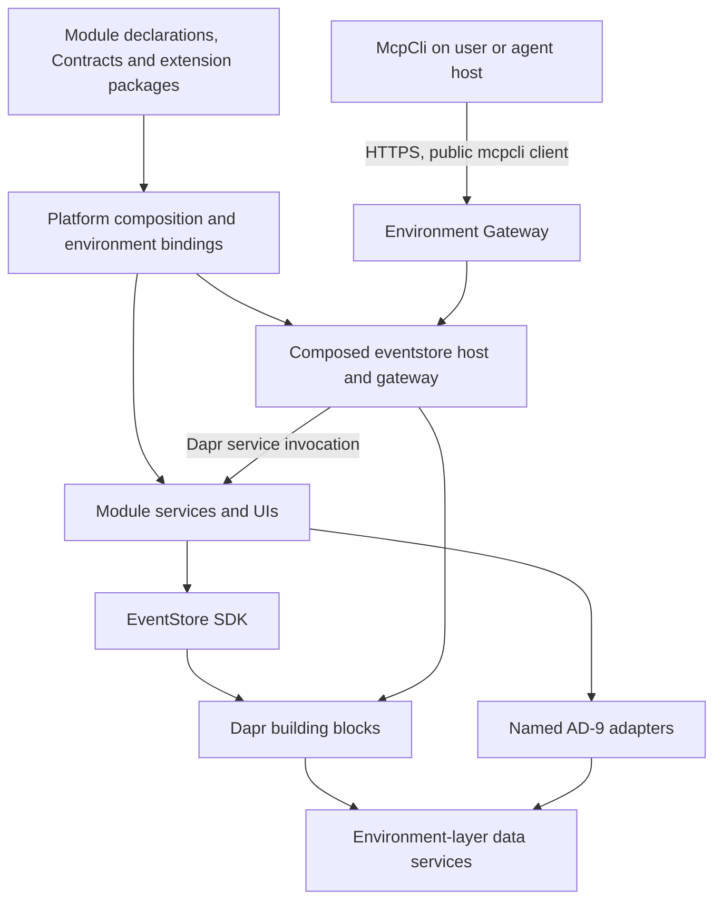
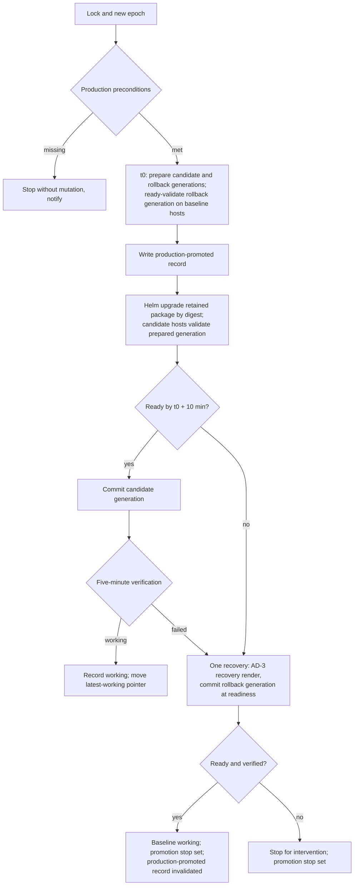
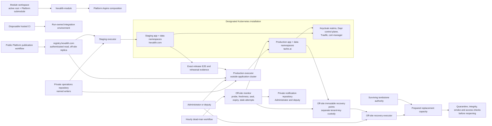
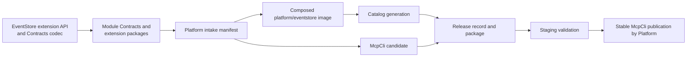

# Architecture Spine — Hexalith Platform

## Design Paradigm

**Modular composition root over event-driven domain services.** Platform composes environments and their operational policies. Technical modules own reusable runtime capabilities; domain modules own contracts, behavior, projections, authorization policy and service-specific readiness. Event-sourced aggregate mutation uses the EventStore SDK. Platform implements no domain behavior and no second orchestration framework.

The MVP covers EventStore, Tenants, Parties, Folders, Projects, McpCli and Memories plus their declared supporting capabilities. **Technical modules:** EventStore, Memories, Commons, Builds, FrontComposer, PolymorphicSerializations. **Domain modules:** Tenants, Parties, Folders, Projects and later domain modules. **Tool:** McpCli. A domain module's minimum composition is EventStore, Tenants, Memories and the servers its declaration's enabled server list specifies; source or package mode follows AD-4. Domain modules keep domain UIs, thin SDK hosts and EventStore extension packages; they own no AppHost, Aspire or ServiceDefaults infrastructure, and existing ones follow Migration and coexistence. Technical modules may own reusable hosting capabilities.

**Roles.** **Administrator** is the production authority, recovery owner and Platform architecture owner; only Administrator approves releases, clears the promotion stop and administers production admission. The named **recovery deputy** receives every deployment-failure, recovery, backup and monitor notification, holds independent recovery and key access, and may execute documented recovery, verify restoration and reopen service, whether or not Administrator is available. **Named writers** of the operations repository are Administrator and the second Hexalith organization owner.

**Terms.** An unprefixed AD-n is this spine's; other modules' decisions carry their module name (EventStore AD-11). PRD glossary terms apply, including G1–G3 (Production entry gates), SM-n success measures and response coverage. The **Platform tool** and **runner** are Builds' `hexalith-module`. **Mode** is source (local, Debug) or package (CI, Release). The **application package**, **environment layer** and **shared infrastructure** are defined in Release tiers; **attempt**, **lock** and **epoch** in Attempt ownership; the **rollback set** and **rollback generation** in AD-15. Binding classes, record kinds and the **working baseline** are defined in Binding classes and records; the lifecycle states evidence-validated, release-available and production-promoted are EventStore AD-11's. The **gateway** is the composed `eventstore` host's authenticated endpoint; a **Gateway** is an environment's Gateway API object. **CI** means module and Platform test workflows, never the publication workflow. The Builds package "release record" is distinct from this spine's release record.

This document fixes the target consistency contract; its status does not establish deployed capability or production qualification. Decision history, rationale and observations live in [.memlog.md](.memlog.md).

Arrows show calls or dependency direction. Module-owned presentation and read transports, such as the Tenants BFF REST reads, remain valid.

## Invariants & Rules

### AD-1 — Modular composition root [ADOPTED, AMENDED]

- **Binds:** enrollment, local/hosted topology, chart generation; FR-1–FR-4, FR-10.
- **Prevents:** divergent application graphs, per-module Dapr plumbing and a second deployment definition.
- **Rule:**
  - *Model:* Platform owns one Aspire application model consuming module declarations through ordinary C# helpers. Environments select modules and bind source or package artifacts and infrastructure. The Platform tool launches this model; no other AppHost composes multi-module environments. Kubernetes runs hosted workloads; no AppHost runs in production.
  - *Chart:* One shared Platform helper adds Dapr sidecar annotations and Pod Security-compliant security contexts to the generated application chart and emits HTTPRoutes with a namespaced parent reference to the environment's Gateway; the chart contains no Gateway. Hosted data services become non-secret parameters carrying only endpoints, never Aspire connection-string resources, which are always secret; credentials resolve through Dapr secret stores or component `secretKeyRef`, and the rendered chart contains no Secret object.
  - *Dapr resources:* Rendered from the canonical profile and declarations and placed per Release tiers.
  - *Single definition:* In staging and production the retained Platform package is the only deployment definition of enrolled workloads; module deploy assets are declaration or conformance inputs, and neither they nor legacy deployments are ever a second writer.
  - *Fallback:* If export needs per-module Dapr hand-modelling, a custom compiler, recurring generated-file patches or a duplicate full topology, switch to the small maintained Helm-chart fallback with parity checks.

### AD-2 — Retained release artifacts [ADOPTED, AMENDED]

- **Binds:** publication, staging, promotion, rollback; FR-6–FR-8, NFR-1.
- **Prevents:** testing one release and deploying, rolling back to or recovering another.
- **Rule:**
  - *Package:* The publication workflow publishes one immutable application Helm package identified by its OCI manifest digest, plus immutable image digests including the composed `platform/eventstore` image, to the retained-artifact registry.
  - *Record:* The release record binds every release-invariant value — module artifacts and image digests, composed-host identity, catalog route-content digest, the stable McpCli package hash, profile template digest, qualified environment-layer and shared sets, Dapr sidecar patch, realm-contract version, module change classifications and check-suite digests — each linked to its evidence.
  - *Promotion:* Promote the same package and images; executors `helm upgrade` the retained package by digest and never regenerate it with `aspire publish` or `aspire deploy`. Deploy accepts artifacts only with matching provenance and records only from their writers (Binding classes and records).
  - *Retention:* Packages, digests, records and evidence are copied off the primary failure domain and retained for the backup retention period or their life as a rollback target, whichever is longer; in-cluster Helm history is never the record.

### AD-3 — Application release ownership boundary [ADOPTED, AMENDED]

- **Binds:** rollout and rollback mechanics, release tiers, persistent state; FR-8–FR-10, NFR-1/NFR-3.
- **Prevents:** an application rollback rewinding data, credentials, data-service versions or infrastructure administration.
- **Rule:**
  - *Tiers:* Every deployed object belongs to exactly one tier in Release tiers, with one version authority; application rollback touches only the application-package tier. Persistent objects survive package removal. Every environment-layer or shared input a release needs is applied forward-only and verified before the attempt, expand-only per AD-15.
  - *Recovery render:* Application recovery renders the prepared AD-15 rollback set through a Helm upgrade and commits its rollback generation at readiness. Helm `--rollback-on-failure`, `helm rollback` and any controller-driven rollback are forbidden; the only automatic recovery is the one in Automatic recovery.
  - *Changed workload:* A workload counts as changed when any release-owned rendered object digest differs or a catalog generation was committed.
  - *Compatibility:* Previous code must read current schemas, events and security state (breaking per Module intake); key generations and durable authority never rewind.

### AD-4 — One active-root source identity [ADOPTED, AMENDED]

- **Binds:** source resolution, build and launch, Platform identity; FR-2/FR-3.
- **Prevents:** debugging one checkout while executing another, or silently substituting packages, catalogs or Platform versions.
- **Rule:**
  - *Mapping:* Resolve the active workspace root once, then its active module and only its directly declared dependencies into one mapping consumed by build and launch. The tool initializes only the active root's direct `references/*` submodules, never recursively, and fails naming any initialized nested submodule. A source and a package copy of one identity fail the build.
  - *Source mode:* Root-declared Hexalith dependencies build from source in Debug; every other dependency resolves through the mapping as a NuGet package or released image at the Builds catalog version, which is never a fallback for a root-declared one. EventStore, Memories and McpCli are root-declared in Platform and are built, launched, debugged and qualified as Platform evidence only from the Platform workspace; a technical module's own workspace supports own-repository tests only.
  - *Package mode:* Outside the Platform repository the tool builds the Platform composition from the Platform submodule at a Platform release tag; in the Platform repository it builds from HEAD. The module under test builds in Release against NuGet library packages at the Builds catalog version; dependency services run from their released images at the catalog version, the same images staging runs; the composed host assembles from the server and extension packages.
  - *Mode selection:* The Platform tool, pinned in the workspace's `.config/dotnet-tools.json`, alone sets the single mode property; file existence never selects a mode. Missing required source fails with the named dependency and path; no ancestor, sibling, recursive, nested-Platform or package fallback.
  - *Platform identity:* Every workspace other than the Platform repository that runs the tool declares `references/Hexalith.Platform` directly, and its submodule commit is the single Platform identity; in the Platform repository the identity is its HEAD. The identity pins the Builds catalog commit and a supported Platform-tool version range. In package mode the tool refuses a composition commit that differs from the submodule HEAD, a Builds submodule that differs from the pinned catalog, or a tool outside the range; source mode warns, and an untagged or dirty submodule is allowed only in source mode.

### AD-5 — Runner-owned CI integration environments [ADOPTED, AMENDED]

- **Binds:** automated tests, artifacts and cleanup; FR-4/FR-5.
- **Prevents:** integration jobs sharing hosted data or credentials.
- **Rule:** Reuse Builds workflows on disposable Linux GitHub-hosted runners. Run isolated tests without Platform first, then real-service integration through the AD-10 runner in package mode as a blocking tier. CI never receives staging or production provider credentials; its only retained-registry access is a read-only pull credential. Staging Kubernetes E2E remains a separate mandatory gate.

### AD-6 — Environment-specific identity realms [ADOPTED, AMENDED]

- **Binds:** users, workloads, realm configuration and administration; FR-10–FR-12, NFR-3.
- **Prevents:** staging credentials, membership or admin authority becoming production authority, agent tokens carrying identity administration, and realm drift between environments.
- **Rule:**
  - *Realms:* Separate staging and production application realms on the existing Keycloak server. Local, CI, staging and production realms are generated from one versioned, value-free realm contract. EventStore owns claim names and semantics. Platform owns the contract instance: the surface-class vocabulary and the AD-14 client-to-surface map, token-exchange permissions and preconditions, admission groups, admin- and user-event settings, refresh-token lifetimes and the synthetic tenant identifier. Modules declare required clients, audiences, roles and claims. The contract version is bound in the release record and applied forward-only before the attempt that needs it: in production by Administrator, in staging by the staging management client.
  - *Validation:* Each environment validates issuer, audiences, admission and module/tenant permissions through EventStore AD-10 JWT and fingerprint conformance and its separate EventStore AD-28 app-channel contract.
  - *Admission:* Production admission is membership in the human production-admission group, granted only by Administrator — never by default, self-registration, IdP mapping, first login, copied staging membership or promotion. Synthetic actors use the synthetic-admission group (Synthetic identities).
  - *Administration:* No automation, executor or fixture holds master or cross-realm admin; staging provisioning uses a staging-only management client. Production realm changes are Administrator-only, except that a recovery run by Administrator or the deputy restores the Keycloak database, re-applies recorded revocations and rotates keys and restored credentials; recovery never grants admission or roles. Identity-administration authority belongs to principals distinct from every application principal used with McpCli, UIs or agents; no application principal calls the Keycloak admin API. Realm clients disable full scope and map audiences and roles explicitly; agent-capable tokens never carry realm-management roles or the admin-API audience. The Keycloak admin API and console, the master realm and cluster consoles are reachable only from a declared Administrator path. Admin and user events are exported off-cluster within a declared bound.
  - *Authentication:* Every Administrator and deputy authority — GitHub, Keycloak administration, OpenBao, registry, DNS, backup store and custody — requires phishing-resistant MFA; sealed break-glass credentials alert on use. Public clients never receive `offline_access`; hosted refresh material has a bounded idle and maximum lifetime and lives only in the OS credential store.

### AD-7 — Isolated private-network executors [ADOPTED, AMENDED]

- **Binds:** staging deployment/E2E, production rollout, shared-infrastructure changes, in-place and replacement-capacity recovery; FR-6–FR-10.
- **Prevents:** module or test code running beside production authority, and repository events or storage writes reaching deployment credentials.
- **Rule:**
  - *Executors:* Staging and production each use a dedicated self-hosted Linux executor on a separate machine or VM with access to the designated Kubernetes API and verification endpoints; the production executor runs outside the application cluster and runs only production jobs. An off-site recovery executor runs only replacement-capacity recovery. No executor shares a host with a CI runner or another executor.
  - *Credentials:* Each executor obtains per-job credentials only for its own environment — the namespace-scoped application deploy identity, the separate environment-layer identity and its synthetic smoke clients — through GitHub OIDC claim checks or executor-held credentials, never with bind, escalate or impersonate. Only the production executor, for named shared-infrastructure workflows, also obtains a per-job cluster-scoped identity. No deployment credential is a repository secret.
  - *Module-code sandbox:* Module-supplied code that runs on an executor — smoke suites, E2E and fence hooks — runs in an isolated sandbox, a separate OS user or container, with no access to the job's credential material, workspace, job token or container runtime; it receives only short-lived synthetic-client tokens and the declared verification endpoint, except that a fence hook receives the custodian-released authority for its one surviving authority, destroyed at job end. Staging, test or PR code never runs on an executor that holds or held production credentials.
  - *Triggers:* Deployment workflows live in a private operations repository whose only writers are the named writers; the organization base repository permission is read or none. Its workflows run with read-only repository permissions, and no PAT, App or deploy key outside the named writers' devices can write it. Executors refuse jobs whose repository, workflow ref, ref or event is not on their allowlist, and act on an Administrator record only after verifying its signature.
  - *Operator-started recovery:* The production executor also accepts an in-place recovery started locally by Administrator or the deputy under their own MFA identity through an allowlisted recovery entry point. The recovery executor holds standing credentials only for the prepared capacity, its record-signing identity and write access to the attempt, lock and stop store, plus read-only access to recovery points and the off-site registry replica; custodians release key, decryption and synthetic-client material per job, destroyed at job end, and its credentials rotate after every drill and DR. It accepts replacement-capacity recovery started by Administrator or the deputy under their own MFA identity from a pinned off-site copy of the recovery workflows and environment definitions, needing neither operations-repository write nor GitHub. Restored artifacts and records are provenance-verified against attestations replicated with the off-site registry replica.

### AD-8 — Separate hosted application state by environment [ADOPTED, AMENDED]

- **Binds:** namespaces, data services, OpenBao, volumes, bindings, providers and pod isolation; FR-9/FR-10, NFR-2/NFR-3.
- **Prevents:** staging principals, pods, restores or maintenance reaching production data, secrets or keys.
- **Rule:**
  - *Namespaces:* Staging and production each have an application namespace and a separate data namespace holding their own data-service instances, OpenBao instance, persistent volumes, Gateway and listener Certificates. The environment-layer identity writes the data namespace plus Dapr Components, HTTPEndpoints, MCPServers and the named bootstrap Secrets in its application namespace. The application deploy identity holds none of these; it is secret-equivalent for its namespace, so it is per-job and never co-resident with module code.
  - *Volumes:* PersistentVolumes are created by the shared-infrastructure identity or by the storage provisioner through an environment-specific StorageClass; quotas deny each namespace the other environment's StorageClass, and no claim binds another environment's PersistentVolume.
  - *Principals:* Each environment has its own credentials, Dapr bindings and external-provider tenancy. Modules sharing an instance within an environment each use a least-privilege principal with no cross-module or instance-admin grant.
  - *Pods and network:* Namespaces enforce Pod Security `restricted` and default-deny ingress and egress NetworkPolicy on a CNI proven to enforce them. Production workloads get a higher PriorityClass; staging runs under quotas and limits.
  - *Dapr:* One trust domain per environment. Hosted Configurations deny by default, allow callers by trust domain, namespace and app ID, and disable HotReload; the Sentry-validated namespace is the enforced discriminator. WorkflowAccessPolicies match by app ID within the single-namespace workflow scope, and every workflow-hosting app has at least one scoped policy. Application-level caller allowlists key on namespace and app ID. The shared Dapr control plane grants staging no write access.
  - *Negative tests:* From staging users, workloads, credentials, automation identities and pods, prove denial across the NFR-3 matrix: production data services, secrets and OpenBao; app ports, sidecars, actors and workflows, including a staging app ID equal to a production one; volumes and PV binding; hostnames and certificates; identity administration, including the staging management client and staging admins against the production realm and McpCli tokens against the admin API; automation targets — production namespaces, environment-layer objects, registry writes, records, evidence, backup prefixes and the internal verification endpoint; restored copies; and revoked principals after every admission change.

### AD-9 — Dapr runtime boundary with named capability exceptions [ADOPTED, AMENDED]

- **Binds:** all application and technical modules, shared SDKs, adapters, component naming, subscriptions and dependency guards.
- **Prevents:** arbitrary provider coupling, unowned exceptions, hardcoded component names, duplicate subscriptions and custom Dapr components built only for uniformity.
- **Rule:**
  - *Default:* Use Dapr through established shared SDKs or provider-neutral contracts wherever it supplies the capability. Module-owned auxiliary records — read-model journals, certificates, progress, audits and mappings — may use Dapr state through module-owned stores when declared with a logical role and recovery class.
  - *Exceptions:* **Memories FalkorDB graph**, **Memories Redis search/vector indexes** and the **Memories SET NX preflight-dedup row**. Provider SDKs, native queries and connection details stay inside each named adapter boundary; all other coordination state, messaging, workflows and secrets use Dapr. Memories' remaining direct Redis coordination is transitional until G2 and does not block local or CI enrollment. No module builds a custom or pluggable Dapr component only to route a named exception through Dapr. A new exception names the missing capability, owner and surface, and needs Administrator acceptance recorded in this spine before the validator admits it.
  - *Component names:* Modules address components by logical role, and Platform binds every name through the configuration key the declaration names. A logical name may remain an option default for isolated module use, but no `const` or attribute literal names a component.
  - *Subscriptions:* In Platform compositions, subscriptions for declared topics are declarative Subscription objects that Platform renders from declarations with the bound component name and dead-letter policy; module code registers no programmatic or streaming subscription for a declared topic outside isolated module use.
  - *Scope:* This governs runtime infrastructure access, not native backup or operator tools or external OIDC, HTTPS and MCP protocols.

### AD-10 — Test environments have explicit run ownership [ADOPTED, AMENDED]

- **Binds:** Platform runner, fixtures, readiness, isolation and lifecycle; FR-4/FR-5.
- **Prevents:** two lifecycle owners, stale implicit reuse, lost debug evidence or cleanup of another environment.
- **Rule:**
  - *Owner:* Only the runner provisions, readiness-waits, records ownership of and cleans multi-module integration environments. EventStore.Testing(.Integration), module and McpCli tests consume its versioned environment descriptor and never start their own AppHost. A technical module's own-repository tests may start its AppHost through a non-exported fixture path; such runs are never Platform integration evidence.
  - *Default run:* A fresh run-owned environment per suite or compatible batch, with run-scoped ports, resources and catalog instance, or a fast failure naming the blocking run. Wait for required readiness and successful startup tasks within the finite deadline, then supply endpoints, composition identity and the synthetic tenant identifier.
  - *Outcome:* Local success cleans; local test or startup failures are retained and listable with owner and age; explicit cancellation cleans only that run; CI always cleans, including after partial startup. A run's first terminal outcome alone decides retention or cleanup.
  - *Attach and cleanup:* Explicit attach is allowed only to local or CI run-owned environments with compatible composition, mode, readiness and data isolation; attaching to hosted environments fails closed. Cleanup is idempotent, removes resources rather than only metadata, and reports leftovers; an incomplete cleanup is never recorded as complete, and a shared AppHost path alone is not ownership.

### AD-11 — One generic tool with environment-aware discovery [ADOPTED, AMENDED]

- **Binds:** module-operation enrollment, discovery, credentials, actor attribution, CLI/MCP routing and legacy MCP/CLI retirement; FR-12.
- **Prevents:** per-module forks and proprietary module MCP/CLI surfaces, discovery advertising operations the selected environment cannot run, tokens reaching the wrong environment and spoofed actors.
- **Rule:**
  - *Tool:* Ship one versioned `Hexalith.McpCli` with statically enrolled module Contracts and a common CLI/MCP core. The publication workflow builds each release's McpCli from its intake Contracts and alone publishes stable `Hexalith.McpCli` versions, only after staging validation, versioned by McpCli base and Platform release and never reusing a version. McpCli's own pipeline publishes stable `Hexalith.McpCli.Abstractions` and only prerelease tool versions; its first increment stays prerelease until the first Platform staging validation. In source and package modes the Platform tool builds a run-scoped, never-published McpCli whose Contracts resolve through the AD-4 mapping.
  - *Availability:* Offline contract inspection is distinct from availability. In connected mode an operation is executable only when the selected gateway's metadata endpoint serves it as executable with a matching contract-schema digest and a surface eligibility that admits McpCli, and current authorization permits it; McpCli uses the served eligibility, not its bundled copy. The gateway reauthorizes every call and never logs or persists bearer tokens.
  - *Profiles and actor:* A profile binds one environment's gateway, issuer, audience and token from a single source, with no mixing, environment fallback or implicit module enablement. Hosted access uses short-lived per-environment OIDC tokens sent only to their issuing gateway. Hosted McpCli derives the actor from the token and refuses actor values from flags, environment or profiles; the gateway rejects a Contracts-declared actor property that differs from the token subject or, for an AD-14 asynchronous step, the attested original actor.
  - *Scope:* This rule governs module-operation access surfaces: commands, queries and administration of module capabilities. The Platform tool, `hexalith-evidence`, build, qualification, validation and deployment tooling, and recovery hooks invoked only through the recovery hook contract are outside it. McpCli stdio is the only MVP MCP surface.
  - *Legacy surfaces:* Proprietary module and technical-module MCP hosts, plug-ins and CLIs, including `Hexalith.EventStore.Admin.Cli` and `.Admin.Mcp`, are obsolete migration sources, frozen with no new operations. They are not enrolled, deployed, routed, mapped in an enrolled host or issued a realm client in any Platform composition; declaration validation rejects an enrolled host that maps an MCP endpoint. Temporary compatibility use happens only outside every Platform composition, under a named migration record and removal gate. Retire a source only after its owner-approved operation inventory, a McpCli replacement or approved withdrawal, AD-14 authorization, audit, structured-output and exit-code parity, compatibility and acceptance evidence, and any applicable EventStore AD-22 consumer-removal authority.
  - *New surfaces:* No module-owned or other proprietary Hexalith MCP/CLI host is admitted, and Platform publishes no other such surface. A new McpCli surface or transport, including McpCli HTTP and non-gateway or infrastructure-admin capabilities, needs a Platform AD admitting it under AD-14 with its surface class, Keycloak client, exposure and realm entries. Until then EventStore Admin.Server and Admin.UI remain a confidential UI surface, and confirmation-required admin operations move to a confidential UI or are withdrawn.

### AD-12 — Independent backups and prepared replacement capacity [ADOPTED, AMENDED]

- **Binds:** recovery inventory, backup classes, key custody, unseal and disaster execution; FR-9, NFR-2.
- **Prevents:** raw volume copies, application rollback, unspecified hardware or key-bearing backups being treated as complete or erasure-safe recovery.
- **Rule:**
  - *Model:* Maintain one active production environment. Restore compatible retained applications and configuration plus module-approved recovery sets onto identified prepared replacement capacity, including shared dependencies, independently available operator and decryption access, artifacts and failure reporting. Platform owns the exercised Disaster recovery sequence, run by the AD-7 recovery executor; modules own state classes, recovery hooks, boundaries, reconciliation and integrity checks. Recovery units use native database backup or module-allowlisted file and metadata backup; a raw volume or snapshot copy never counts toward a recovery point.
  - *Key custody:* Tenant keys live in a named tenant-key store excluded from ordinary OpenBao snapshots and backed up as a separate custody class, never held with ciphertext backups. Erasure makes every earlier key backup unusable for the erased tenant while a fresh key backup keeps others recoverable.
  - *Unseal:* Administrator and the deputy are the unseal and recovery-key custodians and unseal each environment's OpenBao manually within declared coverage. Custodian use of unseal or root material alerts, and any root token is revoked at recovery end.

### AD-13 — Platform-composed shared EventStore host [ADOPTED, AMENDED]

- **Binds:** the `eventstore` app and image, module EventStore extensions, catalog generation and release identity; FR-1, FR-6–FR-8, FR-12.
- **Prevents:** competing module-built `eventstore` images, a generic host missing module semantics, and composed images without release authority.
- **Rule:**
  - *One host:* Each environment runs exactly one `eventstore` app, which is the gateway, composed by Platform from the EventStore server plus zero or more enrolled modules' extension packages — idempotency-intent adapters, trusted-command and coordination policies — against an EventStore-owned versioned extension API. Source and package modes assemble it through the AD-4 mapping; hosted environments run the Platform-published image `platform/eventstore`.
  - *Extensions:* Extension packages implement only the extension API, declare no Dapr roles, and neither reference a provider SDK or Dapr client nor declare a secret, except that a named AD-9 exception may reference its provider SDK and declare its own least-privilege secret. Their configuration inputs are declaration fields. The server declares its supported extension-API majors (current and previous); the build fails naming any module outside them or registering a duplicate. Modules never publish web projects or images named `eventstore`.
  - *Lifecycle subjects:* The server package carries EventStore-issued evidence-validated and release-available records. The composed image is a Platform subject whose release-available and production-promoted records are Platform-issued and bind the release-available server package and extension digests.

### AD-14 — Authenticated client is the calling surface [ADOPTED, AMENDED]

- **Binds:** Keycloak clients, host and gateway authorization, surface eligibility, actor/workload checks, cross-module calls; FR-11/FR-12, NFR-3.
- **Prevents:** surface restrictions resting on caller-asserted identity, agent-held tokens executing UI-only or confirmation-required operations directly or through a cross-module hop, and cross-module calls losing or forging the original actor.
- **Rule:**
  - *Classes:* The realm contract's surface classes are `ui` (confidential; admits agent-eligible, UI-only and confirmation-required operations), `agent` (public; admits agent-eligible operations) and `service` (confidential; admits agent-eligible operations, plus a downstream confirmation-required step that consumes the originating confirmation). No class executes step-up operations in the MVP.
  - *Surface:* Each calling surface is a distinct Keycloak client per environment, mapped to exactly one surface class. Every externally reachable host that accepts bearer tokens derives the surface from the authenticated client (`azp`) through that map, or accepts only tokens audienced to its own confidential client; never from caller-set headers or parameters.
  - *Client types:* `ui` clients are confidential server-side clients without loopback or wildcard redirects, and their tokens never leave their server. Public clients such as McpCli are `agent`. McpCli's CLI and MCP heads form one surface.
  - *Actor and workload:* The actor is the token subject; the workload is the authenticated client or, in server-to-server calls, the calling module's client or sidecar-attested app ID. Every server-to-server step carries a user actor; a module service client's own subject is never the actor of another module's operation and holds no tenant membership. Raw user-token forwarding is forbidden.
  - *Chains:* Synchronous steps carry the user through Keycloak standard token exchange by the calling module's confidential client, permitted per requester and target-audience pair and downscoped to the target's declared operations. Asynchronous task steps use the original actor attested by EventStore at admission, are authorized only for operations bound to that task, and re-check that actor's current admission against EventStore's admission projection, failing closed when unknown, stale or revoked. A server-to-server step's effective surface is the originating request's surface, attested by EventStore with the actor and carried in the exchanged or asynchronous context; a chain's effective surface is its most restrictive class, and a chain that starts outside EventStore admission has the `service` class. Until EventStore ships the attestation, service clients may call only agent-eligible operations.
  - *Negative tests:* For each client in the surface map, prove its tokens are denied operations outside its class, directly and through one cross-module hop.

### AD-15 — Expand/contract rollback sets [ADOPTED, AMENDED]

- **Binds:** catalog generations, idempotency and key generations, secret retirement, forward-only inputs, automatic rollback; FR-8, NFR-1.
- **Prevents:** a committed release making its predecessor unrestorable through retired or non-recommittable catalog, key, secret, realm, routing or component state.
- **Rule:**
  - *Rollback set:* Unless an Administrator-approved release names a separately planned recovery, record the rollback set before production rollout — the working baseline's package with environment-current values plus the rollback generation — and have it prepared and ready-validated under the EventStore catalog protocol.
  - *Rollback generation:* A forward catalog generation holding the baseline's routes plus every idempotency and key entry of the environment's currently committed and candidate generations, fixed at preparation and using the baseline's catalog-codec version. Entries whose adapter or descriptor version the baseline host lacks, including candidate-only ones, are non-executable retention entries it must tolerate.
  - *Expand-only:* Until the candidate is recorded working, every forward-only input stays expand-only relative to the working baseline and the rollback set: catalog commits; key, secret and catalog-entry retirement; realm-contract clients, roles, audiences and claims; client-to-surface map entries; token-exchange permissions and preconditions; admission groups and synthetic clients; environment-layer Components, HTTPEndpoints and MCPServers with their names, scopes and metadata; Gateway listeners with their hostnames and certificates; secret-contract entries; and the Memories operator artifact. Contraction happens in a later attempt.
  - *Rehearsal:* Staging rehearses the rollback set (Staging gate); adapter and descriptor changes are classified per Module intake.

## Consistency Conventions

| Concern | Binding convention |
| --- | --- |
| Module declaration | Platform owns the declaration semantics and validator behavior; Builds implements them in `hexalith-module`'s manifest schema. The current `hexalith.module-manifest.v1`, identified by its `schema` value, lacks most of these fields, so the Platform declaration ships as its next major. Each module owns its instance; Platform accepts the current and previous Platform declaration major, starting with the first major that carries these fields, and never accepts v1 for enrollment. Missing, duplicate or incompatible declarations fail validation. **Identity:** stable module, app and resource identities; enabled server list. **Runtime:** Dapr capabilities by logical role, each with its recovery class (authoritative-restore, rebuild-only, live-authority-only) and the configuration key through which the module reads its bound component name; extension packages and their configuration inputs; resource requests, limits, replicas (default 1) and volume needs. **Surfaces:** logical interface names and route prefixes, each with exposure class (public, internal-only, disabled) and required surface class and authorization; inbound callers and operations. **Integration:** topics with dead-letter policy; logical secrets and dynamic secret namespaces; identity needs; external egress destinations; external providers needing per-environment tenancy; external-effect and destructive-retention workers with their disable control. **Lifecycle:** readiness and startup tasks with lifecycle scope and authority class; recovery hooks, fence hooks and whether reopening waits for rebuild-only replay; startup override with its justification; critical flows and smoke suites with the surface each exercises; change classification; recovery inventory. Platform assigns component names, namespaces, FQDNs and scopes. Module-authoritative files such as the Parties ACL file become declaration sources. |
| Startup task lifecycle | Scopes: per-start verify (idempotent), once-per-environment creation, recovery (run in declared-dependency order), operator-only. Creation tasks run once per module per environment — when the environment is created or the module is first enrolled into it — never on upgrade, rollback, restore or replacement-capacity recovery, and succeed idempotently against data objects that survived a removed first enrollment. Population- or authority-creating tasks are operator-only in hosted environments. |
| Module intake | Module releases enter through a versioned intake manifest in the Platform repository pinning package and image digests, each module's image-attestation identity and its release-evidence references. **Breaking** has one definition: a module release is breaking when its predecessor cannot read the state, events and security state it writes, when the baseline host cannot tolerate its adapter or descriptor changes, or when its staging rehearsal fails; otherwise it is additive, or none when no release-owned object changed. A candidate's effective classification is the maximum over every module release between production's working baseline and the candidate; the manifest keeps that chain and names the working baseline it was computed against. |
| Binding classes and records | **Release-invariant** values live in the release record and are identical in every environment. **Environment-current** values are read from the target environment at deploy and rollback and passed as chart values: secret references and scopes, key and catalog generations with root digest, secret-contract digest, applied realm-contract version, active profile digest, hostnames and credential references. **Attempt-bound** values — the environment-current values used, lock epoch, t0, deadlines, grace and outcome — live in the attempt record; readiness compares attempt-bound digests. **Records and writers**, each accepted only when signed by its writer, never by store access: the *release record* by the publication workflow, held with the package; *attempt records*, one per attempt and immutable once terminal, by the environment's executor, the production executor for in-place recovery or the recovery executor for replacement-capacity DR, kept with the lock and epoch in one named CAS-capable store outside the target cluster and executor hosts; *qualification records*, which extend one release's qualified environment-layer and shared sets for one environment, and the *production-promoted record*, by the attempt that issues them; the composed image's *release-available record* by the publication workflow after staging validation; the *latest-working pointer*, moved only by the writer of a working terminal attempt of that environment with a higher epoch; *promotion-stop* set records by any executor, the off-site monitor, Administrator or the deputy, and clear records only as Administrator records; *Administrator records*, signed by an Administrator-held identity that no executor, workflow token, monitor or deputy holds. *Lifecycle records* follow EventStore AD-11. The **working baseline** is the release record plus the attempt record the latest-working pointer names. |
| Catalogs | EventStore.Contracts owns the routing schema, codec and surface-eligibility vocabulary (agent-eligible, UI-only, confirmation-required, step-up). One deterministic Platform generator produces each composition's generations from enrolled declarations and Contracts plus the idempotency and key entries of the environment's currently committed generation, which persist as non-executable retention entries until a later contraction attempt retires them under EventStore's retirement rule. Each route entry carries the operation's contract-schema digest and surface eligibility, both covered by that digest. The committed `deploy/dapr/eventstore-routing-catalog.json` holds the hosted instance; local and CI instances are run-scoped and named in the environment descriptor. The gateway enforces eligibility from the active generation; its metadata endpoint serves eligibility and lists only executable entries. No second hand-maintained operation catalog. Activation in every environment: prepare the candidate and rollback generations; ready-validate the rollback generation on the running baseline hosts; Helm upgrade, with candidate hosts validating their prepared generation; commit at readiness; verify. Recovery commits the rollback generation. |
| Domain truth and delivery | The EventStore SDK owns domain mutation and projection mechanics; modules own semantics. Preserve at-least-once unordered delivery, message identity, deduplication, sequence gaps, durable poison capture and replay. No second outbox or event ledger; database backup alone does not recover broker backlog. |
| Secrets | Follow EventStore AD-24: Dapr `secretstores.hashicorp.vault` against the environment's OpenBao. Per-app tokens are mounted per pod; Dapr reads a token once at sidecar start, so tokens are renewed outside Dapr and a rotation restarts the pod. Tokens and any Kubernetes Secrets are documented bootstrap exceptions. The value-free `deploy/dapr/openbao-secret-contract.yaml` carries an environment dimension, static entries and module-owned dynamic namespaces such as Memories per-tenant credentials, whose only writer is the owning module. Platform owns scopes and acknowledged rotations. Administrator holds the Memories operator role, which recovery runs by the deputy also exercise, and Platform renders its operator artifact. Required generations gate readiness. |
| Data protection | Hosted volumes on the node and on prepared capacity use node-level volume encryption with keys under Administrator and deputy custody. Data-service connections use TLS where the provider supports it natively, including CloudNativePG PostgreSQL; other in-transit traffic stays inside the environment's data namespace under default-deny NetworkPolicy. |
| Production profile | The EventStore-ratified template — runtime and Dapr minor, component types and versions, sidecar mode, ACL and resiliency shape — changes only through EventStore AD-26. The profile inventory pins providers and topology for the environment layer and shared infrastructure (Release tiers), including the Dapr control plane with sidecar drop-all-capabilities enabled, and separately pins the deploy toolchain. The profile digest covers the template plus those pins; it excludes the remaining environment-current values and all release-invariant values. Staging runs the same template, differing only in declared environment bindings. **Qualification:** a staging attempt that passes a release at the current staging digest issues its staging qualification record; a production release attempt issues the release's production qualification record with its production-promoted record; an environment-layer or shared change's attempt in each environment re-verifies that environment's working release and issues its qualification record, and in production also renews the production-promoted record at the new digest; no release attempt passes precondition 6 until both exist. A deployed release, and a rollback target, stays valid in an environment only while current versions fall within its effective qualified sets (release record plus that environment's qualification records) and, in production, its production-promoted record is valid for the active profile digest; a candidate's production qualification and production-promoted records are issued by its production release attempt. **Dapr skew:** workloads pin the release's sidecar patch; within the template's Dapr minor, a release stays usable after a control-plane patch change once re-verified and qualified at the new patch; a Dapr minor change is breaking for releases pinned to the previous minor; local runs report their patch and warn on mismatch. Inventory pins stay within upstream support and current on security patches, checked at each production attempt and monthly drill; every time-bound certificate, credential, token and domain registration has a named renewal owner. Local allow-defaults never feed the profile. |
| Workflows and provenance | The **publication workflow** runs in the public Platform repository on disposable hosted runners through SHA-pinned Builds reusable workflows. It builds and attests the application package, composed image and McpCli, verifies the intake-pinned module image attestations and writes the release record. **Deployment workflows** (AD-7) only verify and deploy. The provenance predicate is the signer workflow and digest, the source repository and protected ref, and a Build Config URI equal to the publication workflow path; module images carry attestations naming the module repository, workflow, protected ref and pinned Builds workflow ref, recorded per module in the intake manifest. The full `uses:` closure of publication and deployment workflows is SHA- or digest-pinned and checked by the Builds governed closure. Platform `main` carries a repository ruleset — pull request required with code-owner review, no force-push or deletion, Administrator-only bypass — and CODEOWNERS assigns `.github/workflows/**` and `.github/CODEOWNERS` to Administrator; release tags carry a tag ruleset forbidding update and deletion, with creation only by the publication workflow or Administrator; Builds bypass is Administrator-only. Retained artifacts live in `registry.hexalith.com` with anonymous read disabled and per-environment pull credentials, plus an off-site replica with a separate writer. Every writer to a retained repository holds create without update or delete, and registry garbage collection and retention never remove a retained digest; `registry.tache.ai` is not a retained-artifact store. |
| Local tool and readiness | The Platform tool, pinned in `.config/dotnet-tools.json`, provides stable run, down, test and debug commands. The default startup deadline is 10 minutes from environment request; the active module's declared finite override applies, with its justification, the complete environment uses the largest declared override, which is reported as an override, and the effective value appears in diagnostics. Record actual startup duration, readiness and effective deadline. A required resource without a usable readiness declaration is a configuration error; process-running is not readiness. A definite startup failure may stop early; a timeout names unready resources and preserves diagnostics. |
| Hosted interfaces | Staging uses `hexalith.com` and production `tache.ai`, on the designated `192.168.1.30` installation. Platform maps declared public-class interfaces to FQDNs by one pattern and derives redirect URIs, origins and gateway URLs; internal-only and disabled interfaces are neither routed nor advertised, and no module artifact contains an environment FQDN. **Gateway:** each environment's Gateway, Gateway API on Traefik, and its listener Certificates live in that environment's data namespace and are written only by its environment-layer identity. Listeners carry only that environment's exact FQDNs, never wildcards over a zone holding shared names; the HTTPS listener admits routes only from the environment's application namespace, and the port-80 listener also admits ACME solver routes from the Gateway's own namespace. User-ingress admission — open, or executor and probe sources only — is environment-layer state on the Gateway, changed only within an attempt. **Routes:** application namespaces hold only HTTPRoutes that set nothing but hostnames, a parent reference to their environment's Gateway, path matches and same-namespace backends, with no filters or extension references; the application deploy identity cannot create Ingress, `traefik.io` or `hub.traefik.io` objects. Platform never renders on the shared `nginx-public` compatibility class; existing shared Ingresses stay there only until migrated to Gateway API as shared-infrastructure changes. **Names and certificates:** shared-infrastructure and production-trust names are reserved in the FQDN pattern; the release validator and admission reject any staging listener, route, Certificate or CertificateRequest that names a reserved or out-of-pattern host or references a ClusterIssuer. Staging Certificates reference only the staging HTTP-01 Issuer, and staging holds no DNS-01 credential. The production realm issuer uses a production-controlled name. Each DNS zone has one named owner. Ingress terminates TLS and routes to the gateway or module UIs but makes no authorization decision, and no external caller bypasses ingress to reach pods. Executors verify through a declared internal endpoint with the same authentication. |
| Synthetic identities | Platform owns one synthetic tenant identifier per environment, published in the environment descriptor and realm-contract instance and attested by EventStore on admitted events; modules exclude that tenant from real-tenant views and aggregates by the identifier. Tenants owns the synthetic tenant aggregate through one idempotent creation task keyed by that identifier: once per environment locally and in CI, operator-only in hosted environments. Per surface class, synthetic actor and workload clients are flagged in their tokens and carry no admin or cross-tenant grant. Synthetic actors are admitted only through a standing, Administrator-granted synthetic-admission group limited to the synthetic tenant, except the G1 SM-4 temporary grant; the gateway never treats a synthetic flag as admission. Administrator provisions production synthetic credentials, held only by the production executor, and by the recovery executor for one DR job, and rotated through an Administrator attempt or a DR run. Confirmation-required flows are tested only through their UI surface. Production smoke suites never create or delete tenants; staging E2E suites may create and delete only run-scoped tenants carrying the synthetic exclusion marker within a module-declared tenant-lifecycle critical flow; run-owned local and CI environments are exempt. Smoke writes use only synthetic identities and data, without external effects. |
| Diagnostics and notification | Use shared technical-module health and telemetry. Telemetry sinks are per environment, or partitioned so production data is readable only by production principals; Platform renders exporter configuration and egress, and modules never declare the sink. Attempt-window diagnostics and the production telemetry needed for incident analysis ship outside the primary failure domain with a declared minimum retention. Bind evidence to run or release, environment, artifacts and effective configuration; preserve classified, redacted diagnostics after cleanup. Deployment logs and artifacts are private; notifications carry environment, release identity, outcome status and opaque references to access-controlled evidence. GitHub issues in a private notification repository with the operations repository's writer set, raised through an issues-only credential, assigned to Administrator and mentioning the recovery deputy, are the single accepted notification path. The off-site monitor runs the availability probe and the recovery-point, event-export, stale-attempt, seal-state, volume-headroom and expiry checks, warning a declared lead time before each expiry and listing upcoming expiries at every drill. An hourly dead-man workflow in the notification repository, on an off-hour minute, alerts when the monitor's heartbeat is stale, and the monitor alerts when the dead-man run is stale beyond two scheduled intervals. Domain audits remain module-owned data. |
| Migration and coexistence | Builds.Module.AppHost launches the AD-1 model rather than composing its own, and Builds.Module.UiHost is a run-scoped runner host, never a hosted workload. Domain-module AppHosts are frozen, with no new cross-module wiring, until retirement; new hosting helpers are refused until the canonical ServiceDefaults and Aspire Dapr package set is recorded here. FrontComposer.AppHost is sample-only. Agents EXT-HOST-1 and the Works lane enroll through the same schema; this spine's ownership split supersedes Works AD-20. Adopt producers before retiring consumers; retire legacy hosting only after the owning module's source, package and deployed parity evidence plus applicable EventStore AD-22 exact-subject consumer-removal authority. Legacy MCP/CLI sources retire under AD-11. |

### Release tiers

| Tier | Contents | Version authority | Change path | Rollback |
| --- | --- | --- | --- | --- |
| Application package | Workloads, services, HTTPRoutes, Dapr Configurations, WorkflowAccessPolicies, Subscriptions and Resiliency; composed and module images | Release record | Release attempt under the environment lock | AD-3 recovery render with the AD-15 rollback set |
| Environment layer, per environment | Data services, broker, OpenBao, tenant-key store, volumes, the Gateway and its Certificates, every Dapr Component, HTTPEndpoint and MCPServer, bootstrap Secrets | Profile inventory environment facet for providers and topology; qualification inputs such as Memories.Aspire digest sets | Its own attempt, staging first, applied forward-only by the environment-layer identity; a changed Component restarts every workload whose sidecar loads it, with the application deploy identity, before re-verification | Forward only; restore is DR |
| Shared infrastructure | Kubernetes minor and node OS, CNI, Traefik and Gateway API CRDs, cert-manager, storage provisioner, operators and other CRDs, Dapr control plane, Keycloak server and database | Profile inventory shared facet | Named shared-infrastructure workflow under both locks and one named change owner after a complete recovery point; from G1 rehearsed first in the monthly drill environment on prepared capacity, except an urgent security patch applied in place with an Administrator record; re-runs each environment's working-release smokes on that environment's executor, and the NFR-3 negative tests | Forward revert or DR entry; a failed verification is non-working, and a failed currency check blocks automatic promotion |
| Outside every release | Business data, backups, credential rotation, DNS zones, registry, executors, monitor, CI runners | Their owners | Owner procedures | None |

Environment-layer objects derived from declarations — Components with their names and scopes, HTTPEndpoints, MCPServers, Gateway listeners and bootstrap Secrets — are rendered from the union of the working baseline's and the candidate's release records and applied as the candidate's forward-only input by an environment-layer attempt that completes before the candidate's release attempt (precondition 6); DR and in-place recovery render them from the recovered release. Environment-layer and shared-infrastructure definitions — pinned upstream charts or manifests with values, the rendered environment-layer objects, the profile inventory, the realm-contract instance and the secret contract — live in the operations repository; each attempt records their digest, and the pinned off-site recovery copy carries them at every retained recovery point's configuration identity.

Keycloak is production-critical: staging has no backup or restore access to its server or database and no write access beyond the staging realm through the staging management client, staging realm recovery regenerates from the realm contract, and a whole-server restore is DR-class under both locks with revocation replay.

## Release and Recovery Acceptance

These policies inherit the [Platform PRD](../../prds/prd-platform-2026-09-27/prd.md); they are requirements, not measurements.

| Phase | Required behavior |
| --- | --- |
| Staging gate | Staging accepts candidates whose EventStore server package is evidence-validated. Each staging attempt first cuts a staging recovery point. One serialized attempt deploys production's working baseline, upgrades to the candidate, runs E2E, then rehearses the AD-15 rollback set with HotReload off, exercising at least one idempotent command new in the candidate and verifying that the baseline reads state and events the candidate wrote. When production has no working baseline, the attempt rehearses a fresh install plus the candidate. A failed rehearsal is breaking evidence, not a staging failure. Every enrolled module in the complete release, including unchanged modules, declares a non-empty critical-flow set with complete flow-to-test mappings; removing or remapping a critical flow needs module-owner review. All required E2E checks, including the McpCli candidate's flows, pass for the exact release. Results carry the serving release, the production working baseline they were computed against, and the suite, profile and configuration digests; evidence has a declared maximum age, and rerun evidence never hides an earlier failed or incomplete attempt. Missing, skipped, failed, incomplete, stale or wrong-release results block promotion. A staging failure blocks only that candidate. Staging catalog, key and secret retirements follow AD-15 relative to production's working baseline. |
| Staging reset | A candidate is not adopted once a later candidate's staging attempt starts without an Administrator record reserving it. When a later candidate's staging attempt is requested and an unadopted candidate's writes cannot be read by production's working baseline, staging first runs an in-place recovery as its own staging attempt, and the later candidate's attempt starts after it; the staging realm regenerates from the realm contract. Additive unadopted candidates need no reset. |
| Release modes | The production deployment workflow has two modes. **Automatic** requires G3 and complete compatibility evidence. **Administrator-approved** replaces only those two triggers with an Administrator record; it serves pre-G3 releases, SM-5 fault rehearsals before G2, empty or degraded production, and releases without demonstrated safe rollback. When compatibility evidence is missing, stale, wrong-baseline, failed or breaking, the record names, before the attempt, the separately planned recovery and its acceptance checks; the attempt starts only after a complete recovery point cut after the lock, and on a non-working outcome the executor sets the promotion stop, closes user ingress and stops; the named recovery then runs as an in-place recovery. The staging gate, lock, provenance, verification and records apply to both modes. |
| Empty or degraded production | When production has no working baseline, or its last outcome was non-working, the Administrator record for an attempt names the reason and lifts the promotion stop and precondition 8 for that attempt only; its terminal outcome re-sets the stop unless working. The staging gate then rehearses a fresh install plus the candidate, and the rollback set is "remove workloads, keep data". Any other manual change is an Administrator-approved attempt under the lock and epoch; an In-place recovery needs no Administrator record. Either becomes the working baseline only after passing verification. |
| In-place recovery | In production, Administrator or the deputy starts it on the production executor (AD-7) under a new epoch, with the promotion stop kept set; a staging reset runs it on the staging executor. It re-deploys the recorded working baseline after a failed, unverified or interrupted recovery, or runs DR steps 3–6 against the live environment, without fence, Keycloak restore or cutover, from a named recovery point: for an approved release's named recovery, the point cut after that release attempt's lock; for a staging reset, the point cut at the start of the unadopted candidate's attempt. Verification is the same as Automatic recovery; the result becomes the working baseline only after it passes. Replacement-capacity DR stays with the recovery executor. |
| Attempt ownership | One per-environment lock covers every workload-affecting change: release, rollback, configuration-only change, rotation rollout, catalog activation, environment-layer, profile, realm-contract or operator-artifact change, in-place recovery and DR restore. Shared-infrastructure changes hold both locks (Release tiers). The lock carries a monotonic epoch checked before every mutation. A production attempt runs from lock to terminal outcome in one job. Only an Administrator record, an In-place recovery or DR entry started by Administrator or the deputy, or a replacement job of the same workflow resuming the same attempt within the grace to perform its remaining single recovery, may take it over, incrementing the epoch. An executor dying during verification leaves the lock held and stops for intervention. The off-site monitor notifies when a record stays non-terminal past its recorded maximum lifetime. |
| Timing and interruption | Each attempt records t0 at its first mutation (catalog preparation), the rollout deadline t0 + 10 minutes, and one attempt grace no longer than the check timeout plus 30 seconds, used for in-flight retries, interruption detection and takeover; its maximum lifetime is derived from these and recorded. Timers never restart; an observation gap invalidates the window. A retry completing within the grace is the check's latest result. An interruption detected before the verification deadline plus the grace fails the attempt, which may still use its one recovery. Later detection, record/cluster disagreement, an unknown actual release or lock owner, or an unreadable record stops for intervention without mutation. Restarts never add a recovery. |
| Rollout | Write the Platform-issued production-promoted record, bound to the active profile digest, before the Helm upgrade; a non-working terminal outcome invalidates it under EventStore's invalidation rule. All required workloads reach the intended release and readiness by the rollout deadline. |
| Verification | Production runs only the immutable check-suite digests bound in the release record that passed staging, without source builds, in the module-code sandbox. After readiness, observe five minutes. Smoke checks have stable IDs and run at window start, then at a fixed cadence; a timeout is a failure, and results from another release count as missing. Sample unavailability at 10 seconds or less. The attempt fails when a required service cannot serve traffic for 60 continuous seconds, the same smoke check fails twice consecutively with the second attempt 30 seconds after the first failure, or a passing result is missing at the deadline. A single failed probe or restart alone does not fail it. The attempt is working only when readiness and the latest passing checks hold at window end; otherwise it is failed. Re-verify SM-4 access outcomes after access-configuration changes. |
| Automatic recovery | One recovery: the AD-3 recovery render, including partially changed workloads; readiness within 10 minutes, then the same verification with that release's checks. If no workload changed and no generation was committed, retain and report. A failed first deployment keeps ingress closed and stops; rolling back a first module enrollment removes workloads, never data objects. Never cycle through older releases. Report every deployment failure and recovery outcome, including success, to Administrator and the deputy. |
| Promotion stop | Set by every non-working terminal outcome, every recovery entry, a failed pre-update health check, a probe failure beyond a declared bound, a recorded incident, or an Administrator or deputy declaration. The off-site monitor may set it but never clear it, and setting it never triggers a release search. Only an Administrator record naming the reason and a verified current working release clears it, except as Empty or degraded production allows. Promotion stays suspended during any recovery. |
| Production entry gates | **G1:** Kubernetes on a supported minor; deployment into the production application namespace with ingress closed — production hostnames admit only executor and probe sources and the human production-admission group is empty; GitHub delivery works; the probe runs from G1 with pre-G2 notifications. After the G1 deployment and before G2, Administrator may temporarily add one designated synthetic test identity to the human production-admission group solely for SM-4 positive evidence; that identity holds production permissions limited to the synthetic tenant and is exercised only from executor and probe sources while ingress stays closed; the grant is recorded and its revocation followed by a denial check; drills use isolated identity copies; this does not open G2. **G2:** admit users and open ingress only after the AD-12 drill passes, including Memories tombstone and key continuity (Memories is in every MVP composition), SM-4 isolation and access checks pass, and recovery access, capacity, deputy alert delivery and response coverage are verified. **G3:** enable automatic promotion only after SM-5 rehearsals; a change to verification, recovery or rollback-set policy suspends automatic promotion until the affected SM-5 rehearsals repeat. |
| Backup coverage and cadence | Inventory module-authoritative databases, files and configuration and required shared services, including the Keycloak database with its event export and each environment's OpenBao, each with a recovery owner, a recovery class and, for every authority that survives a failure, a fence-and-reissue owner and procedure. A backup unit holds one recovery class; it may contain rebuild-only state only when its restore discards that state as the state's owner prescribes. Runs start every 30 minutes; keep frequent points seven days and daily points 30 days with complete chains. Copies are encrypted, restricted, immutable and off-site under per-environment-instance prefixes, with access and decryption material independent of the primary failure domain. Rotated key generations are retained at least as long as the data backups. |
| Recovery point and freshness | A usable recovery point is the set of inventory artifacts sharing one declared cut, with its compatible release and configuration identity and profile digest, the Memories register population and sequence, a tenant-key backup covering every key generation referenced at or before the cut, Keycloak event-export lag within its bound, and integrity verified when written — checksums, unbroken chains, test decryption with independent keys — recorded in off-site metadata. The monitor verifies tenant-key coverage without holding key material. Age is failure time minus cut. The off-site monitor checks at least every 15 minutes, reports the newest complete set, warns below one hour and notifies on job failure, age over one hour or event-export lag beyond its bound. Pruning skips points referenced by an open recovery. |
| Detection and response | The off-site probe checks production ingress and readiness every five minutes or less. The recovery procedure publishes response coverage with its time zone, primary and deputy responsibility and maximum acknowledgement time, before the first qualifying drill; deputy hours count toward coverage only after the G2 deputy proof. The four-hour RTO applies to outages beginning within coverage and stays applicable when coverage ends mid-incident; outside coverage no four-hour commitment is made. Every incident records the original outage time, actual response time, coverage status and full outage-to-verified-restoration duration; the clock never pauses or restarts. |
| Disaster recovery evidence | Administrator owns an isolated drill before G2, monthly repeats and repeats after material storage or backup changes or recovery-mechanism changes. The drill assumes the primary server and its storage are unavailable and applies the declared worst-case response. Detection time is the probe interval plus the measured probe-to-issue latency against a drill target. Each substitution — fence against drill-scoped copies, Keycloak restored into the drill or generated from the realm contract with the event export applied, DNS and certificate cutover, mirror copies — records a measured or bounded duration for the real step, added to the RTO; an unbounded substitution fails the RTO proof. Each module's declared wait for rebuild-only replay is timed at representative size. Each drill records recovered-data age, coverage status, full elapsed time and every substitution. Prove RPO at most one hour and outage-to-verified-service RTO at most four hours including capacity, transfer, replay and validation. Drills never mutate live production or shared authority; real fence steps are rehearsed on staging before G2. Drill restores are ephemeral and egress-denied, and drill and quarantine copies are erasure targets destroyed with verification within a stated bound. A real DR entry aborts any running drill and reclaims the prepared capacity. |
| Memories erasure continuity | Shared Redis/FalkorDB projections and tenant-keyed coordination have no operational backup-restore path; they rebuild through authoritative replay. A copied register is not live authority. Memories and EventStore must qualify the independently durable synchronous complete tombstone mirror and lineage protocol. No acknowledged tombstone may be lost and no erased key or tenant resurrected; unknown lineage fails closed. EventStore payload protection is required for Memories partitions captured in backups. |
| Lost window and external effects | Non-Memories erasures, deletions, legal holds and module-owned authorization revocations acknowledged after the recovery cut are an accepted RPO exception. The recovery runner records them in the DR report before reopening, and Administrator reviews them before clearing the promotion stop. Destructive retention and external-effect workers stay disabled until each owning module has restored and reconciled its external-operation state; never blindly repeat an unknown prior provider outcome. |
| After DR | The verified DR attempt record becomes the working baseline. Production then runs in a recorded reduced-recovery posture, which is not Empty or degraded production, until new prepared capacity is identified, a drill repeats as a material change and Administrator records the return to G2 conditions; the promotion stop stays set until staging is re-established. |

### Production preconditions

A production release attempt mutates nothing until all hold; a missing precondition stops without mutation and notifies.

1. The lock and a new epoch are held, and the promotion stop is clear.
2. The release-mode trigger is met (Release modes).
3. Provenance matches Workflows and provenance.
4. Exact-release staging evidence exists within its maximum age (Staging gate).
5. The EventStore server package and the composed `platform/eventstore` image are release-available.
6. Staging and production profile digests are equal; current environment-layer and shared versions fall within the release record's qualified sets, or within its staging qualification record at that equal digest; the production realm reports the required realm-contract version or a compatible later one; environment-layer inputs are applied and verified.
7. Every included module is enrolled for production with its production qualification evidence present, and has valid, non-empty readiness and smoke declarations.
8. Production is healthy: its working baseline is ready and its smoke suite passes now.
9. Compatibility evidence exists: effective change classification plus the staging rehearsal against production's working baseline with the prepared rollback set. Missing, stale, wrong-baseline, failed or breaking evidence routes the release to the Administrator-approved mode with a named planned recovery.

### Disaster recovery sequence

Replacement-capacity DR runs on the recovery executor, started by Administrator or the deputy; in-place recovery reuses steps 3–6.

1. **Fence.** Set the promotion stop. Each surviving authority's fence-and-reissue owner revokes the old environment instance's credentials there — off-site backup store, tombstone mirror, external providers, Keycloak event-export sink, registry, record store and tenant-key backup custody — module-owned authorities through a module fence hook run in the recovery executor's sandbox with custodian-released authority for that authority only, or a module-owned manual procedure, and Platform-owned authorities by Administrator or the deputy; prove the revoked credentials fail there. Keep the old node isolated from network and DNS until re-imaged. Disable external-effect and destructive retention workers.
2. **Environment.** Reproduce the environment layer and shared infrastructure on the prepared capacity from the off-site definitions at the digest recorded with the recovery point, or a later digest within the recovered release's effective sets. Administrator or the deputy restores the Keycloak database into quarantine under custody, DR-scoped, with the staging realm disabled; restore the environment OpenBao into quarantine. Deploy the recovery point's release from the off-site registry replica by digest after verifying its replicated provenance, with user ingress closed and workers disabled. Quarantine admits the recovery executor and the restored release's workloads.
3. **Keys.** Restore the tenant-key store and re-apply tombstone key destruction from the surviving tombstone mirror, read through its fence-and-reissue owner for this run.
4. **Data.** Restore data into quarantine. The recovery executor invokes each module's recovery hooks, which run as recovery-scope tasks inside the owning module's restored workload under its own least-privilege principals, through the recovery hook contract on a declared internal endpoint reachable only from the recovery executor, in declared-dependency order: admission and purge, backend-principal and dynamic-credential re-provisioning and rotation, then rebuild-only replay. Re-provision the broker and catch subscribers up from restored checkpoints.
5. **Credentials.** Rotate every restored credential and application signing key, except module-owned dynamic namespaces, which only the owning module's hook rotates in step 4. Rotate the restored synthetic clients' credentials under the run's DR-scoped realm rights, released to the recovery executor for that job only. Rotate realm signing keys unless the old issuer is proven unavailable; a compromise-driven restore rotates the Dapr trust root and realm signing keys without that exception. Each surviving authority's owner issues the replacement instance's credentials there. Re-apply admin and user revocations recorded after the cut, and prove old in-environment credentials fail against the restored instances.
6. **Verify.** Check compatible releases, cross-module integrity, restored-release smokes, SM-4 access outcomes, denial of revoked principals, and that new credentials work and old ones fail at every surviving authority; record the lost-window exceptions.
7. **Reopen.** Resume protection and monitoring, cut over DNS and certificates, hand fresh synthetic and deployment credentials to the production executor, re-provision its allowlist for the replacement capacity and record both in the DR attempt record, and report the lost window. Administrator or the deputy reopens; the promotion stop stays set.

## Source Precedence and Module Integration

The Platform MVP envelope — one-hour RPO, four-hour disaster RTO, 30-minute backup runs, seven-day frequent and 30-day daily retention, backup-restore onto prepared capacity, no HA or standby — governs the stricter infrastructure clauses of **Folders** (I-10, I-11, EXT-ES-RECOVERY) and **Projects** (AD-28 availability, RPO 0, service RTO beyond process restart and in-transit encryption beyond the Data protection row; G-1 durable task engine, outside the MVP), by explicit user authority. Neither blocks enrollment, and Projects AD-30 release gates may not demand Platform HA or RPO-0 evidence. Module behavior, authorization, data-safety and release gates are never waived. Platform measures availability without guaranteeing a percentage.

| Input | Platform-facing contract retained |
| --- | --- |
| [EventStore architecture](../../../../references/Hexalith.EventStore/_bmad-output/planning-artifacts/architecture.md) | Requested from EventStore: its First shared versions rows, the logical-role binding of fixed component names such as `openbao`, and the G3 confirmations in Owned work. Retained: EventStore AD-11 lifecycle states for the server package; catalog, secret and idempotency authorities under the AD-15 retention and activation rules; the profile template and binding split. |
| [Memories spine](../../../../references/Hexalith.Memories/_bmad-output/planning-artifacts/architecture/architecture-memories-2026-09-09/ARCHITECTURE-SPINE.md) | Per-tenant principals and dynamic secrets with Memories as their only writer; projection replay; tombstone lineage and key custody; direct-provider access only per the AD-9 exceptions. Its `deploy/kubernetes` manifests and environment list, which omits staging, are conformance inputs only (AD-1); the Platform staging gate applies to Memories. |
| [McpCli spine](../../../../references/Hexalith.McpCli/_bmad-output/planning-artifacts/architecture/architecture-mcpcli-2026-09-22/ARCHITECTURE-SPINE.md) | Canonical target for Hexalith-owned module-operation CLI/MCP access; generic static Contracts enrollment and the common CLI/stdio MCP core per AD-11/AD-14. Platform overrides McpCli AD-4's package-only Contracts manifest (source-mapped Contracts are accepted by assembly identity), AD-10's forwarded-header actor, AD-13's per-setting source mixing, AD-14's plaintext profile token for hosted use, AD-16's own test AppHost (it migrates to the AD-10 descriptor; no new `Parties.Aspire`), AD-17's stable tool publication (Abstractions stays McpCli-published) and, until the upstream amendment merges, the committed McpCli PRD's EventStore Admin exclusion. |
| [Builds README](../../../../references/Hexalith.Builds/README.md) | `hexalith-evidence` is the readiness validator; Builds owns the release-record, check-suite and governed-closure encodings and the catalog as the single package version authority. Its "unpublished" tool statement is stale: versions through 4.27.4 are on NuGet but not Platform-accepted. |
| [Tenants architecture](../../../../references/Hexalith.Tenants/_bmad-output/planning-artifacts/architecture.md) | Domain UI ownership, separate Tenants read and EventStore command transports; InteractiveServer above one replica requires its key, session and cursor evidence; owner of the synthetic tenant aggregate. |
| [Parties extraction spine](../../../../references/Hexalith.Parties/_bmad-output/planning-artifacts/architecture/epic-8-domain-focus-2026-07-06/ARCHITECTURE-SPINE.md) | Shared technical capability ownership and parity before retirement; privacy and erasure semantics stay Parties-owned; erasure records and key-rotation progress are declared AD-9 auxiliary records; no MCP erasure operation. |
| [Projects spine](../../../../references/Hexalith.Projects/_bmad-output/planning-artifacts/architecture/architecture-projects-2026-07-15/ARCHITECTURE-SPINE.md) | Versioned manifest and tool integration; actor plus workload authorization and cross-module steps per AD-14; operation-specific MCP restrictions and release evidence; module-level process restart and five-minute task recovery with NeedsAttention. AD-14 overrides Projects AD-30's MCP confirmation and Selection Evidence unlock; confirmation stays UI-only. |
| [Folders architecture](../../../../references/Hexalith.Folders/_bmad-output/planning-artifacts/architecture.md) | Idempotency-intent adapters delivered as AD-13 extension packages; functional contracts, idempotency and external-effect reconciliation. Folders consumes the common Platform-qualified profile; no Folders-only state-store version or topology gate applies. |

## Stack

Seed from commit b9410d3 and the Builds catalog at 0610f78 on 2026-09-27; per-row evidence is in the memlog. These are existing pins, not upgrade requests.

| Name | Version | Status |
| --- | --- | --- |
| .NET SDK | 10.0.401, latestPatch | Current |
| Aspire AppHost SDK, Docker and Redis hosting | 13.5.4 | Current stable |
| Aspire CLI | 13.5.4 | Equals the AppHost SDK, checked by the Platform tool |
| CommunityToolkit Aspire Dapr hosting | 13.5.1-beta.757 | Prerelease; moves with EventStore.Aspire |
| Hexalith.EventStore.Aspire | 3.106.0 | Catalog 3.109.0, which needs toolkit beta.767 or later |
| Aspire.Hosting.Kubernetes | 13.5.4-preview.1.26464.4 | Prerelease toolchain |
| Aspire.Hosting.Keycloak | 13.5.4-preview.1.26464.4 | Prerelease, transitive via EventStore.Aspire |
| Helm | 4.2.0 floor | Exact version in the profile inventory, equal on every executor |
| Dapr runtime | 1.18 | Sidecar patch pinned per release |

Keycloak, OpenBao, data-service, broker, Traefik, Gateway API CRDs, cert-manager, Calico, Zot and Velero pins belong to the profile inventory (Release tiers).

## Structural Seed

The first diagram is the deployment and environment view; the second is the AD-13/AD-11 build and release order. Current root composition is an opt-in Works development preview, not the MVP. Observed infrastructure needs classification or remediation before reuse (Owned work): one node with local storage, one shared OpenBao, existing Memories resources, Traefik serving the `nginx-public` class, a privileged Forgejo runner, an anonymously readable registry, and public Keycloak admin routes and cluster console.

## Capability → Architecture Map

| Capability | Owner/location | Governing decisions and conventions |
| --- | --- | --- |
| Module enrollment (any module) | Module owner's declaration, Platform validator | AD-4/AD-9/AD-10/AD-11/AD-13/AD-14; Module declaration, Startup task lifecycle, Module intake, Secrets, Synthetic identities, Diagnostics and notification, Migration and coexistence |
| FR-1 complete environment | Platform composition via the Platform tool, composed host, module declarations | AD-1/AD-9/AD-13; Module declaration, Catalogs |
| FR-2/FR-3 active module and minimum | Active-root resolver, Platform submodule, enabled server list | AD-1/AD-4; Local tool and readiness |
| FR-4/FR-5 local and CI tests | Runner, environment descriptor, Builds CI | AD-4/AD-5/AD-10; Startup task lifecycle |
| FR-6 staging promotion gate | Staging executor, module critical flows, rehearsal | AD-2/AD-7/AD-13/AD-15; Staging gate, Staging reset, Module intake |
| FR-7/FR-8 production and rollback | Production executor, records, rollback set | AD-2/AD-3/AD-7/AD-15; Binding classes and records, Production preconditions, Attempt ownership, Timing and interruption, Rollout, Verification, Automatic recovery, In-place recovery, Promotion stop |
| FR-9 disaster recovery | Recovery executor, module inventory and hooks, Administrator and deputy | AD-2/AD-3/AD-6/AD-8/AD-12; Disaster recovery sequence, Backup coverage and cadence, Recovery point and freshness, Data protection |
| FR-10 isolated hosted environments | App and data namespaces, OpenBao, Dapr trust domains, per-environment Gateways | AD-1/AD-6/AD-8/AD-9; Hosted interfaces, Release tiers |
| FR-11 explicit production admission | Administrator, realm contract, module authorization | AD-6/AD-14; Synthetic identities, Production entry gates |
| FR-12 CLI/MCP operation access | McpCli, gateway metadata, Contracts, catalog; legacy MCP/CLI retirement | AD-4/AD-6/AD-11/AD-13/AD-14; Catalogs |
| NFR-1 rollback data safety | Compatibility rehearsal, rollback set, release tiers | AD-2/AD-3/AD-15; Staging gate, Module intake |
| NFR-2 bounded disaster recovery | Drills, off-site monitor, recovery executor, response coverage | AD-7/AD-12; Detection and response, Disaster recovery evidence |
| NFR-3 shared-infrastructure isolation | Identity, network, pod, Dapr and data authorization with negative tests | AD-6/AD-7/AD-8/AD-14; Hosted interfaces, Release tiers |

## Deferred and Qualification Work

Deferral assigns work; it never turns absent evidence into a pass.

### First shared versions

Module adoption epics wait for the rows they consume.

| Artifact | Owner | Consumers | Must precede |
| --- | --- | --- | --- |
| Declaration schema and validator: the next `hexalith.module-manifest` major carrying the Module declaration fields; once published, the Module declaration row links to it instead of enumerating fields | Platform semantics, Builds implementation | All modules | First Platform-accepted `hexalith-module` version or any workspace pin; any module enrollment |
| EventStore extension API with supported majors | EventStore | Folders, Agents, modules with extensions | AD-13 composed host |
| AD-13 ratification and composed-subject issuer registration | EventStore | Platform | Composed host release-available |
| Routing catalog schema with per-operation schema digests, surface eligibility and retention entries | EventStore.Contracts | Platform, gateway, McpCli | Catalog generator, McpCli discovery |
| Gateway metadata endpoint | EventStore | McpCli | FR-12 acceptance |
| Admission-time original-actor and originating-surface attestation, extending EventStore AD-29 | EventStore | Projects, gateway, McpCli, modules with cross-module steps | First asynchronous or confirmed cross-module step; FR-12 acceptance |
| Admission predicate and projection: the human group, or the synthetic group for the synthetic tenant only, fed from the realm admin-event export with a declared maximum staleness | EventStore | Gateway, modules with asynchronous steps | First asynchronous cross-module step |
| Realm contract with surface classes, client-to-surface map, token-exchange permissions and preconditions (requester in the subject token audience, per-client standard-exchange switch, refresh-token setting, the `downscope-assertion-grant-enforcer` policy on every requester, full scope off) and synthetic tenant identifier | EventStore claims, Platform instance | All modules, McpCli | Local realm and hosted enrollment |
| Test environment descriptor | Platform, implemented in `hexalith-module` | EventStore.Testing, module and McpCli tests | Fixture migration |
| Check-suite invocation and result contract | Builds | Modules, executors | Staging gate |
| Recovery hook contract: cut identity (the Platform-declared cut and the position each recovery class reaches at or before it, including EventStore position and Memories register sequence), quarantine admission, purge, backend-principal and dynamic-credential re-provisioning and rotation, fence hooks, rebuild, integrity, external-effect reconciliation, reopen-before-replay declaration, internal recovery endpoint, result shape | Platform | All modules | First AD-12 drill |
| Profile template and per-release binding split | EventStore with Platform | Deployment workflows | First staging deployment |
| Release, attempt, qualification and Administrator record encoding | Builds | Publication and deployment workflows | First staging deployment |
| Attempt lock, record and promotion-stop store | Platform with Builds | All executors, monitor | First staging deployment |
| McpCli migration inventory schema and generic administration/resource contract | McpCli with EventStore | FrontComposer, module owners | Any legacy MCP/CLI retirement |

### Owned work

| Gate | Work | Owner | Acceptance boundary |
| --- | --- | --- | --- |
| First Platform-accepted tool version | Platform tool ratification | Builds with Platform | Versions through 4.27.4, already on NuGet, are not Platform-accepted and no workspace pins them. Remove the hard-coded platform version constants (EventStore, Dapr runtime and SDK, FrontComposer) so the catalog is the one version authority; correct the README's publication statement; Builds.Module.AppHost launches the Platform model; Builds.Module.EventStoreHost becomes the AD-13 seed or is removed; implement AD-4 package mode, the identity, catalog and tool-range checks, direct-only submodule initialization and the debug entry point; confirm the Platform AppHost form and Aspire testing-builder compatibility; make the Platform-runner CI tier blocking and retire the advisory module-AppHost tier. |
| Before accepting local/CI composition and testing evidence | Runner lifecycle, ownership and resource isolation | Builds with Platform and module owners | Implement the AD-10 lifecycle in `hexalith-module`: collision failure, deadline and override, first-terminal-outcome retention, listing with owner and age, compatibility-checked attach, resource cleanup reporting leftovers, CI partial-start cleanup and the environment descriptor; resolve `HXR003`. Prove active-root mapping, finite readiness, exact cleanup, retained-run listing and CI package parity; reconcile fixed Dapr ports and volumes, dapr-init Redis, the fixture lock, fixed-port Keycloak and the shared certificate directory. No custom DSL or environment service. Repeat SM-3 lifecycle scenarios after runner lifecycle changes. |
| First publication | Publication and operations repository controls | Administrator | Apply the Platform `main` ruleset, CODEOWNERS and release-tag ruleset, and Administrator-only Builds bypass; set the organization base repository permission to read or none; create the operations and notification repositories with only the named writers. |
| First local enrollment | Local Dapr and hosting conventions | Platform, consulting EventStore and Commons | Ratify the local mTLS, per-receiver ACL and scoped-component convention; record the canonical ServiceDefaults and Aspire Dapr package set. |
| Module adoption | Source/package adoption | Platform, Builds, module owners | Add missing direct declarations, including `references/Hexalith.Platform` in every workspace other than Platform that runs the tool (McpCli keeps its reference), and canonical McpCli enrollment; remove sibling, nested and package-fallback helpers and file-existence selectors; move the Works lane off hard-coded sibling paths; align EventStore.Aspire and the Dapr toolkit to the catalog together; remove the HS256 key from the Works preview when the local realm lands; update the README Aspire CLI floor. |
| Module adoption | Dapr component-name injection and declarative subscriptions | Module owners, with EventStore for SDK defaults and subscriptions | Apply the AD-9 naming and subscription rules and reconcile EventStore AD-24's `openbao`, before the Aspire-to-Helm qualification and hosted enrollment. |
| Module adoption | Hosting inventory | Module owners with Platform | Inventory each domain module's AppHost, Aspire and ServiceDefaults projects and plan retirement per Migration and coexistence. |
| Module adoption | Connected McpCli | McpCli, EventStore Contracts, Platform | Amend McpCli availability, token, actor, profile-source, source-mapped Contracts manifest, publication and package/source-mode contracts; migrate its test AppHost to the AD-10 descriptor; prove digest compatibility, served eligibility, freshness, token renewal and all required agent-eligible operations before FR-12 acceptance. |
| Module adoption | Legacy MCP/CLI migration and retirement; generic administration and resource contracts | McpCli, EventStore, FrontComposer and module owners, with Platform for composition and route removal | Per AD-11. |
| First staging deployment | Composed host | EventStore, Platform; Folders for its adapters | Build the composed host with zero or more extensions; package Folders adapters before Folders joins. |
| First staging deployment | Aspire-to-Helm qualification | Platform | Prove the representative composition (Parties with EventStore, Tenants and Memories) with the shared Dapr helper, HTTPRoutes emitted with a namespaced parent reference and no Gateway in the chart (Aspire 13.5.4 `AddGateway` materializes its own Gateway and names parents without a namespace), HotReload off, server-side admission dry-run against `restricted`, no Secret object or secret value in the rendered chart, digest-pinned image references through values without regeneration, Helm server-side-apply ownership, chart OCI attestation verification and retained-package rollback; apply the AD-1 fallback trigger. |
| First staging deployment | Shared runtime and profile evidence | EventStore and Platform with consumers | Ratify the profile; create the catalog and secret-contract instances; select and qualify the durable production broker (Redis pub/sub excluded per EventStore AD-26) with delivery retention, dead-letter and backlog recovery; confirm EventStore's actor-exposure assumption; qualify component layouts, upgrades and the Dapr skew rule. |
| First staging deployment | Secrets, identity, network and transport | Platform, Administrator, module owners | Keycloak inventory; realm contract with event export channel, bound and retention; token-exchange clients; per-environment OpenBao and tenant-key store; per-app token mounts (seed: `vaultTokenMountPath` with `dapr.io/volume-mounts`); classification of the existing OpenBao, splitting its shared `openbao-runtime-bootstrap` token per app and renewing before its 2027-07-19 expiry; executor credentials or OIDC; module-code sandbox; CNI enforcement; Pod Security compatibility of data services and OpenBao; Dapr sidecar drop-all-capabilities (live: off); node volume encryption and native data-service TLS; Gateway API CRDs at a version the Traefik pin supports, the Traefik Gateway provider and cert-manager Gateway API support with per-environment `gatewayHTTPRoute` issuers replacing the `nginx-public` solvers; hostname admission and staging HTTP-01; Dapr trust domains, HotReload off and workflow policies; all negative isolation cases. |
| First staging deployment | Telemetry sink | Platform | Per-environment sink, exporter and egress; retention and off-site durability before G2. |
| First staging evidence | Staging evidence policy | Platform with Builds, module owners | Staging triggers, rerun acceptance without hiding failures, evidence maximum age, the per-attempt staging recovery point, and the critical-flow removal and remap review policy. |
| First staging promotion | Module image attestation | Builds, EventStore, Memories | Builds `domain-release` attests image digests; EventStore and Memories adopt it or an equivalent attested path. |
| First staging promotion | Image and dependency vulnerability policy | Builds with Platform | Scan module and composed images at intake, set the severity that blocks promotion, and record exceptions. |
| First production attempt | Release state, checks and notifications | Platform, Builds, Administrator | Production instance of the attempt, lock and stop store reachable from the production executor, recovery executor and monitor; provenance; interruption, epoch and timing; one recovery; in-place recovery entry point; signed records; executor runner update and version monitoring; stale-attempt detection. SM-5 rehearsals and EventStore confirmations of AD-15 retention entries, catalog activation order and production-promoted invalidation and renewal additionally gate G3. |
| G1 | Exposure, DNS and certificates | Administrator | Each environment's public exposure path and ingress-closure mechanism, DNS zone owners, staging HTTP-01 and production ACME credentials, the internal executor verification endpoint, the registry's failure domain, authenticated read with a declared per-environment credential mechanism, create-only writers, retention and off-site replica, the off-site monitor host, notification repository and dead-man workflow, and actual GitHub issue delivery; remove Keycloak admin and master-realm routes and the public cluster console, verified by an external negative probe. |
| G1 | Infrastructure currency | Administrator with dependency owners | Kubernetes 1.34 (end of life 2026-10-27) to a supported minor and current patch; OpenBao to a patched release; Redis Stack 7.4 to Redis 8 through the Memories digest set; Keycloak on a supported minor; CloudNativePG, both PostgreSQL instances, FalkorDB, the Dapr control-plane patch, Traefik, Calico, cert-manager, Gateway API CRDs, the storage provisioner, Zot and Velero current; KubeSphere current or removed; renewal owners and monitor lead times for every expiring certificate and credential; retain evidence of actual configuration and versions. |
| G1 | Forgejo runner relocation | Administrator | Move the privileged Forgejo runner to a separate machine or VM not shared with any executor; earlier if staging holds real data. |
| G2 | Recovery capacity and coverage | Administrator with deputy and dependency owners | Capacity and its location; published response coverage; the recovery executor host with credential custody and the pinned off-site copy of recovery workflows and environment definitions; independent artifacts, access and keys; the key-custody mechanism; fence-and-reissue owners for every surviving authority; the deputy's identity, minimum permissions, key custody, alert delivery and rehearsed restore and reopen; Keycloak database backup; capacity budget and representative data sizes; prove the AD-12 drill. No cost target is set. |
| G2 | Memories conformance and continuity | Memories, EventStore, Platform | Tombstone and key continuity, tenant-key store, per-tenant principals and operator artifact, fence hook for the tombstone mirror, the adapter boundary, and migration of other Redis coordination to Dapr; repeat whenever recovery mechanisms change. |
| Before recovery or deployment stories are finalized | Source-document alignment | Module documentation, spec and PRD owners | Record the Folders, Projects and McpCli overrides upstream; re-sync `_bmad-output/specs/spec-platform/SPEC.md` and the PRD addendum (tool identity, notification recipients, deputy follow-up) with this spine; not an enrollment block. |
| Trigger | GitHub Team controls | Administrator | Adopt environments, protected branches and runner groups once anyone beyond the named writers gains write or admin on the operations repository. |
| Trigger | Additional McpCli transports including HTTP, step-up flows, generic mocks, traffic-metric rollback, system-initiated cross-module operations without a user actor | McpCli with Platform, or the owning capability team | Outside the MVP; each needs an AD (AD-11 New surfaces, AD-14). |
| Trigger | Broker change, warm standby, regions, scale or in-transit TLS for every data service | Platform with a measured requirement | Revisit only when measurements, a multi-node topology or an accepted availability requirement justify the work. |

### Accepted risks

A single node and shared kernel with no node or site HA, including the shared Keycloak server, Dapr control plane and Traefik; in-place Kubernetes-minor upgrades that take both environments down; staging on Kubernetes 1.34 after 2026-10-27 until G1; GitHub Free with repository-level rulesets only, where organization owners and publication-repository admins can edit rulesets; two named writers of the operations repository, each able to change what executors run; GitHub as the single notification path; prerelease Aspire, Dapr toolkit, Keycloak hosting and Dapr WorkflowAccessPolicy (`v1alpha1`) pins; plaintext Redis and FalkorDB connections inside each environment's data namespace on the single node; manual OpenBao unseal leaving both environments sealed after an unplanned restart outside coverage; whole-site loss when prepared capacity is not at an independent location; non-Memories erasures and module-owned revocations inside the lost RPO window.
