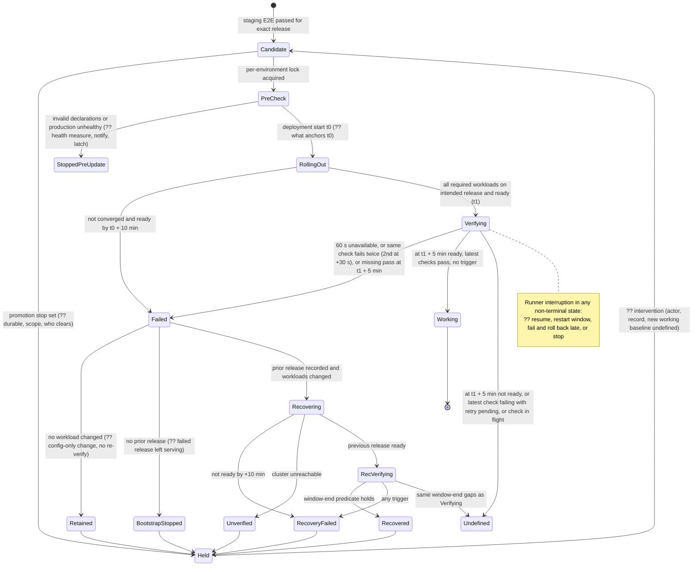

# Review — Operability & recovery
Verdict: FAIL — The numeric policies match the PRD, but the rules are not complete. At the end of a verification window some outcomes count as neither working nor failed. What happens after an interrupted attempt is undefined. The rules for the rollback target, compatibility, recovery-point usability and RTO detection are left open, so two compliant teams (Platform release workflow, Builds, module smoke owners, Administrator runbooks) would behave differently on the production path.

Scope read: spine (all of AD-2/3/5/7/8/10/12, acceptance table, conventions, seed, deferred), full `.memlog.md`, PRD + addendum, EventStore AD-8/11/22–33, Memories AD-2/16/21 + Deferred, Projects AD-23/28/30, Folders I-10/I-11/D-3 headers. Numeric parity with the PRD is exact: 10 min rollout, 5 min verification, 60 s unavailability, second attempt at +30 s, 10+5 min recovery, 30 min backup cadence, 7 d/30 d retention, 1 h alert, 1 h RPO, 4 h RTO, 10 min local startup.

## Release attempt state machine (as derivable from the spine)

| Transition / timer | Defined? | Gap |
| --- | --- | --- |
| Candidate → PreCheck while Held | Partly | Stop exists. Its durability, scope (staging?), clearing actor and record are not defined (OPS-3). |
| PreCheck "production unhealthy" | ?? | No measure (readiness only, or a re-run of the recorded smoke suite?). No rule on notification or on setting the promotion stop (OPS-3). |
| t0 "deployment start" | ?? | Could be lock acquisition, record write or Helm invocation. Undefined after a resume (OPS-2). |
| Verifying at window end with the working predicate false and no trigger fired | **??** | No terminal state (OPS-1). |
| Smoke cadence, per-attempt timeout, "unable to serve traffic" measure, release attribution | ?? | Unmeasurable as written (OPS-1). |
| Failed → Retained ("no workload changed") | Partly | "Workload" is undefined. The retained release is not re-verified (OPS-7). |
| Failed → Recovering target composition | ?? | Catalog, secret/key generations and authority validity (OPS-6). |
| Runner dies in any state | ?? | Resume or fail. No watchdog. No notification because the notifier is the dead runner (OPS-2, OPS-4). |
| Held → Candidate | ?? | No exit path. No re-baselining after manual repair or disaster recovery (OPS-3). |
| Non-release production mutations (rotation rollout, catalog commit, config-only change, disaster recovery) | ?? | Not serialized with attempts (OPS-8). |

## Findings

### OPS-1 — Some verification windows end in neither "working" nor "failed", and the verification inputs cannot be measured
- Severity: critical
- Where: Release and Recovery Acceptance → Verification (spine L144); Automatic recovery reuses it (L145).
- Finding: The row defines three failure triggers and a "working" predicate that must all hold at the window end. It has no rule for a window end where the working predicate is false and no trigger has fired. The row also leaves these undefined:
  - how often smoke checks run (once, or repeatedly);
  - the timeout for a single check attempt;
  - where "30 seconds after the first failure" is measured from;
  - how "unable to serve traffic" is observed (which probe, from where, at what interval, and what "continuous" means between samples);
  - how a check result is tied to the intended release;
  - whether an attempt still running at the window end counts.

  Two PRD clauses were dropped from the row: FR-7 "a single failed probe or container restart does not by itself trigger rollback" and the addendum's "check runner must identify the intended release rather than … an old replica".
- Evidence: L144 "…fails the attempt. Declare working only with required readiness and latest passing checks at the window end and no fired failure trigger." PRD FR-7 bullets 5–7; addendum "Failure triggers" item 3.
- Failure scenario:
  - (a) The single-replica Tenants InteractiveServer pod (Tenants AD-14) restarts at 4:50. Readiness is false at 5:00, the outage is 10 s, and no trigger fired. Implementation A rolls back, B extends the window, C waits for readiness and declares the release working.
  - (b) Check X passed at 0:20 and first fails at 4:40. Its +30 s retry falls after the window ends. The latest result is failing but not "missing", and the retry is not due.
  - (c) One implementation runs each check once, so a 5-minute-old pass satisfies "latest". Another re-runs every 30 s and sees a flapping check fail at the window end.
  - (d) A 30 s probe interval cannot distinguish a 45 s outage from a 75 s outage.
- Recommendation: Make the verdict total. At the window end the attempt is working only if the predicate holds, and failed otherwise. Allow one bounded grace period: a pending +30 s retry or an in-flight attempt may complete, up to 30 s plus the check timeout, then evaluate without further exceptions. Also fix:
  - Smoke checks are identified by stable IDs from the enrollment declaration.
  - Each check runs at window start and repeats at a declared fixed interval.
  - Each attempt has a finite timeout, and a timeout counts as a failure.
  - Unavailability is measured by a runner-side probe of the module-declared endpoint at an interval of 10 s or less. "Continuous" means every sample in a span of at least 60 s failed.
  - Every result carries the served release identity. A result from any other release counts as missing.

  Apply the same rules to recovery verification.
- Suggested disposition: autofix (verdict and grace clause); interval values as implementation seed with owner.

### OPS-2 — Interrupted attempts: timer anchoring and resumption are undefined, and a late automatic rollback is allowed
- Severity: critical
- Where: Deployment ownership (L141); Rollout, Verification and Automatic recovery (L143–145); AD-7 (L88).
- Finding: The spine forbids a "fresh rollback allowance by restarting" and says "ambiguity stops promotion for intervention". It does not define any of the following:
  - whether t0 (deployment start) and t1 (readiness) are durable timestamps that a resumed job must honor;
  - whether a resumed job may open a new verification window;
  - whether an observation gap invalidates the window (no samples cannot establish "no 60 s outage");
  - what "ambiguity" is;
  - how late an automatic rollback may start. Hours later, real users have written data under the new release, and the spine itself says "later incidents are outside this automatic policy".
- Evidence: L141 "A retried/interrupted job reconciles actual state and the recorded attempt before mutation; ambiguity stops promotion for intervention." No definition of ambiguity, and no maximum automatic-recovery horizon.
- Failure scenario: The runner host reboots at verification minute 3 and returns 40 minutes later. The cluster runs the intended release and it is ready. Three readings are all compliant:
  - A: deadline passed with missing results, so the attempt failed. It rolls back 40 minutes into live traffic.
  - B: state is clear, so it starts a new 5-minute window and declares the release working.
  - C: treats it as ambiguity, sets the promotion stop and leaves the release unverified.

  The production outcomes are rollback, promotion or hold.
- Recommendation:
  - Timers anchor to recorded t0/t1 and never restart.
  - Any gap in observation during a window invalidates it.
  - Interruption detected within t1 + 5 min + grace: the attempt fails and uses its single recovery.
  - Interruption detected later: stop for intervention with no automatic mutation.
  - List the "ambiguity" conditions: record and cluster disagree, actual release unknown, lock held by an unknown owner, or the record cannot be read.
- Suggested disposition: discuss (choosing late rollback or stop is a policy decision; the default above is the conservative one).

### OPS-3 — The promotion stop, how it is cleared, and how the working-release baseline is re-established are undefined
- Severity: high
- Where: Automatic recovery (L145 "Stop further automatic promotions … pending intervention"); Before production update (L142); Deployment ownership (L141); AD-12.
- Finding:
  - The stop is not declared durable; only the attempt record is.
  - Its scope is not stated. Does a staging deployment failure stop production promotion? Do Rollout, Verification and Recovery apply to staging at all? The rows do not say "production", but the PRD rows do.
  - No clearing actor, record or required evidence is named.
  - It is not stated whether a pre-update stop (unhealthy production, invalid declarations) or an "ambiguity" stop sets the promotion stop or notifies anyone. Only "deployment/recovery/backup failures" notify.
  - "Existing unhealthy production" has no measure.
  - Nothing re-establishes the recorded "previous working release/configuration" after manual repair, a manual deployment or a disaster-recovery restore. The next pre-check must still identify it.
  - Candidates that queued while the stop was set have no defined promotion order (latest only, or each in turn).
- Evidence: L142, L145. PRD glossary: "Working release … has passed the required production readiness and smoke-test verification". No non-automatic path to that state exists.
- Failure scenario: Recovery fails. The Administrator manually deploys N−2 and clears the stop by editing a repository variable. On the next promotion, pre-check A trusts the record (N−1, which just failed recovery) and makes it the rollback target. Pre-check B sees the record and cluster disagree and stops forever. Neither behavior can be tested against the spine.
- Recommendation:
  - The promotion stop is a field of the durable per-environment record.
  - It is set by every non-working terminal outcome and by entry into disaster recovery.
  - It is cleared only by an authenticated Administrator record. That record binds the reason and a verified current working release.
  - Every production change outside the automatic attempt (manual deployment, disaster-recovery restore, rotation rollout) must pass the same verification predicate to write a new working baseline. Otherwise production stays "unbaselined", which blocks automatic promotion.
  - Define pre-update health as: the recorded working release is ready and its recorded smoke suite passes now.
  - State staging behavior explicitly. For example: deadline and verification apply; no automatic rollback; a failure blocks the candidate and does not stop production promotion.
- Suggested disposition: discuss (staging scope), autofix (the rest).

### OPS-4 — The attempt record has no fixed location; the runner is a single point of failure and silent when it dies
- Severity: high
- Where: Deployment ownership (L141 "durably beyond the runner process"); AD-7 (L88 "prefer the deployment runner outside the application cluster"); Diagnostics (L131).
- Finding:
  - "Beyond the runner process" still allows storing the record on the runner host's disk or inside the target cluster (a ConfigMap, or Helm release Secrets). Both are lost with the site, and disaster recovery needs the record for "compatible releases".
  - A self-hosted runner runs one job at a time. The same runner executes attempts and sends the GitHub notifications, so if it dies mid-attempt nobody is notified.
  - Nothing detects an attempt that exceeds its maximum lifetime (10 + 5 + 10 + 5 min plus grace).
  - Staging deploy and E2E share this runner with production verification and recovery. If the production attempt is split into jobs, a queued staging E2E job can take the runner between "failed" and "recovering" and delay recovery beyond every timer.
  - "Prefer outside the cluster" is not a requirement.
- Evidence: L141; L88; memlog L57 ("prefer locating deployment execution outside the application cluster").
- Failure scenario: The runner VM shares the host with the node. The host reboots during verification. An unverified release keeps serving, no notification is sent, and the Administrator notices days later.
- Recommendation:
  - Store the attempt record, the promotion stop and the working baseline outside both the target cluster and the runner host, for example in GitHub deployment/environment records or the off-site store.
  - Add an independent watchdog, such as a GitHub-hosted scheduled job, that notifies when a record stays non-terminal beyond its maximum lifetime.
  - Run a production attempt from lock to terminal outcome in one job, or reserve runner capacity for it.
  - Make "outside the application cluster" a rule for the production executor, or record the accepted risk.
- Suggested disposition: autofix.

### OPS-5 — NFR-1 compatibility evidence has no gate and no evidence format, although the PRD assigns it to architecture
- Severity: high
- Where: AD-3 (L64 "Previous code must read current schemas/events"); Staging gate and Before production update (L140, L142); Deferred L236. PRD NFR-1: "Compatibility must be verified before automatic promotion … The architecture must define the compatibility evidence and rollback mechanism."
- Finding:
  - The rule exists, but the acceptance table has no compatibility gate.
  - The AD-2 release record binds check-suite evidence but not compatibility evidence.
  - Nothing classifies a release as "incompatible", so an incompatible release can enter the automatic path.
  - Staging's predecessor is not necessarily production's working release. Staging may have received N−1a and N−1b while production is still on N−3, so evidence "against the previous release" is ambiguous.
  - Recovery smoke checks for the previous release run over data written by the failed release, and nothing proves they can.
- Evidence: L140–142 contain no compatibility row. Deferred L236 only says "prove … schema/event compatibility".
- Failure scenario: Team A accepts a module-declared `backwardCompatible: true`. Team B requires a staging rehearsal. Release N writes a new event type that N−1's projection rejects. Rollback "succeeds" at readiness, and then N−1's smoke check or subscriber poisons on the new event.
- Recommendation: Add a pre-promotion gate. Each module provides evidence against production's recorded working release (by exact identity), produced by an automated staging rehearsal: deploy the candidate, exercise its new writes and schemas, restore production's working release, then run that release's smoke checks and readers over the data the candidate wrote. Missing evidence, or evidence against a different release, blocks automatic promotion and routes the release to the separately planned procedure. Bind the evidence into the release record.
- Suggested disposition: autofix.

### OPS-6 — The rollback target combination (catalog, secret/key generations, authority validity) is neither recorded nor testable
- Severity: high
- Where: AD-2 (L58 "current secret references"); AD-3 (L64 "use current security state … Catalog restoration follows its owner's activation/continuity protocol; never rewind key generations or durable authority"); Secrets (L127); EventStore AD-11 (authority records with expiry and revocation), AD-24 (rotation, retirement), AD-25 (catalog idempotency facet with active and reader digest-key generations), AD-33 (activation; "failure rolls back to the prior complete generation").
- Finding:
  - EventStore AD-33 defines a rollback only for a failed activation. It says nothing about reverting a catalog that was committed and then belonged to a failed release.
  - Key generations must not be rewound, so after rollback the system runs the previous code with a catalog and secret set that neither release was tested with. No owner builds or validates that combination.
  - AD-24 retirement may remove a secret generation the recorded rollback target needs. The spine does not count the rollback target as a "live reference".
  - If the previous release's AD-11/AD-26 `production-promoted` authority has expired or been revoked, "module publication/profile authority remains mandatory" forbids restoring it. What recovery then does is undefined.
- Evidence: L58, L64, L125, L127; EventStore architecture.md AD-25 "Deployment catalog", AD-33 "Activation".
- Failure scenario: N adds a route and commits digest-key generation g2, then fails verification. Implementation A re-commits N−1's catalog (g1 only), so readiness fails on g2 records. B keeps N's catalog, so N−1 hosts fail the root-digest check. C builds a merged generation that was never validated. Every path ends in "recovery failed".
- Recommendation: Before the forward rollout starts, record and prepare/ready-validate a rollback combination:
  - the previous package and configuration;
  - current secret references;
  - a catalog generation containing the previous routes and the current key generations.

  Until the release is declared working, forbid catalog commits and secret/key retirements that combination cannot satisfy. Keep the retained rollback target protected afterwards. Validate the rollback target's authority at pre-check; if it becomes invalid mid-attempt, stop for intervention and notify.
- Suggested disposition: discuss (EventStore AD-24/25/33 owner).

### OPS-7 — Recovery mechanism, "workload changed" and data ownership are ambiguous for Helm
- Severity: medium
- Where: AD-2 (L58 "Deploy retained packages through Helm; rollback never regenerates them"); Automatic recovery (L145); AD-3.
- Finding:
  - The spine does not say whether recovery is a `helm upgrade` to the recorded previous package and configuration from retained artifacts, or `helm rollback`. The latter uses history stored in the cluster: not the release record, lost in disaster recovery, and changeable out of band.
  - It does not forbid Helm's own automatic rollback (`--atomic`, or rollback-on-failure). That would use up the single recovery with Helm's timeout and no Platform verification.
  - "No workload changed" is undefined. Config-only changes (ConfigMaps, Dapr Components/Configuration/Resiliency, NetworkPolicy, hook Jobs) change behavior without touching Deployments.
  - "Retain and report" re-verifies nothing.
  - An upgrade to a previous package deletes objects absent from it. A PVC or data service owned by the chart of a newly enrolled module would be deleted, violating AD-3 "persistent data outside application rollback". Nothing states that data objects must not belong to the application release.
- Evidence: L58, L145; PRD addendum on Kubernetes rollback scope.
- Failure scenario: A new module's chart-owned PVC is removed during the "one rollback". Or implementation A treats a Dapr Component-only change as "no workload changed" and retains the release, while B rolls it back.
- Recommendation:
  - Recovery is an upgrade to the recorded previous identities (plus the OPS-6 rollback combination). Helm automatic rollback is forbidden, and Helm waits are subordinate to the spine deadlines.
  - "Changed" means the digest of any release-owned rendered object differs from the recorded previous set.
  - Always run the verification predicate before reporting "retained".
  - Persistent data objects and cluster-scoped objects are not owned by the application release (or carry a keep policy).
- Suggested disposition: autofix.

### OPS-8 — Serialization covers release attempts only; other production changes race with verification and rollback
- Severity: high
- Where: Deployment ownership (L141 "Serialize release attempts per environment"); Secrets (L127 "acknowledged rotations"); EventStore AD-24 ("app-channel token is startup-loaded, rotation requires a controlled sidecar/workload rollout"); AD-33 commits; AD-12 disaster recovery; Memories AD-14 tenant migrations.
- Finding:
  - Rotation rollouts, catalog commits, config-only production changes, manual changes and disaster-recovery restores all change production workloads, but none has to take the environment lock.
  - A rotation rollout during a verification window produces restarts that are blamed on the release, which can cause a false rollback. The rollback then restores pods that re-read startup secrets mid-rotation, leaving AD-24's acknowledgment protocol half-done.
  - Whether a config-only production change is a release attempt (gate, verification, rollback) is undefined. It cannot pass the staging E2E gate against production configuration.
  - Entering disaster recovery does not block a pending automatic promotion from targeting the environment being recovered.
- Evidence: L141 (scope is "release attempts"); L127; EventStore architecture.md AD-24.
- Failure scenario: The Administrator rotates the app-channel token while release N is verifying. Pods restart and 60 s of unavailability fires the trigger. Recovery restores N−1 with an unacknowledged generation, and readiness fails on the generation check. The result is "recovery failed" caused by an unrelated operation.
- Recommendation: Use one per-environment lock for every change that affects workloads: release attempts, config-only changes (as release attempts with a new configuration version and the same verification and recovery), rotation rollouts, catalog commits and disaster-recovery restores. Entering disaster recovery sets the promotion stop.
- Suggested disposition: autofix.

### OPS-9 — "Usable recovery point", its age and the cross-module recovery set are undefined, so RPO and freshness alerts cannot be measured
- Severity: high
- Where: Backup coverage (L146); Recovery freshness (L147 "A completed job alone is not evidence of a usable point"); DR evidence (L148 "cross-module integrity"); AD-12. PRD glossary: "Recovery point … with the compatible application version and configuration". Addendum: "Record the application release and configuration compatible with each recovery point … independently timed database snapshots do not by themselves prove a recoverable cross-module state."
- Finding:
  - The spine says what is not evidence of a usable point, never what is.
  - The age reference is undefined: data cut time or job completion time.
  - It is unclear whether the RPO and the freshness monitor apply to each job, each store, or the jointly restorable set. On the observed cluster: EventStore PostgreSQL can have WAL/PITR, the OpenBao raft snapshot is daily (memlog L129), and Keycloak's database has no backup configured. The set's usable age is limited by its oldest member at a common cut.
  - The addendum's per-recovery-point release/configuration record is not carried into the spine.
  - The 1 h notification only fires once the RPO is already breached. With 30-minute cadence plus capture and upload time, no early warning exists.
  - The 7-day window can prune chain points needed by a long-running recovery.
- Evidence: L146–148; memlog L129–131, L138.
- Failure scenario: The EventStore WAL is 2 minutes old and the OpenBao snapshot is 23 hours old. Monitor A (per job) reports green. Monitor B (per set) alerts continuously. The drill "proves" 1 h RPO under A while a real restore produces a mismatched set of keys and events.
- Recommendation: Define a recovery point as a set of per-inventory artifacts that share a declared cut (a common timestamp or a module-declared compatible boundary), together with:
  - the recorded compatible release/configuration identity;
  - the Memories register populationId and sequence (AD-21);
  - verified integrity: manifest checksums, an unbroken chain to its base, and decryptability with independently held keys.

  Age = failure time minus cut time. The monitor reports the age of the newest complete set. Keep the PRD's 1 h notification but add an earlier warning. Hold points referenced by an open recovery from pruning.
- Suggested disposition: autofix (definitions); discuss (warning threshold).

### OPS-10 — Backups of tenant keys contradict crypto-shredding, and a physical restore has no quarantine or admission stage
- Severity: high
- Where: Backup coverage (L146 "keep required access/decryption material independent…", 30 d retention); Memories erasure continuity (L149 "secret-store recovery must preserve key destruction"); AD-12 sequence (L118). Memories AD-16: backups may remain only if "protected exclusively by tenant key material that AD-16 destroys"; verification requires "for the tenant key and each retained backup class, sampled ciphertext … no longer decrypts"; "a global backup key … does not satisfy". Memories AD-21: artifact admission against the live register. Memlog L141: an OpenBao raft snapshot restore returns the store to the snapshot state. EventStore AD-23: payload protection is no-op by default.
- Finding: The spine requires two things and chooses no mechanism that satisfies both:
  - If OpenBao, which holds the tenant keys, is in the 7/30-day backup set, a destroyed tenant key survives in retained snapshots for up to 30 days. Erased tenants' EventStore backups stay decryptable by restoring OpenBao, so AD-16 unreadability cannot be verified, and disaster recovery re-materializes erased keys.
  - If tenant keys are excluded, a disaster destroys every live tenant key.

  Two further gaps:
  - A native database point-in-time restore (the spine's seed) restores all rows wholesale. Memories requires per-record admission against the register. The AD-12 sequence has no "restored but not admitted" stage, and no step re-applies register-driven key destruction before a key consumer starts.
  - Platform's 30-day EventStore backups satisfy AD-16 only if tenant payload protection is active. It is no-op by default.
- Evidence: L146, L149, L118; Memories spine AD-16 "Operational-backup rule" and "Verification and completion", AD-21 "Terminal effect and artifact admission".
- Failure scenario: Platform backs up OpenBao wholesale, as its rules require. Memories marks tenant T erased after verifying against the live key store. A disaster restore on day 10 restores the day-9 OpenBao snapshot, and T's key and data are readable again before any reconciliation runs.
- Recommendation: Make tenant-key custody a separate backup class with its own escrow. The register drives destruction in escrow within a stated bound. Alternatively, wrap tenant keys under per-period escrow keys that are themselves destroyed. Extend the disaster-recovery sequence:
  1. Restore the key store.
  2. Re-apply every tombstone's key destruction from the live register or its mirror.
  3. Restore authoritative data into quarantine (no serving, no replay).
  4. Run module admission and purge against the register.
  5. Only then rebuild and replay.

  State that EventStore backups of Memories partitions require tenant-key payload protection to be active; otherwise they are AD-16 purge targets. Owners: Memories and EventStore, with Platform.
- Suggested disposition: discuss.

### OPS-11 — The RTO includes detection and operator response, but nothing detects an outage and nothing bounds the response, so the drill cannot measure it
- Severity: high
- Where: DR evidence (L148 "including detection, operator response"); Diagnostics (L131); Automatic recovery (L145 "Later incidents are outside this automatic policy"); AD-12. PRD NFR-2; addendum: "GitHub notifications and a single recovery owner do not establish round-the-clock response coverage".
- Finding:
  - Only deployment, recovery and backup failures notify.
  - Nothing monitors production availability outside release windows. A server or storage failure is noticed indirectly (a backup job failing up to about 30 minutes later) or by users.
  - The RTO clock starts at the outage and includes response by a single Administrator with no response-hours commitment. A scheduled drill with a forewarned operator measures neither detection nor response.
  - The operational envelope is otherwise silent: no minimum retention for telemetry, logs or diagnostics, and no alert routing for health.
- Evidence: L131, L145, L148; memlog L142 ("The four-hour clock starts at outage").
- Failure scenario: The node's disk fails at 19:00 on a Friday. The backup-failure notification arrives about 19:30 and is read Monday morning. The RTO is missed by days, yet every drill "passed".
- Recommendation: Add an invariant for an availability probe hosted off-site that checks production ingress and readiness and notifies within a stated detection bound. Make response a measurable parameter: either staffed-hours scope for the RTO or a maximum acknowledgement time. Require drills to add measured detection and the documented worst-case response to the restore time, or to be unannounced. Set a minimum retention for diagnostics and telemetry.
- Suggested disposition: discuss (tension at PRD level between the RTO and no 24/7 coverage).

### OPS-12 — "Fence old writers" is undefined in scope and in how it is proven
- Severity: high
- Where: AD-12 (L118 "Fence old writers …"); External effects (L150); Structural Seed (one node, local storage).
- Finding: Fencing is the first recovery step, but the spine never lists the writers or says what evidence proves a fence. A node that returns after a partition or reboot restarts all of these:
  - application pods and Dapr actors or reminders;
  - workflow workers;
  - backup CronJobs writing into the same off-site repository paths, which forks or corrupts the chain the restore used;
  - the deployment runner and automatic promotion;
  - Folders provider mutations, which would repeat external effects.

  One team fences by switching DNS, another by revoking credentials.
- Evidence: L118, L150; memlog L137 ("prevent old writers from resuming").
- Failure scenario: The replacement environment is serving. The old node returns, its backup CronJob uploads a new base and WAL into the shared prefix, retention prunes by time, and the restored environment's chain is broken without anyone noticing.
- Recommendation: Define the fence as revoking credentials and authority, not network reachability. Revoke the old environment's database, broker, OpenBao, backup-write and deployment credentials. Give each backup repository a prefix per environment instance, so a returning old writer cannot append to the new chain. Set the promotion stop. Keep external-effect workers disabled until module reconciliation. Record a fence check (old credentials fail) before the restore proceeds.
- Suggested disposition: autofix.

### OPS-13 — The independent freshness and failure monitor has no defined host, no liveness check and relies on GitHub alone
- Severity: medium
- Where: Recovery freshness (L147 "Monitoring/reporting remains available when the primary environment is down"); Diagnostics (L131); Deferred L236.
- Finding:
  - The spine does not say where the monitor runs. On the self-hosted runner (likely on-site) it dies with the site.
  - As a GitHub scheduled workflow, it inherits GitHub's documented behavior: "The `schedule` event can be delayed during periods of high loads … High load times include the start of every hour. If the load is sufficiently high enough, some queued jobs may be dropped" (GitHub docs, events that trigger workflows).
  - Nothing detects a monitor that stopped running.
  - GitHub is the only notification channel. A GitHub outage during a failure is silent, and this is not recorded as an accepted risk.
- Evidence: L147, L131.
- Failure scenario: The hourly freshness workflow is scheduled at :00 and dropped under load for several cycles while backups are failing. No alert fires.
- Recommendation: Fix the monitor's placement off-site (neither the cluster nor the runner host) and schedule it away from the top of the hour. Add a heartbeat: a missing monitor run beyond twice its period raises an alert through a second path. Otherwise, record GitHub as a single point of failure accepted with a rationale.
- Suggested disposition: autofix.

### OPS-14 — Retention of artifacts, release records and evidence is not tied to the 30-day recovery window
- Severity: medium
- Where: AD-2 (L58 "retain"); Diagnostics (L131); AD-12 (L118 "artifacts"); Backup (L146).
- Finding: Disaster recovery must restore "compatible retained applications/configuration" for points up to 30 days old, and must "verify compatible releases" through the release record's evidence. Nothing fixes retention periods. Registry garbage collection, lower GitHub artifact-retention settings or an on-site registry could make a valid recovery point unrestorable or its compatibility unverifiable.
- Evidence: L58, L118, L131, L146.
- Failure scenario: The registry's untagged-image cleanup removes the image digest of the release that matches the day-20 recovery point.
- Recommendation: Retain packages, image digests, configuration versions, release records and evidence for at least the longer of the backup retention and their life as a rollback target, plus a margin. Keep copies outside the primary failure domain. Garbage collection must refuse to delete items referenced by a retained recovery point.
- Suggested disposition: autofix.

### OPS-15 — The production entry gate is ambiguous, and on the observed topology every restore needs the Memories tombstone mirror
- Severity: high
- Where: AD-12 (L118 "Meet the recovery policy below before production"); Memories erasure continuity (L149 "required for finite recovery after total lineage loss"); Deferred L239–240 ("before production", "before claiming recoverable production"); Structural Seed L207. Memories AD-21: "copied or application-restored stream … is unavailable". While unavailable, "EventStore restore … fail[s] closed".
- Finding:
  - "Production" is not defined. It could mean the first deployment into the production namespace (which the first-deployment path implies happens), opening access to production users, or enabling automatic promotion.
  - It is unclear whether site-loss protection is required, and therefore what the pre-production drill scenario is. The spine phrases it conditionally ("site-loss protection requires…").
  - On a single node with local storage, every storage failure that needs backup restoration loses the live register lineage completely. The Memories mirror is therefore a prerequisite for any disaster recovery, not an edge case. Through the drill gate it blocks production for every domain module, because each module's minimum composition includes Memories. The wording hides this dependency from module planning.
- Evidence: L118, L149, L207, L239–240; Memories spine AD-21 "Continuity failure posture", Deferred row "Erased-tenant register recovery after total authoritative-lineage loss".
- Failure scenario: The Parties team plans production after its own gates. It does not realize that production access is blocked on an unfunded, deferred Memories/EventStore feature that the drill cannot pass without.
- Recommendation: Name the gates in order:
  - G1: deployment into the production namespace allowed.
  - G2: users admitted and ingress open, only after the AD-12 drill passes, including Memories continuity.
  - G3: automatic promotion enabled after the SM-5 rehearsals.

  State explicitly that on the observed topology the mirror is a G2 prerequisite for every composition that includes Memories. Decide whether site loss is in the required drill scope.
- Suggested disposition: discuss.

### OPS-16 — Projects' availability and recovery targets are owned by neither side and not reconciled with the release policy's downtime
- Severity: medium
- Where: Source Precedence, Projects row (L163 "Preserve the 99.9% target, five-minute task recovery/NeedsAttention and … RPO 0 qualification"); Deferred L241 ("module owners with Platform"). Projects AD-28: "The platform AppHost owns … deployment, and primary-region recovery policy … The platform configuration and evidence must enforce 99.9% monthly availability, 15-minute service RTO, … committed-event RPO 0".
- Finding:
  - Projects assigns enforcement to the platform, and Platform assigns qualification back to module owners, so nobody owns the measurement.
  - 99.9% a month is about 43.8 minutes. One failed attempt under Platform policy may legitimately take up to 30 minutes of degraded service: a 60 s tolerance per window, plus restarts of single-replica UIs on every rollout.
  - No availability probe exists (OPS-11).
  - Committed-event RPO 0 is impossible for storage loss on one local disk unless the "durability domain" is defined as that disk.
- Evidence: L163, L241; Projects spine AD-28.
- Failure scenario: Projects' production release gate (AD-30, Story 8.11) asks for availability evidence that no Platform component produces.
- Recommendation: Name Platform as the owner of availability measurement and state the downtime budget of a release attempt. Record with the Projects owner whether 99.9% and RPO 0 are Projects production gates or residuals Platform does not currently supply.
- Suggested disposition: discuss.

### OPS-17 — After a failed first deployment, what happens to the failed release is unspecified
- Severity: medium
- Where: Automatic recovery (L145 "With no prior release, stop without claiming rollback").
- Finding:
  - A failed first release may be partly running and reachable through `tache.ai`. It is unclear whether it stays serving, has ingress withdrawn or is uninstalled.
  - With incremental MVP enrollment, "no prior release" can also mean a module newly added to an existing production release. The recovery then removes the new module's workloads, and what happens to its data is undefined (see OPS-7).
- Evidence: L145; PRD FR-8.
- Failure scenario: A half-started first release serves errors to users, because open access was never tied to a first working release.
- Recommendation: After a failed first deployment, keep ingress closed or withdraw it and keep workloads for diagnosis. Open production access only after a first working release. For a first module enrollment, rollback removes the module's workloads but never its data objects.
- Suggested disposition: autofix.

### OPS-18 — Local test lifecycle: retained failures pile up and outcome precedence is undefined
- Severity: low
- Where: AD-10 (L106); Local tool and readiness (L129). Memlog L111 said "Retained local failures must remain discoverable"; the spine dropped it. Memlog L107 notes fixed Dapr ports 50001/51005/51006 and a shared scheduler volume.
- Finding:
  - Retained failure environments cannot be listed and have no collision rule. One retained environment can make the next fresh run fail; that run is then retained too, and the failures cascade.
  - Precedence is undefined when a cancellation follows a failure (for example Ctrl+C during diagnostic capture). Does it clean the retained environment?
  - For a composition with several modules, it is undefined whose startup-deadline override applies.
- Evidence: L106, L129.
- Failure scenario: Three retained failed runs keep ports and memory in use. The fourth run times out, so the startup deadline gets raised to "fix" it (SM-C5 hidden delay).
- Recommendation: The Platform tool lists retained runs with owner and age. A fresh run uses run-scoped ports and volumes, or fails fast naming the retained run that blocks it. A run's outcome is fixed by the first of failure, cancellation or success. State which override wins.
- Suggested disposition: autofix.

### OPS-19 — Staging evidence never expires, and staging E2E is not stated to be inside the staging lock
- Severity: low
- Where: Staging gate (L140); Deployment ownership (L141).
- Finding:
  - E2E results are tied to the release identity but not to staging environment state or time. A candidate held for weeks can be promoted on evidence produced against an older profile or dependency state.
  - The serialized staging attempt is not stated to include the E2E run. A concurrent staging deployment during E2E yields mixed-release results, unless every result is attributed to the release that served it.
  - On the shared single node, staging E2E load during a production verification window can trigger production unavailability or smoke failures, causing a false rollback.
- Evidence: L140–141; Structural Seed L207.
- Failure scenario: Release N−1 is deployed to staging over release N mid-E2E. The later checks pass against N−1 and are recorded as N's evidence.
- Recommendation: Make staging deploy plus E2E one serialized staging attempt. Each result carries the release that served it. Evidence binds the profile and staging configuration digests and has a maximum age. Avoid running staging E2E during a production verification window.
- Suggested disposition: autofix.

## Checked and clean
- Numeric policies match the PRD exactly: rollout, verification, unavailability, smoke retry, recovery budget, backup cadence, retention, freshness alert, RPO/RTO, drill cadence, local startup deadline.
- Retained immutable artifacts: rollback never regenerates, and the digest is the identity. Mutable tags and generic passing workflows are not authority (AD-2 matches EventStore AD-11).
- Recovery limits: exactly one recovery attempt, never cycling through older releases, no false rollback claim on first deployment, truthful failed/unverified reporting, and notification of every outcome including successful recovery.
- The rollback boundary excludes data, event history, Keycloak, backups and credential rotation (AD-3, consistent with NFR-1). The remaining gaps concern how it composes (OPS-6), not the boundary.
- The staging gate fails closed on missing, skipped, failed, incomplete or wrong-release results and on empty critical-flow sets. Production smoke writes are synthetic, with no external effects.
- CI lifecycle on disposable hosted runners: each run is isolated per VM, cleanup runs on success, failure, cancellation and partial startup, and diagnostics are kept after cleanup. There are no shared hosted resources to leak.
- Local startup-deadline semantics: measured from the request, overrides are finite and visible, actual duration is recorded, a definite failure can stop early, and a timeout names unready resources. Explicit attach never stops externally owned services.
- Broker backlog is not assumed recoverable from database backups. Replay and reconciliation are delegated to the modules with named owners, and external-effect reconciliation comes before provider mutations resume.
- The Folders override is applied consistently (no stronger RPO or topology gate). Warm standby is deferred with a measurable trigger. Separate staging and production deployment credentials. The runner is explicitly not claimed as disaster-recovery capability.
