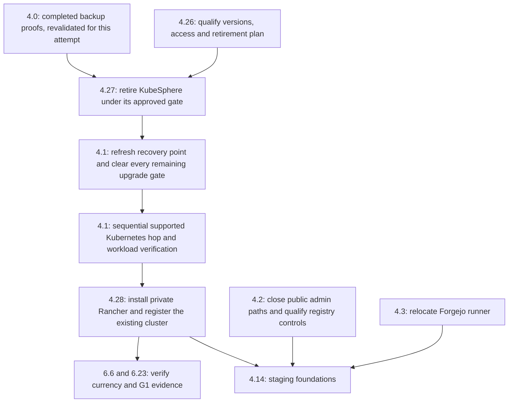

# Sprint Change Proposal: Replace KubeSphere with Rancher

Replace KubeSphere 4.2.1 with the Apache-2.0 Rancher community distribution. Add three stories to Epic 4, retire KubeSphere safely before the Kubernetes 1.35 hop, and install Rancher on a dedicated management VM after the hop. Import the existing kubeadm cluster; continue native Kubernetes maintenance and the existing application deployment process.

This is a **moderate course correction** requiring backlog coordination and an architecture amendment. The twelve epics, seven MVP modules, release ownership and G1/G2/G3 objectives remain achievable. This document retains the complete approved before/after edits and handoff. Administrator approved it on 2026-10-01 with “I approve.” Canonical planning changes implement that decision; live operations retain their exact qualified execution gates.

## 1. Issue summary and evidence

The Administrator requested a move from KubeSphere to Rancher because KubeSphere no longer meets the desired open-source baseline. Story 4.1's compatibility preparation independently exposed a related operational obstacle.

| Evidence | Finding and consequence |
| --- | --- |
| Current KubeSphere repository license, checked 2026-10-01 | The license adds conditions covering commercial distribution/integration, SaaS and branding to Apache 2.0 for version 4.x onward. Earlier versions are expressly excluded from those additional terms. The public repository still exists, but its current terms conflict with the requested unrestricted open-source baseline. [KubeSphere license](https://raw.githubusercontent.com/kubesphere/kubesphere/master/LICENSE). |
| Rancher repository license, checked 2026-10-01 | Rancher's repository uses Apache 2.0. Qualification must retain the license and identities of the actual selected release and required dependencies. [Rancher license](https://raw.githubusercontent.com/rancher/rancher/main/LICENSE). |
| Installed product and isolated rehearsal | The retained maintenance continuation identifies production `ks-core` chart 1.2.4/app 4.2.1. In the isolated Kubernetes v1.35.9 fixture, matching production image contents passed some read/native tests, but KubeSphere application writes returned HTTP 403: `forbidden: invalid license, violation type: Empty license`. No production credentials or license were used. This is fixture evidence, not a claim that production writes were tested or failed. [Continuation evidence](../implementation-artifacts/evidence/epic-4/4-1/20261001t114842z-maintenance-continuation/summary.md). |
| Vendor compatibility boundary | The KubeSphere 4.2.1 upgrade guide specifies Kubernetes v1.23.x–v1.34.x as its prerequisite range. The partial fixture does not establish vendor support for the proposed 1.35 hop. [Version-specific guide](https://docs.kubesphere.com.cn/v4.2.1/03-installation-and-upgrade/03-upgrade-kubesphere/03-online-upgrade-kubephere-from-4.1.x/). |
| Kubernetes deadline | Kubernetes 1.34 reaches end of life on 2026-10-27. Preserve Story 4.1's deadline and before-staging ordering; resolve the current supported patch at execution. [Kubernetes releases](https://kubernetes.io/releases/). |

The change has two causes: a stakeholder technology decision about licensing and an implementation constraint about compatibility. Buying or renewing KubeSphere activation, downgrading to an earlier KubeSphere version, or accepting unsupported compatibility would not satisfy the requested direction.

### Current sprint and operational boundary

The [sprint status](../implementation-artifacts/sprint-status.yaml) records Epic 4 in progress, Story 4.0 done, and Stories 4.1–4.3 in progress. Later stories remain backlog. Story 4.0's completed backup work remains valuable and is not rolled back.

The latest retained observation is Kubernetes v1.34.9, one Ready/schedulable node, 16 Ready protected running pods and 17 protected PVCs with unchanged bindings. These are timestamped observations, not a fresh live-state assertion. No new live inspection or cluster mutation was performed for this proposal.

The existing approved maintenance metadata ends **2026-10-02 14:00 Europe/Paris (12:00 UTC)**. Its signed backup gate expires **2026-10-02 08:16:52 Europe/Paris (06:16:52 UTC)**. The window extension did not extend backup validity. A hop at or after expiry needs fresh qualifying evidence. The exact [maintenance procedure](../../eng/kubernetes-upgrade/MAINTENANCE.md) and its additional workload outage scope remain unapproved in the retained records; that procedure expressly excludes KubeSphere removal. This proposal therefore creates a retirement procedure and revises the later upgrade procedure instead of treating the earlier outage acknowledgement as migration authorization.

KubeSphere removal does not resolve the remaining full API/operator/admission assessment, Forgejo's five orphaned-object consistency finding, authenticated workload expectations, or the signed per-hop gate. Those remain Story 4.1 requirements. Full OS reconstruction remains the disclosed conditional recovery limitation in the current story; this proposal does not silently turn it into a new immediate upgrade prerequisite.

## 2. Impact analysis

### Epics and dependencies

| Epic | Impact |
| --- | --- |
| 1–3: declarations, test environments and local composition | No direct scope change. Rancher is hosted shared infrastructure and does not enter the local/CI composition. |
| 4: staging foundations and urgent operations | Add 4.26 qualification, 4.27 KubeSphere retirement and 4.28 Rancher installation/registration. Amend 4.1's mutation dependency and 4.2's console criteria. Extend 4.9's profile inventory and 4.14's before-staging prerequisites. |
| 5: staging qualification | Consume the qualified hosted baseline and existing evidence contracts. No change to domain critical flows or application rollback semantics. |
| 6: production and G1 | Replace 6.6's optional “current or removed” KubeSphere outcome with qualified Rancher plus completed KubeSphere retirement. Include 4.28 evidence in 6.23's G1 prerequisites. |
| 7: production isolation | Extend 7.6 to Rancher's UI/API, Kubernetes proxy, downloadable credentials and management authorities. A console must not offer staging principals a route around production isolation. |
| 8: recovery and G2 | Extend 8.4, 8.9, 8.11 and 8.17 for management-state inventory, fencing, credential/role reconciliation and isolated manager-loss/restore drills. |
| 9: automatic promotion and G3 | Extend 9.2's inventory checks to Rancher and its management cluster/operator. Requalify affected recovery and access policies under existing rehearsal rules. |
| 10: module enrollment | Consume the amended G1/G2/G3 baseline. No new module contract or domain migration. |
| 11: McpCli | No product scope change. Native infrastructure tools remain within AD-11's existing infrastructure exception; Rancher does not replace module CLI/MCP contracts. |
| 12: Works migration | No direct change to migration parity or the rollback composition. |

No epic is obsolete and no new epic is needed. New IDs follow the existing 4.25 without renumbering current stories. Numerical order does not determine execution order. The urgent track's dependency statement must explicitly include 4.26/4.27; the full staging track also requires 4.28.

### Artifact conflicts

The [PRD](prds/prd-platform-2026-09-27/prd.md) describes supported infrastructure generically. Its goals remain valid, but it needs an explicit management-platform requirement and recovery/access consequences. The [addendum](prds/prd-platform-2026-09-27/addendum.md) needs a corresponding hosted-architecture row. The [epics](epics.md) and [architecture spine](architecture/architecture-platform-2026-09-27/ARCHITECTURE-SPINE.md) still permit keeping KubeSphere and must be amended.

The active 4.2 implementation story already accepts KubeSphere removal with a verified private CLI path, while its canonical epic text still assumes a surviving private console. Reconcile that discrepancy rather than require an obsolete UI. No standalone UX specification was found; operator navigation and access runbooks change, while the application UI and end-user journeys keep their existing requirements.

The accepted-risk text in the spine, AR-64 and spec sequencing still permits staging on Kubernetes 1.34 after its end of life until G1. That conflicts with the urgent track's before-staging upgrade requirement. Supersede that waiver explicitly as part of this ordering amendment; a delayed upgrade delays staging rather than silently using the older waiver.

The [spec package](../specs/spec-platform/SPEC.md), Epic 4 context, active story instructions and upgrade runbooks must consume the approved decision. Timestamped brownfield observations, signed evidence, completed 4.0 proofs and the previously approved urgent-track spec retain their historical content; append dated decisions or issue a new migration spec rather than rewriting evidence.

### Technical effects

KubeSphere workspaces, project metadata, accounts and roles do not have a presumed one-to-one Rancher equivalent. Inventory their actual use and map only required operator capabilities. Preserve native Kubernetes namespaces, workload identities, PVC bindings, applications, networking, storage and workload credentials. Any relied-on KubeSphere-only controller or extension needs a named replacement or retirement decision before its deletion.

Rancher introduces management state, downstream agents, credentials, CRDs/webhooks and cluster authority. Treat these as shared infrastructure with their own pinned deployment and recovery procedures. The existing Aspire model and retained application chart continue to own application composition; Fleet or console actions must not become a competing application writer.

## 3. Recommended approach

### Direct adjustment within the existing plan

| Option | Assessment | Effort / risk |
| --- | --- | --- |
| Direct adjustment: add migration stories and amend existing dependencies | **Recommended.** Resolves licensing and compatibility while preserving completed backup work and business scope. | Medium effort; high operational risk during retirement/upgrade on the single-node cluster. |
| Roll back completed work | Not recommended. Undoing 4.0 removes the prerequisite for safe maintenance and does not fix the license or version boundary. No completed story needs reversal. | High avoidable rework; high recovery risk. |
| Review/reduce MVP scope | Not needed. The seven modules and production-entry gates remain achievable. A temporary native-admin phase preserves operations without reducing the product goals. | Broad replan would add effort without removing the infrastructure work. |

### Target topology

Use a **dedicated single-node K3s management VM** for the Rancher server, exposed only through the declared private Administrator path. Register the existing kubeadm workload cluster at `192.168.1.30` as a generic imported cluster. A distinct management cluster avoids assuming that a generic imported-cluster support claim also certifies Rancher server hosting on the current kubeadm installation.

This is a proposed topology to approve, not provisioned capacity. Confirm VM capacity, OS, storage, placement, network reachability and cost in 4.26. A VM on the same physical host provides an OS/process boundary but no host/site resilience. The management VM is not application failover capacity and supplies no HA guarantee. Rancher's installation documentation recommends dedicated HA hosting and permits a single-node Kubernetes installation as a resource-saving interim option. Explicitly retain the single-node management availability limitation. [Installation options](https://ranchermanager.docs.rancher.com/getting-started/installation-and-upgrade/).

Rancher v2.14.4 is a **compatibility candidate**, not a claim about the latest release or a final pin. Its published matrix covers K3s/RKE2 management hosting and generic imported Kubernetes clusters in the 1.33–1.35 range. Select a supported, security-current community release and exact compatible management/workload versions during 4.26; retain version-specific evidence. This candidate supports considering a 1.35 workload hop, not automatically choosing 1.36/1.37. [Version-specific matrix](https://www.suse.com/suse-rancher/support-matrix/all-supported-versions/rancher-v2-14-4/).

Generic registration does not change the workload distribution. Retain kubeadm maintenance, external-etcd recovery and native kubeconfig access for the current cluster. Rancher's extra lifecycle features are cluster-type dependent; do not assume imported kubeadm has the RKE2/K3s upgrade/snapshot controls. [Registration capabilities](https://ranchermanager.docs.rancher.com/how-to-guides/new-user-guides/kubernetes-clusters-in-rancher-setup/register-existing-clusters).

### Sequence and gates



1. Begin 4.26 with native private access and a read-only ownership/dependency census. Qualify the version/topology direction and rehearse the exact retirement procedure. Procurement or Rancher deployment must not block that retirement qualification; use native tools in the interim.
2. Execute 4.27 only with its own approved deletion/outage/stop/recovery plan, current recoverable state and workload-owner acknowledgement. Native administration must work before removing the old console. Public-console closure in 4.2 can proceed independently using its existing private-CLI option; do not wait for the replacement UI to secure the old route.
3. After retirement, obtain a fresh external-etcd recovery point and matching node/configuration inventory. Revalidate 4.0 proofs, remote readability and workload baselines; refresh stale evidence. Complete all remaining 4.1 compatibility/admission/Forgejo/smoke checks and approve the revised exact maintenance procedure before opening the signed hop gate.
4. Perform only the approved sequential Kubernetes hop, targeting a freshly resolved supported patch compatible with the chosen Rancher release. Retain the 2026-10-27 deadline and before-staging requirement. Installation of Rancher is not a prerequisite for this native upgrade.
5. Complete 4.28's private installation, registration, access checks and initial isolated backup/restore qualification before staging foundations. Later integrated G2 recovery and G3 policy qualification extend that initial evidence; they do not become new prerequisites for the native upgrade.

Estimate **3–6 operator working days** across qualification, retirement, installation and initial verification, plus approval scheduling and any VM procurement. This is a planning estimate, not measured duration or a commitment that fits the current window. Reserve 1–2 days for each new story, refine after the dependency census, and prioritize retirement/upgrade before console rollout. Remaining 4.1 blockers have separate, presently unquantified effort. If timing slips, reschedule with fresh evidence; do not extend freshness or waive compatibility to fit an outage window.

### Principal risks and controls

| Risk | Required control |
| --- | --- |
| KubeSphere uninstall cascades into namespaces or application state | Rehearse from the observed chart/configuration; inventory owner references, finalizers, controllers and delete propagation. Approve an exact UID-bound resource allowlist. Preserve every application/data namespace and PVC. Never use a blanket namespace/CRD deletion as the migration plan. |
| A relied-on extension disappears | Classify every installed extension and KubeSphere-managed dependency. Rehome it under a named native owner or approved replacement before retirement. Stop on unresolved ownership or dependencies. |
| Old snapshots resurrect retired controllers or authority | Archive the pre-retirement recovery set; create the upgrade recovery point after retirement. Record old-point restoration as a separate recovery decision with fencing and removal reconciliation. |
| New console bypasses isolation | Private UI/API/proxy access; named Administrator permissions and scoped deputy recovery permissions. Test staging and unauthorized identities against UI, proxy and credential issuance. No ordinary staging user receives cluster-owner/global-admin authority. |
| Broad agents or a second application deployment writer | Record required agents/permissions and bounded system-namespace exceptions. Keep application namespaces restricted and current executor identities scoped. Do not enroll application releases into Fleet or enable unattended workload-cluster upgrades. |
| Management VM loss blocks recovery | Independently retained native kubeconfigs, SSH/custody and native Helm/kubeadm procedures. Prove operations while Rancher is unreachable and an isolated Rancher restore with old authority fenced. |
| Management backup mistaken for workload recovery | Rancher backup covers its management application, not downstream business data or external etcd. Retain all existing native workload/etcd backups and add management-cluster recovery separately. [Backup scope](https://ranchermanager.docs.rancher.com/how-to-guides/new-user-guides/backup-restore-and-disaster-recovery/). |

## 4. Detailed change proposals

“OLD” blocks below are current excerpts or explicit statements that a section does not exist. “NEW” blocks replace those excerpts or are additive where stated. Unquoted acceptance criteria remain in force. Apply these edits only after proposal approval, then validate the canonical artifacts together.

### 4.1 PRD and addendum

**P1 — PRD, Confirmed MVP scope; append after the hosted-installation paragraph.**

OLD:

> The designated hosted Kubernetes installation is at `192.168.1.30`; this address does not establish cluster topology or availability. Staging and production may share physical capacity and the existing identity provider; their application state and credentials remain isolated in separate environment instances as selected by the architecture. User access to production requires explicit production-user declaration.

NEW: retain that paragraph and append:

> Hosted cluster administration uses a maintained open-source management platform whose required core management functions do not depend on vendor activation. Rancher community replaces KubeSphere. The management UI and API are reachable only through the declared private Administrator path. Independently retained native Kubernetes access supports maintenance and recovery when the manager is unavailable. This substitution does not require changing the existing workload-cluster distribution or establish high availability.

Rationale: make the technology constraint durable without changing module scope or claiming Rancher creates resilience.

**P2 — PRD FR-9, shared dependencies bullet.**

OLD:

> The recovery inventory includes required identity, secret and other shared dependencies, including Keycloak, production access configuration and revocation evidence. Each dependency has an identified recovery owner and evidence that it remains available or can be restored within the recovery procedure.

NEW:

> The recovery inventory includes required identity, secret and other shared dependencies, including Keycloak, Rancher management state and configuration, its management-cluster recovery inputs, production access configuration and revocation evidence. Each dependency has an identified recovery owner and evidence that it remains available or can be restored within the recovery procedure. Rancher management backup does not substitute for workload-data or workload-cluster recovery. Native cluster access, management-backup decryption material and recovery procedures remain independently available to Administrator and the deputy; restored management authority is fenced and reconciled before reconnection.

Rationale: cover the new state and authority under the existing FR-9 requirements. Recovery still respects the deputy's existing limits and never grants admission.

**P3 — PRD FR-10, append to testable consequences.**

OLD: no explicit cluster-management consequence.

NEW:

> Rancher server, required downstream agents and management-cluster changes follow the shared-infrastructure change and currency controls. Application deployment identities receive no Rancher administrative authority. A manager outage does not remove independently qualified native maintenance and recovery access. Management UI/API, Kubernetes proxy access and credentials issued through the manager are included in the affected NFR-3 tests.

Rationale: prevent a new management plane from bypassing release ownership or isolation.

**P4 — PRD Downstream actions row.**

OLD:

> Supported infrastructure, ingress/DNS/certificates, executor/probe access, independent monitoring and verified GitHub delivery | Administrator with Platform implementation | Before G1; retain evidence of actual configuration and versions

NEW:

> Supported infrastructure, KubeSphere retirement and qualified private Rancher management with independent native access, ingress/DNS/certificates, executor/probe access, independent monitoring and verified GitHub delivery | Administrator with Platform implementation | Retirement before the Kubernetes hop; Rancher qualified before staging; retain actual configuration/version, access and recovery evidence before G1

**P5 — Addendum, hosted-architecture table; add a row after Secrets and infrastructure.**

OLD: no named cluster-management row.

NEW:

> Cluster management | Rancher community on a dedicated, privately reachable K3s management VM registers the existing kubeadm workload cluster. Exact versions, resource budget, permissions and licenses are qualified in the shared profile inventory. Native kubeconfig/SSH and workload recovery remain independent. The initial management server is single-node and does not establish HA. KubeSphere is retired before the workload Kubernetes upgrade; Rancher is qualified before staging.

Rationale: align the product requirement with the selected operational topology and sequencing.

### 4.2 Architecture spine

**A1 — Add a Cluster management convention adjacent to Release tiers.**

OLD: no explicit cluster-management convention; AD-1/3/6/7/8/12 govern composition, recovery, admin access, executor authority, isolation and DR.

NEW:

> **Cluster management.** Rancher community is shared infrastructure, deployed through a pinned owner-controlled Helm procedure on a dedicated private K3s management VM. It registers the existing kubeadm installation as a generic downstream cluster; its native maintenance and external-etcd procedures remain authoritative. Independent native Administrator and scoped deputy access must work without Rancher. The management server, required agents, CRDs, credentials and recovery inputs belong to the shared profile inventory, never the Aspire application model or retained application Helm package. Application release writers remain the existing qualified executors. Fleet does not reconcile those releases and Rancher does not automatically upgrade the workload cluster. Required system-namespace/agent privileges are inventoried and narrowly approved; application namespace restrictions and NFR-3 remain enforced. The UI/API and proxy are private, and management identity grants do not derive from staging-user membership. Qualify administrative authentication/MFA and current-role reconciliation without expanding the deputy's admission powers. Rancher and management-cluster recovery preserve independent native access and fence stale management/agent authority before reconnecting. The single-node manager is an explicit availability limitation; placement on shared hardware establishes no site resilience.

Rationale: record mechanism and authority boundaries while preserving AD-1 through AD-15. Route the amendment through the architecture workflow; this spec/proposal does not itself ratify an AD change.

**A2 — Release tiers, Shared infrastructure row, Contains column.**

OLD:

> Kubernetes minor and node OS, namespaces, environment identity RBAC, PriorityClasses and StorageClasses, CNI, Traefik and Gateway API CRDs, cert-manager, storage provisioner, operators and other CRDs, Dapr control plane, Keycloak server and database

NEW:

> Kubernetes minor and node OS, Rancher server and required downstream agents/CRDs, its management cluster and backup operator, namespaces, environment identity RBAC, PriorityClasses and StorageClasses, CNI, Traefik and Gateway API CRDs, cert-manager, storage provisioner, operators and other CRDs, Dapr control plane, Keycloak server and database

Rationale: use the existing named change owner, recovery point, environment locks and forward-revert/DR controls; do not make management changes an application rollback operation. Before environment locks exist, use the approved urgent operator procedure; do not pretend future machinery already exists.

**A3 — Stack, infrastructure-pin sentence.**

OLD:

> Keycloak, OpenBao, data-service, broker, Traefik, Gateway API CRDs, cert-manager, Calico, Zot and Velero pins belong to the profile inventory (Release tiers).

NEW:

> Keycloak, OpenBao, data-service, broker, Rancher and required agents, the management-cluster distribution and backup operator, Traefik, Gateway API CRDs, cert-manager, Calico, Zot and Velero pins belong to the profile inventory (Release tiers). Rancher qualification records its exact chart, required images, license provenance, supported management/workload version pairing and private endpoint configuration.

**A4 — Owned work, G1 Infrastructure currency row, KubeSphere clause.**

OLD: `KubeSphere current or removed;`

NEW: `KubeSphere retired with workload-preservation evidence; Rancher community, required agents and the management cluster qualified at supported, security-current pins with private-access and initial restore evidence;`

Rationale: require the chosen replacement rather than preserve the obsolete alternative. All other currency items remain required.

**A5 — Structural Seed diagram.**

OLD: the diagram has no distinct Rancher management component.

NEW: add a dedicated private management-cluster node outside the existing workload-cluster subgraph; connect the private Administrator path to Rancher and its registration relationship to the existing cluster. Retain direct native Administrator/recovery access and executor-to-Kubernetes paths. Add no application-traffic dependency on Rancher. Label shared-host placement, if selected, as a common physical failure domain.

Rationale: show the actual management/workload separation and recovery path. Append the approved choice and qualifications to the architecture memlog; retain the earlier observed state.

**A6 — Accepted risks, Kubernetes staging waiver and management availability.**

OLD clause: `staging on Kubernetes 1.34 after 2026-10-27 until G1`

NEW:

> The supported Kubernetes upgrade precedes staging; a delayed upgrade blocks staging and does not authorize using Kubernetes 1.34 past its 2026-10-27 end of life. The initial dedicated Rancher management cluster is single-node, with no management HA; a same-host VM shares the physical failure domain. Manager unavailability is mitigated by independently qualified native access and recoverable management state.

Rationale: remove the conflicting older waiver and explicitly record the proposed manager's availability limitation. Preserve all other accepted risks and do not claim replacement capacity or HA has been supplied.

### 4.3 Epic requirements, current stories and urgent ordering

**E1 — AR-59 exposure and currency clauses.**

OLD: `removal of the public Keycloak admin, master-realm and KubeSphere console routes, verified by an external negative probe.`

NEW: `removal of the public Keycloak admin and master-realm routes and public cluster-management exposure, including the retired KubeSphere route and Rancher UI/API/proxy, verified by external negative probes; retain qualified private native administration throughout the transition.`

OLD: `update or remove KubeSphere; name renewal owners.`

NEW: `retire KubeSphere before the Kubernetes upgrade and qualify Rancher community, required agents and its management cluster before staging; name renewal owners.`

Rationale: align G1 requirements with the decision while letting old-console closure complete before the new console is installed. Add 4.26/4.27 to the early independent-track table and reference 4.28 in Epic 4's staging prerequisites. Preserve the existing 4.0–4.4 independent work, with explicit new dependencies for 4.1.

**AR-64 alignment:** replace the old clause `staging on 1.34 after 2026-10-27 until G1` with `staging waits for the supported Kubernetes upgrade; the initial single-node Rancher manager has no HA and needs independent native access and management recovery`. Preserve the remaining accepted-risk clauses. This proposal removes the earlier staging waiver rather than relying on it when sequencing slips.

**E2 — Story 4.1, dependency and additional acceptance criterion.**

OLD dependency tag: `Independent, pull forward` with a mutation dependency on 4.0's signed proofs.

NEW dependency tag: `Independent preparation, pull forward; upgrade mutation requires current 4.0 proof validation and completed 4.27 retirement.` Retain all existing acceptance criteria and append:

> **Given** Story 4.27's signed retirement and workload-preservation result
> **When** the upgrade mutation gate is evaluated
> **Then** KubeSphere's runtime, owned blocking admission dependencies and public route are absent, and any retained/replaced dependency has a named qualified owner
> **And** a fresh post-retirement external-etcd recovery point and matching node/configuration inventory are independently verified
> **And** the complete remaining API/add-on/admission compatibility assessment, source workload consistency findings, authenticated smoke expectations and exact revised maintenance procedure are cleared for the selected supported target patch
> **And** removing KubeSphere alone never opens the hop gate or extends evidence validity.

Rationale: remove the obsolete compatibility dependency without weakening any other gate. Upgrade evidence still records the actual result; `in-progress` is not reset.

**E3 — Story 4.2, user story and console acceptance criterion.**

OLD user-story line:

> I want the Keycloak admin and master-realm routes, the KubeSphere console and anonymous registry reads closed now,

NEW:

> I want the Keycloak admin and master-realm routes, public cluster-management exposure and anonymous registry reads closed now,

OLD console criterion:

> **Given** the public Keycloak admin and master-realm routes and the KubeSphere console at `kube.hexalith.com`
> **When** this story completes
> **Then** they are reachable only from the declared Administrator path
> **And** an external negative probe proves they are unreachable from the internet

NEW:

> **Given** the public Keycloak admin/master-realm routes and existing KubeSphere route at `kube.hexalith.com`
> **When** their public exposure is closed
> **Then** the required Keycloak administration and native cluster administration work only through the declared private Administrator path
> **And** the KubeSphere console is private while present, or absent following approved Story 4.27 retirement
> **And** external negative probes prove that the administrative routes are unreachable from the internet while approved public OIDC functionality still works
> **And** Rancher, when introduced by 4.28, passes the same private-access and public-denial requirement before its endpoint is accepted
> **And** the replacement console's later installation does not delay closing the existing public routes.

Rationale: synchronize the canonical epic with the existing 4.2 private-CLI/removal option. Keep all registry consumer, anonymous-denial and retained-digest GC criteria intact. Story 4.27 owns retirement; 4.2 owns exposure closure and re-verification.

**E4 — Stories 4.9 and 4.14, additive acceptance criteria.**

OLD: 4.9 has generic hosted inventory/contract ratification; 4.14 starts from applying staging's environment layer without the new migration dependency.

NEW for 4.9:

> **Given** the hosted profile inventory
> **When** it is ratified
> **Then** it records the Rancher release/chart/image identities and license, management-cluster version/topology/capacity, registered workload-cluster identity/version, private access/authentication, required agent permissions, backup units, independent native access, renewal/currency owners and deployment writer boundaries.

NEW for 4.14:

> **Given** the urgent infrastructure work
> **When** staging namespaces are first created
> **Then** 4.1, 4.2, 4.3, 4.27 and 4.28 have accepted evidence, including the qualified private Rancher baseline and independent native access
> **And** all existing namespace, storage, pod, network and identity-isolation criteria still apply.

Rationale: make the before-staging direction explicit without making later G2 recovery machinery an urgent-upgrade prerequisite.

### 4.4 New migration stories

**E5 — Story 4.26: Qualify Rancher and the management migration.**

OLD: no Story 4.26.

NEW:

As Administrator, I want an exact supported Rancher target, independent native access and an ownership-based migration plan, so that replacing management does not change workload data or silently expand authority.

**Repo:** Administrator operations and Platform planning. **Covers:** FR-9, FR-10, NFR-3, AR-59, AR-63. **Dependencies:** none for read-only preparation; current qualifying recovery evidence is required before any production mutation.

Acceptance criteria:

1. Record the live workload-cluster identity/topology, effective kubeadm/client versions, KubeSphere chart/images/configuration, extensions, CRDs and instances, owners/finalizers, API services, webhooks, RBAC, routes, namespaces and native persistent-state inventory. Retain sensitive exports encrypted outside Git.
2. Classify every KubeSphere-managed capability as unused/retired, native-owned or replaced. Identify all consumers and approved replacements. Unknown ownership, deletion effects or required functionality blocks retirement.
3. Select exact Rancher community chart/image identities, required dependency licenses and a security-current version pairing for the management cluster and target imported workload cluster. Retain dated version-specific matrices and release notes. No unqualified tag or claim that a generic import certifies manager hosting is accepted.
4. Specify the dedicated K3s VM's host, supported OS, CPU/RAM/storage budget, private DNS/TLS endpoint, route/firewall/CA requirements, independent backups and owner. Record costs, provisioning dependencies and single-node/shared-host limitations. Actual provisioning and console rollout may follow the workload upgrade.
5. Independently demonstrate authorized native Kubernetes administration and deny unauthorized/public access. Retain recovery kubeconfig/key custody independent of KubeSphere and Rancher. Do not substitute Rancher-proxy credentials for this path.
6. Map required operator accounts/roles to approved native/Rancher authority. Preserve the Administrator/deputy division, MFA requirement and least privilege; no automatic workspace-to-project, account-to-admin or staging-membership mapping is accepted.
7. Rehearse the version-specific uninstall against a representative isolated inventory. Produce an exact proposed resource allowlist, ownership/deletion-propagation result, dependency order, workload-preservation assertions and stop/recovery procedure. Demonstrate that licensed KubeSphere application writes are not needed to complete the qualified native retirement procedure.
8. Deliver a separately reviewable retirement runbook, revised upgrade ordering and 4.28 installation/access/backup plan. Qualification evidence alone neither authorizes live deletion nor clears Story 4.1. Story 4.26's retirement deliverable may complete while management-VM procurement remains scheduled for 4.28.

Rationale: replace a blanket name substitution with executable version, ownership, access and recovery decisions.

**E6 — Story 4.27: Retire KubeSphere without changing workload data.**

OLD: no Story 4.27.

NEW:

As Administrator, I want KubeSphere removed through a rehearsed native procedure while applications and recovery inputs are preserved, so that its licensing and compatibility no longer block the supported Kubernetes hop.

**Repo:** Administrator operations. **Covers:** AR-59, AR-63, FR-9, NFR-3. **Dependencies:** 4.26 retirement qualification and current validated 4.0 proofs; precedes 4.1 mutation. No dependency on Rancher availability.

Acceptance criteria:

1. Before mutation, obtain approval bound to the exact removal procedure, resource allowlist, workload interruption scope, incident/recovery owner, window and stop conditions. Independently verify fresh encrypted immutable off-node native workload proofs, external-etcd recovery and node/configuration recovery inputs under the approved attempt policy. Preserve sources and qualifying prior evidence.
2. Capture pre-change native API, authenticated workload health, controllers/replicas, namespace/resource ownership, admissions, storage and PVC UID/binding census. Verify independent private Administrator access again. Drift from the qualified deletion/dependency inventory stops execution.
3. Archive KubeSphere configuration and required metadata under restricted encrypted custody. Rehome any required extension/controller or resource ownership before removing its reconciler. Preserve public application/OIDC service contracts.
4. Apply only the rehearsed, UID-bound uninstall steps to KubeSphere-owned resources. Do not delete application/data namespaces, PVCs/PVs, shared storage/CNI/ingress/identity components or unrelated CRDs. Any finalizer intervention or changed deletion propagation requires the specific approved resource decision; no blanket forced deletion is permitted.
5. Verify the retired releases/controllers, obsolete API services/admission references and public console route are absent; classify any intentionally retained inert archival resources with owner and cleanup date. No unresolved KubeSphere-only runtime/admission dependency may remain on the 1.35 path.
6. Prove native API and private administration, DNS/CNI/storage/admission health, unchanged application/data namespace and PVC identities/bindings, and authenticated protected-workload smoke outcomes. Check old public console access from outside the private path. A failed/unobserved result stops further work and does not mark retirement done.
7. Record signed before/after inventories, deletion identities, preserved-state comparisons, versioned runbook digest and accountable outcome. Prepare a fresh post-retirement etcd point and configuration inventory for 4.1; old-point restoration must explicitly reconcile retired controllers and authority before reopening.
8. Handoff to 4.1 only with accepted retirement evidence. Keep all remaining upgrade blockers, freshness checks and approvals in force; no Kubernetes binary change, drain or upgrade is implied by retirement completion.

Rationale: retire the management layer with a bounded change instead of rebuilding the workload cluster.

**E7 — Story 4.28: Deploy Rancher and register the existing cluster.**

OLD: no Story 4.28.

NEW:

As Administrator, I want private Rancher management of the existing supported cluster with independently tested recovery, so that cluster visibility and administration use the chosen open-source platform without becoming a workload-recovery dependency.

**Repo:** Administrator operations and Platform operations definitions. **Covers:** FR-9, FR-10, NFR-3, AR-59. **Dependencies:** 4.26 target qualification, 4.27 accepted retirement and 4.1 accepted supported workload-cluster upgrade; precedes staging foundations and G1.

Acceptance criteria:

1. Provision the approved dedicated management VM/K3s cluster and deploy the exact qualified Rancher Helm release, required certificates, agents and backup operator from retained identities. Record actual versions, placement, resource use, licensing and owner. Use a Kubernetes installation with declared single-node limitations.
2. Configure the declared private TLS UI/API endpoint, verified trust chain and required agent connectivity. Demonstrate private authorized access and public/unauthorized denial. Inspect the registration manifest and its authority before applying it; do not use an insecure unverified download as the installation procedure.
3. Register the existing kubeadm cluster identity as generic/imported and prove a healthy agent connection and representative read/admin operations. Preserve native maintenance and external-etcd recovery; do not recreate the workload cluster or enable unattended Kubernetes upgrades.
4. Qualify administrator authentication/MFA, narrowly scoped deputy recovery access, token custody/rotation and revocation. Prove staging users, workload/service identities and executor credentials cannot obtain global/cluster-owner authority, production proxy access or usable production credentials through Rancher.
5. Inventory required agent namespaces, service accounts, cluster roles, CRDs and admission endpoints. Bound any necessary system-namespace security exception to those resources. Preserve application namespace restrictions, network policy and executor authority. Do not enable optional app/platform stacks or Fleet application reconciliation as part of registration.
6. Prove existing workload/namespace/PVC preservation and smoke outcomes against the post-upgrade baseline. Re-run affected access checks. Record any new reconcilers and demonstrate that application deployment remains owned by the existing qualified workflow.
7. Create encrypted immutable off-node management backups and separately retain required encryption configuration/keys, TLS material, definitions and management-cluster recovery inputs. Restore into an isolated non-production-connected target and verify the manager's configuration and authorized state. State clearly that this backup does not recover downstream business data or external etcd. Native workload backup coverage continues.
8. Demonstrate direct native administration and a representative authorized maintenance/recovery operation while Rancher is unreachable. Rehearse stale manager/agent fencing and deny a revoked management credential after isolated restore before reconnection. Preserve the deputy's prohibition on approving releases or granting admission.
9. Deliver pinned deployment/upgrade/backup/restore runbooks and actual profile inventory with currency, renewal, monitoring and recovery owners. Initial evidence is required before staging/G1; later integrated FR-9 retention, monitoring and RPO/RTO evidence follows Epic 8.

Rationale: make Rancher useful while proving that its failure or broad authority cannot invalidate existing operational guarantees.

### 4.5 Later stories

**E8 — Story 6.6, KubeSphere criterion.**

OLD:

> **Given** KubeSphere
> **When** reviewed
> **Then** it is either current or removed

NEW:

> **Given** the cluster-management inventory and Stories 4.27/4.28
> **When** G1 currency is accepted
> **Then** KubeSphere retirement is proven, and Rancher community, required agents, management cluster and backup operator have qualified supported, security-current pins
> **And** the retained evidence proves private access/public denial, independent native access and initial isolated management restore
> **And** every expiring management certificate or credential has a renewal owner and monitoring lead time.

Rationale: validate the selected replacement alongside all existing currency work.

**E9 — Story 6.23, G1 record list.**

OLD list item: `a supported Kubernetes minor;`

NEW list items:

> a supported Kubernetes minor at its qualified current patch;
> accepted 4.27/4.28 evidence for retired KubeSphere, private Rancher management, independent native administration and initial management backup/restore;

Rationale: connect G1 to the concrete migration evidence. Keep all other G1 list items and negative tests.

**E10 — Story 7.6, attempted-target list; add one item.**

OLD: no explicit Rancher-management target.

NEW:

> Rancher UI/API, management-cluster administration, Kubernetes proxy and issued kubeconfigs/tokens, including attempts by staging admins or automation to gain global/cluster-owner roles, bind broader authority or reach production through the manager;

Rationale: retain the zero-success requirement across the newly introduced access path. Repeat affected tests after management access/agent changes.

**E11 — Story 8.4, shared-dependency inventory criterion.**

OLD:

> **Then** the Keycloak database with its event export, each environment's OpenBao, the production access configuration and the revocation evidence are listed with owners, and evidence that each survives or can be restored

NEW:

> **Then** the Keycloak database with its event export, each environment's OpenBao, Rancher management resources/configuration and required management-cluster recovery inputs, production access configuration and revocation evidence are listed with owners and recovery classes, and evidence that each survives or can be restored
> **And** management-backup decryption configuration/keys, TLS and registration authority, independent native access and fence/reissue procedures are inventoried under independent Administrator/deputy custody
> **And** management backup is distinguished from workload native-data and external-etcd recovery.

Rationale: preserve existing per-unit recovery classification; separate rebuild-only state from live authority and backed-up configuration.

**E12 — Story 8.9, additional fencing criterion.**

OLD: generic surviving-authority fencing; no named Rancher manager/agent case.

NEW, append:

> **Given** a surviving or restored Rancher manager, agent or registration authority
> **When** the failed environment is fenced and rebuilt
> **Then** old management/agent connections and credentials cannot control the recovered cluster
> **And** native recovery works with Rancher unavailable; the restored manager remains isolated until current authority and cluster identity are reconciled.

**E13 — Story 8.11, additional restored-authority criterion.**

OLD: generic credential rotation and admission reconciliation; no named Rancher-authority case.

NEW, append:

> **Given** restored Rancher users, role bindings, API tokens and cluster-registration credentials
> **When** authority is reconciled
> **Then** later revocations are reapplied, current approved operator grants bound restored access, and old tokens/proxy credentials are proven denied
> **And** no restore promotes a staging principal, expands deputy authority or grants production admission.

**E14 — Story 8.17, additional manager-loss drill criterion.**

OLD: the drill assumes primary server/storage loss but has no explicit manager-loss/restore case.

NEW, append:

> **Given** loss or unavailability of the management plane during the isolated drill
> **When** workload and management recovery are exercised
> **Then** qualified native access completes the required workload recovery, and Rancher recovery/re-registration is measured within the applicable recovery plan
> **And** old management/agent authority stays fenced, restored-role reconciliation and revoked-token denial pass, and every necessary management step or substitution is included in the RTO accounting.

Rationale for E12–E14: prove the new management authority cannot reconnect prematurely or resurrect access; retain all existing quarantine, custody, isolation, RPO and RTO requirements.

**E15 — Story 9.2, shared-component comparison criterion.**

OLD:

> **Then** it compares each deployed shared component with the supported, security-current version in the inventory under the policy from Story 9.1, and records the result

NEW:

> **Then** it compares each deployed shared component, including Rancher, required agents, management-cluster distribution and backup operator, with the supported, security-current inventory under Story 9.1
> **And** it checks the qualified management/workload version pairing and records exact deployed identities and the result.

Rationale: include the new components in existing automatic-promotion refusal rather than introduce unattended management upgrades. Stories 9.6/9.7 use their existing policy-change/rehearsal rules when this changes recovery, access or qualification policy.

### 4.6 Spec, implementation artifacts, tracking and operator experience

| Artifact and section | OLD | NEW / action after approval | Rationale |
| --- | --- | --- | --- |
| SPEC.md, Constraints | Shared hosting/access/recovery constraints have no named replacement manager. | Append the approved cluster-management convention reference: Rancher is shared infrastructure outside the Aspire application composition, with independent native access and private administration. Keep FR/CAP/AD identifiers. | Align implementation input with the amended spine. |
| acceptance-criteria.md, CAP-9/CAP-10 | Generic recovery and admin/isolation checks. | Add management-state inventory/restore/fencing and native-access checks to CAP-9; private UI/API/proxy/credential and staging-principal denial cases to CAP-10. Reference 4.27/4.28 and later integrated Epic 8 proof. | Make the new consequences observable without renumbering capabilities. |
| sequencing.md, early track, G1 currency and Around the gates | Upgrade/closure ordering and generic currency without the Rancher chain; the older clause permits staging on 1.34 after 2026-10-27 until G1. | State 4.26 retirement qualification → 4.27 → 4.1 hop → 4.28 → staging; console closure remains independently urgent; G1 requires accepted replacement evidence. Replace the older waiver with “The Kubernetes upgrade precedes staging; delay blocks staging and does not authorize using 1.34 past its end of life.” Keep all other gates. | Prevent console procurement from blocking retirement/upgrade and remove contradictory staging permission. |
| glossary.md | No distinct manager/local versus registered/downstream cluster terms. | Define the dedicated management cluster, existing imported workload cluster and independent native admin path. | Avoid treating registration as rebuilding or changing distro. |
| brownfield.md, dated observations | 2026-09-27/28 publicly reachable KubeSphere and unproven backup observations. | Retain observations; append a dated approved-decision note pointing to current 4.0 proof and migration evidence. Do not claim retirement or installation until evidenced. | Preserve history while distinguishing current decisions/results. |
| Epic 4 context, urgent work bullets | 4.0–4.3 before staging; 4.1 gated by 4.0; historical backups unproven. | Record current 4.0 completion with its evidence and time-bound validation, new retirement/hop/installation dependencies, shared-management boundaries and private native path. Keep past observations dated. | Avoid stale instructions and preserve achieved work. |
| Active 4.1 story, current decision/tasks | KubeSphere compatibility remains a blocker; mutation gates closed. | Append the approved retirement dependency and post-retirement revalidation tasks, preserving signed attempts, open blockers and historical observations. Keep status in progress. | Maintain evidence continuity. |
| Active 4.2 story, console tasks | Already accepts removal with private CLI proof. | Reference 4.27 as removal owner and 4.28 as replacement endpoint qualifier. Revalidate exact route/DNS/UID state; retain independent public-closure work and registry controls. | Reconcile canonical and implementation acceptance without duplicate deletion ownership. |
| eng/kubernetes-upgrade/README.md and MAINTENANCE.md | Current proposed maintenance excludes KubeSphere removal and includes its pause/restart/compatibility steps. | Create a distinct retirement runbook; after retirement, issue a new version of the upgrade procedure using the observed remaining controller/admission/outage census. Remove obsolete KubeSphere pause/restart steps, bind the new digest to approval and preserve the old digest/evidence. | The current hashed procedure cannot silently become a different authorized operation. |
| New migration spec and operational definitions | No Rancher migration implementation spec or pinned manager definitions. | Produce a separate migration spec/runbook package with exact qualified targets, removal allowlist, private management deployment, registration, access checks and recovery procedures. Keep signed/private recovery material outside Git. | Turn approved intent into independently reviewable operational actions. |
| Architecture/spec memlogs | No approved 2026-10-01 replacement decision. | Append approval, topology/authority decision and canonical synchronization record; later append actual qualification and execution results. | Preserve decision and evidence provenance. |
| Monitoring, recovery inventory and currency policy | Existing shared/workload coverage. | Inventory Rancher/agent connectivity, backup freshness, management-cluster dependencies and expiring admin credentials/certificates under existing owners and independent notification mechanisms. Keep application availability probes independent. | A console outage and workload outage require distinct observations. |

The [frozen urgent-track spec](../implementation-artifacts/spec-4-0-4-3-start-urgent-kubernetes-upgrade-track.md) remains historical approved intent. Reference the new migration spec from current story instructions rather than rewriting its approval record. Existing staged maintenance-continuation files are user work and are outside this proposal's edits.

**Sprint status before → after.** Keep Epic 4 in progress, 4.0 done and 4.1–4.3 in progress. Add only these backlog entries before `epic-4-retrospective`, updating `last_updated` when the approved changes are actually applied:

```yaml
  4-26-qualify-rancher-and-the-management-migration: backlog
  4-27-retire-kubesphere-without-changing-workload-data: backlog
  4-28-deploy-rancher-and-register-the-existing-cluster: backlog
```

Do not mark these ready for development merely because they appear here. Create their scoped implementation story/runbook inputs and bind qualification/dependencies first. No other story status is reset or advanced by this planning decision.

**Operator experience before → after.** The current public KubeSphere console is closed or retired under 4.2/4.27. During transition, approved operators use the tested private native path. After 4.28, operators use the private Rancher endpoint with qualified administrative authentication/MFA, a deliberately approved cluster/role map and direct native recovery access. Publish the actual endpoint, access/revocation procedure and manager-unavailable procedure only after qualification; no hostname has been provisioned by this proposal. Product users retain their existing application/Keycloak journeys and receive no cluster-management role by virtue of staging or production admission.

## 5. Implementation handoff and success criteria

| Recipient / owner | Responsibility | Concrete deliverable |
| --- | --- | --- |
| Administrator | Approve the complete course correction and proposed single-node private management topology; own capacity, private access, maintenance outcomes and separately bound execution approvals. | Approval record with conditions; qualified placement/cost and operator/custody decisions; exact retirement and revised upgrade procedure approvals when ready. |
| Product Owner / Developer | Apply approved epic/dependency and sprint-status changes; preserve existing IDs/statuses; create scoped 4.26–4.28 implementation inputs. | Synchronized backlog, migration spec and story files with explicit gates and ownership. |
| Architect with Administrator | Amend and validate the spine's convention, deployment tiers, diagram and recovery/access implications, then synchronize PRD/addendum/spec. | Ratified canonical architecture and matching requirements/acceptance documents with appended decision records. |
| Developer / delegated operations executor | Implement qualification/runbooks and the gated native retirement, supported upgrade and private Rancher installation; retain sanitized evidence. | Version/ownership inventories, rehearsals, approved resource steps, signed preservation/access/restore outcomes and pinned operational definitions. |
| QA / dependency owners | Verify affected negative access tests, workload smoke/consistency outcomes and initial restore proof; extend integrated Epic 8/9 qualification. | Current failure-sensitive evidence tied to the actual deployed identities, plus measured G2/G3 outcomes when those gates are reached. |

This is a handoff plan, not a claim that another agent was invoked, a stakeholder was notified or operational execution started.

Implementation succeeds when:

1. Canonical PRD/addendum, spine, epics, spec and sprint tracking agree on the Rancher decision and migration ordering without rewriting historical evidence or losing existing work.
2. KubeSphere is retired with approved, signed workload/PVC-preservation and private-native-access evidence; the old public route fails external access tests.
3. Story 4.1 reaches a supported, current qualified Kubernetes target before staging and the 2026-10-27 deadline with every existing gate satisfied and actual workload outcomes recorded.
4. Rancher runs at qualified community pins on the approved private management cluster, registers the existing cluster, satisfies administrative MFA/least privilege/public-denial tests and has an initially proven isolated backup/restore procedure.
5. Maintenance/recovery remains possible without the manager; required agents do not become a competing application release writer or an untested staging-to-production authority path.
6. Later G1/G2/G3 gates account for the new management components and preserve the existing admission, fencing, retention, monitoring, recovery and promotion requirements.

### Approval and next action

**Approved on 2026-10-01:** Administrator said “I approve,” accepting the complete proposal, dedicated single-node K3s management VM, sequencing and backlog additions. Canonical artifact/backlog synchronization and scoped migration inputs implement that decision. Live deletion, installation and the Kubernetes hop still require their qualified execution evidence and exact procedure approvals; those approvals are not fabricated by accepting this document.

## 6. Change-navigation checklist record

`[x]` analysis or drafting complete; `[N/A]` not applicable; `[!]` explicit follow-up remains. Implementation prerequisites in the story acceptance criteria are planned future work, not missing impact analysis.

| Item | Status | Finding / follow-up |
| --- | --- | --- |
| 1.1 Triggering story | [x] | User technology decision; 4.1 compatibility preparation and 4.2/6.6 management requirements expose the affected work. |
| 1.2 Core problem | [x] | Strategic licensing pivot plus observed activation restriction and documented version ceiling. |
| 1.3 Evidence | [x] | Primary licenses/matrices/vendor guide and timestamped local continuation; fixture versus production explicitly distinguished. |
| 2.1 Current epic | [x] | Epic 4 remains viable with new qualification/retirement/installation stories. |
| 2.2 Epic changes | [x] | Modify existing epic scope/criteria; no new or removed epic. |
| 2.3 Remaining epics | [x] | All twelve reviewed; direct changes in 6–9, downstream consumption in 5/10, no direct product changes in 1–3/11/12. |
| 2.4 Invalidated/new epics | [x] | None; existing recovery and isolation epics accommodate management state. |
| 2.5 Priority/order | [x] | Retirement before the native hop; replacement qualification before staging; exposure closure remains independently urgent. |
| 3.1 PRD | [x] | P1–P5 add licensing, management and recovery consequences without reducing MVP. |
| 3.2 Architecture | [x] | A1–A6 cover placement, stack, ownership, access, recovery, diagram and accepted-risk alignment. The architecture update gate passed and ratification is recorded. |
| 3.3 UI/UX | [N/A] | No standalone UX artifact found. Operator flow/runbook changes are explicitly specified; product user journeys preserve current scope. |
| 3.4 Other artifacts | [x] | Spec, current stories/context, runbooks, inventory, monitoring and sprint tracking listed with concrete changes. |
| 4.1 Direct adjustment | [x] | Viable; medium effort, high operational risk; recommended. |
| 4.2 Rollback | [x] | Evaluated and rejected; completed backups should be preserved. |
| 4.3 MVP review | [x] | Evaluated; scope reduction not needed. Procurement and remaining upgrade blockers affect schedule, not module scope. |
| 4.4 Recommended path | [x] | Direct adjustment with a private native-admin transition and separate Rancher rollout. |
| 5.1 Issue summary | [x] | Section 1. |
| 5.2 Impact/artifact needs | [x] | Sections 2 and 4. |
| 5.3 Approach/rationale | [x] | Section 3, alternatives and risks. |
| 5.4 MVP/action plan | [x] | Preserved goals; explicit sequence, estimates, timing and independent execution gates. |
| 5.5 Handoff | [x] | Moderate scope; named Administrator/PO/DEV/Architect/QA responsibilities. |
| 6.1 Checklist review | [x] | Applicable analysis, approval, planning application and handoff are complete. |
| 6.2 Proposal accuracy | [x] | Source anchors, story IDs, local links, ordering, evidence scope and time conversion checked. |
| 6.3 Explicit approval | [x] | Administrator approved the complete proposal on 2026-10-01 with “I approve”; no additional conditions stated. |
| 6.4 Sprint-status update | [x] | Added 4.26–4.28 as backlog; retained every prior story/epic status. |
| 6.5 Confirm handoff | [x] | Approved ownership is captured in the synchronized plans, three scoped story inputs, migration spec and operational package; next implementation input is 4.26 qualification. |

The invoked [correct-course skill](../../.agents/skills/bmad-correct-course/SKILL.md) requires explicit approval of the complete proposal before implementing the planning changes. Approval and planning application are recorded above; consistency verification and final handoff are recorded in the execution log below.

## 7. Approval, execution and handoff log — 2026-10-01

- **Approval:** Administrator said “I approve” after Batch review of this complete proposal; no additional conditions. The subsequent “continue” steered the same approved work.
- **Classification:** Moderate; existing epic/backlog coordination with an architecture update. No epic or existing story is renumbered or removed.
- **Applied:** PRD/addendum; architecture convention, stack/release-tier/diagram/accepted-risk updates; epic requirements and 4.1/4.2/4.9/4.14/6.6/6.23/7.6/8.4/8.9/8.11/8.17/9.2 criteria; spec constraints/acceptance/sequencing/glossary and dated brownfield note; current Epic 4 context and active 4.1/4.2 handoffs; sprint tracking; append-only decision logs. Historical signed evidence and the exact hashed maintenance proposal are preserved.
- **Scoped implementation inputs:** [4.26 qualification](../implementation-artifacts/4-26-qualify-rancher-and-the-management-migration.md), [4.27 retirement](../implementation-artifacts/4-27-retire-kubesphere-without-changing-workload-data.md), [4.28 Rancher deployment](../implementation-artifacts/4-28-deploy-rancher-and-register-the-existing-cluster.md), [migration spec](../specs/spec-kubesphere-to-rancher/SPEC.md) and [operator package](../../eng/cluster-management/README.md). All three new sprint entries remain backlog; every previous status is retained.
- **Architecture review:** [Gate summary](architecture/architecture-platform-2026-09-27/reviews/update-2026-10-01-rancher/gate-summary.md) passes rubric/PRD, reality/spec and adversarial/proposal reconciliation. Clarifications capture the exact pre-lock urgent path, explicit sequence, manager backup scope/tool qualification, independently retained current role/revocation authority and manager-independent workload recovery. Stable AD-1–AD-15 remain.
- **Verification:** Zero spine-linter findings; links/fences/whitespace, story IDs/criterion placement, YAML and dependencies checked. Original maintenance evidence remains intact. This is document validation; no cluster qualification, removal, installation, upgrade or runtime test is claimed.
- **Route and next action:** PO/Developer receives synchronized backlog and scoped implementation inputs; Architect’s amendment is finalized; Administrator owns qualified access/capacity and exact execution decisions; QA/dependency owners verify actual outcomes. Begin 4.26 native-access/inventory/version/retirement qualification, then follow the recorded dependencies. No external stakeholder notification or automated operational dispatch was performed.

The Correct Course workflow is complete. Live implementation acceptance remains with the three migration stories and existing upgrade gates, as specified in the approved plan.
